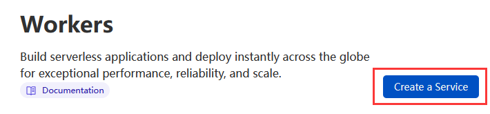
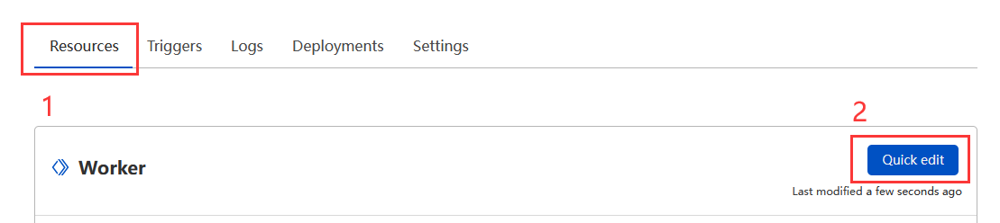
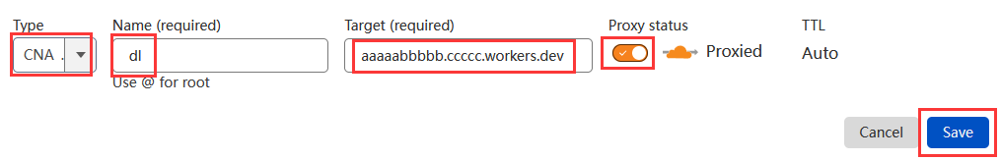

 > 转载自 [Arcaea-Infinity/dl.arcaea.moe](https://github.com/Arcaea-Infinity/dl.arcaea.moe/blob/main/usage.md)  （部署文档部分是本人写的，而 js 脚本由 [TheSnowfield](https://github.com/TheSnowfield) 提供）

## 简介

这是一个 Arcaea 镜像下载服务，该服务通过 Cloudflare Workers 反向代理实现，本质上是通过 [Lowiro webapi](https://webapi.lowiro.com/webapi/serve/static/bin/arcaea/apk) 获取最新的 APK 文件 URL，然后通过该 URL 下载文件。

目前该服务已经搭建在了：

 - [https://dl.arcaea.moe](https://dl.arcaea.moe)
 - [https://dl.lcwiro.com](https://dl.lcwiro.com)

你可以使用这些网址随时下载最新的 `arcaea_X.X.Xc.apk` 文件。

## 部署

### 1. 创建一个 Cloudflare Workers 实例

进入 Cloudflare 控制台，点击 `Workers` 标签页，然后点击 `Create a Service` 按钮。

选择 `HTTP handler`，然后点击 `Create service` 按钮。

此时你的服务已经搭建好了，你应该可以得到一个类似于 `aaaaabbbbb.ccccc.workers.dev` 的 URL，这就是你的 `Workers` 实例的 URL。

!!! 提示

    一个 `Workers` 实例也叫 `服务`，下文一律简称 `服务`。

### 2. 设置该服务

在上一步操作的同一个页面内，选择 `Resources` 标签，然后点击 `Quick edit` 按钮。

从我们的 [Repo](https://github.com/Arcaea-Infinity/dl.arcaea.moe) 下载到 [index.js 的代码](https://github.com/Arcaea-Infinity/dl.arcaea.moe/blob/main/index.js) ，直接复制全文，然后粘贴到如下区域，记得是全文覆盖。

然后点击 `Save and Deploy` 按钮。

此时你的服务已经可以投入使用了。

### 3. 测试服务可用性

打开你的浏览器，输入你的服务的 URL，如 `https://aaaaabbbbb.ccccc.workers.dev`，你的浏览器此时应该正确开始下载最新版本的 Arcaea。

!!! 注意 attention

    如果你只是想部署到 Cloudflare Workers，此时你需要做的事情已经做完了。如果你想继续将其部署到你的自定义域名，你需要继续看下去。

### 4. 设置自定义域名的 DNS 记录

打开你的 DNS 控制台，添加一个 `CNAME` 记录。

注意以下值的填写：

| 字段           | 值                              | 备注              |
|--------------|--------------------------------|-----------------|
| Type         | `CNAME`                        |                 |
| Name         | `dl`                           | 你想部署到哪个子域就使用哪个值 |
| Target       | `aaaaabbbbb.ccccc.workers.dev` | 使用你服务所在的 URL    |
| Proxy status | `Proxied`                      | 必须是 `Proxied`   |

然后点击 `Save` 按钮。

### 5. 将你的自定义域名的子域设置为该服务的路由:

在控制台中进入 `Workers` 标签页然后点击 `Add route` 按钮。

!!! 注意 attention

    这里的 `Workers` 标签页不是 Cloudflare 主页的那个标签页，而是你点击你的域名之后出现的 `Workers` 标签页。

注意以下值的填写：

| 字段      | 值                  | 备注                |
|---------|--------------------|-------------------|
| Route   | `dl.example.com/*` | 必须是 `你的子域` + `/*` |
| Service | `aaaaabbbbb`       | 使用你的服务的名字         |

然后点击 `Save` 按钮。

### 6. 测试的你的子域

现在打开你的浏览器，输入你的子域，如 `https://dl.example.com/` ，你的浏览器此时应该正确开始下载最新版本的 Arcaea。，
