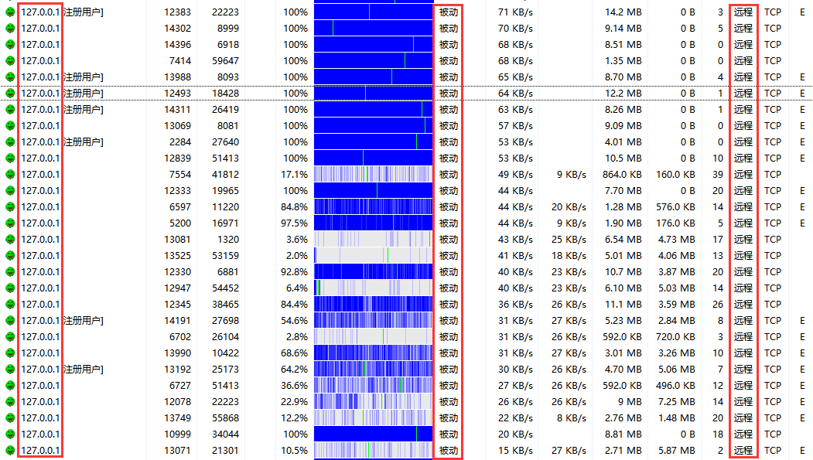

## 背景

想用比特彗星下种子，但是因为身处数个 NAT 身后，根本没有公网 IP，导致无法让别的 peer 连接到你，下载速度堪忧。

没有公网 IP 怎么办？打电话问运营商？还是算了吧，干脆向自己 VPS 借一个。

## 前提条件

 - 一台有公网 IP 的机器（最好是固定的 IP）
 - 这台机器被允许搭建 frp 等内网穿透服务
 - 这台机器被允许搭建代理服务

## 操作

### 部署 frps

首先在有公网 IP 的那台机器上部署 frp 服务端。

去 [release](https://github.com/fatedier/frp/releases/tag/v0.41.0) 下载对应系统的 frp，下载之后解压，里面的 frps 就是我们需要的 frp 服务端。

写 `frps.ini`：

```ini title="frps.ini" linenums="1"
[common]
bind_port = 7000
bind_udp_port = 7000
bind_addr = 0.0.0.0
allow_ports = 1001-1500,10001-22500
token = 你的密码
tls_only = true
```

注意以下配置项：

 - `allow_ports` 是指经过 frp 代理/转发的连接可以使用的端口范围。
 - `token` 请自己随便设置一个。
 - `tls_only` 则要求所有的 frpc 客户端（是你，不是指那些 peers）也启用 TLS 才能连接。建议设置成 `true`。

其他的参数可以通过 [官网文档](https://gofrp.org/docs/reference/server-configures/) 查看。

然后通过

```bat
frps.exe -c frps.ini
```

启用 frps 服务端。

此时你的服务端上应该显示如下日志：

```
2022/04/13 09:42:18 [I] [root.go:200] frps uses config file: frps.ini
2022/04/13 09:42:18 [I] [service.go:192] frps tcp listen on 0.0.0.0:7000
2022/04/13 09:42:18 [I] [service.go:276] nat hole udp service listen on 0.0.0.0:7000
2022/04/13 09:42:18 [I] [root.go:209] frps started successfully
```

说明你的服务端正在监听所有来自 `7000` 端口的 frp 连接。

### 部署 frpc

在自己需要运行比特彗星的电脑上部署 frp 客户端。

同样，去下载对应系统版本的 frp，解压获取 frpc。

写 `frpc.ini`：

```ini title="frpc.ini" linenums="1"
[common]
server_addr = 给定的IPv4地址/IPv6地址/域名
server_port = 7000
protocol = websocket
token = 你的密码
tls_enable = true

[Remote Download]
type = tcp
local_ip = 127.0.0.1
local_port = 2333
remote_port = 2333

[BT Listen TCP]
type = tcp
local_ip = 127.0.0.1
local_port = 10400
remote_port = 10400

[BT Listen UDP]
type = udp
local_ip = 127.0.0.1
local_port = 10400
remote_port = 10400
```

注意以下配置项：

 - `server_addr` 设置成那台有公网 IP 的机器的 IP 地址，可以是 IPv4/IPv6/域名。设置成 IPv6 地址时不需要加括号 `[` 和 `]` 。`server_port` 和 `frps.ini` 保持一致。
 - `protocol` 一律选择 `websocket`。
 - `token` 和 `tls_enable` 均与 `frps.ini` 保持一致。

`Remote Download` 指的是比特彗星的远程下载服务，如果你比特彗星需要开这个功能，你可以把他打开，端口号和比特彗星上的设置保持一致，比如 `2333`。


`BT Listen TCP/UDP` 就是 peer 的通信端口，均设置成 `127.0.0.1` 上的 `10400`，和比特彗星保持一致。


## 测试 frp 连接

现在在你的客户端上执行：

```bat
frpc.exe -c frpc.ini
```

客户端上应该会显示日志：

```
2022/04/13 09:43:20 [I] [service.go:301] [44dfbb2737aff979] login to server success, get run id [44dfbb2737aff979], server udp port [7000]
2022/04/13 09:43:20 [I] [proxy_manager.go:144] [44dfbb2737aff979] proxy added: [Remote Download BT Listen TCP BT Listen UDP]
2022/04/13 09:43:20 [I] [control.go:180] [44dfbb2737aff979] [Remote Download] start proxy success
2022/04/13 09:43:20 [I] [control.go:180] [44dfbb2737aff979] [BT Listen TCP] start proxy success
2022/04/13 09:43:20 [I] [control.go:180] [44dfbb2737aff979] [BT Listen UDP] start proxy success
2022/04/13 09:43:21 [I] [proxy.go:481] [44dfbb2737aff979] [BT Listen UDP] incoming a new work connection for udp proxy, ws://XXX.XXX.XXX.XXX:7000/~!frp
```

同时服务端上应该会立即显示一条日志：

```
2022/04/13 09:43:21 [I] [service.go:447] [44dfbb2737aff979] client login info: ip http://XXX.XXX.XXX.XXX:7000 version [0.38.0] hostname [] os [windows] arch [amd64]
```

其中的 `XXX.XXX.XXX.XXX:7000` 应该是你服务端的 IP + 端口，而 `44dfbb2737aff979` 是你被服务端分配的用户 ID，每次你连接到服务端时，都会被服务端随机分配一个用户 ID。


现在，所有 peers 发送到那台具有公网 IP 的机器的 `allow_ports` 端口（包括 `10400`）的 TCP 和 UDP 数据包，都会被 `frps.exe` 通过反向 websocket 转发回客户端上的 `frpc.exe`，然后 `frpc.exe` 再发送到 `localhost:10400`，由于此时比特彗星正在监听本地的 `10400` 端口，因此比特彗星将会把这些 `frpc.exe` 发来的数据包认为是 peers 发送过来的数据包。

## 设置代理

frp 只能解决一个方向上的问题，就是 peers 连接到客户端，而客户端连接到 peers 的方式将会由代理服务器实现。

你需要在那台具有公网 IP 地址的机器上搭建一个代理服务，从而让你的比特彗星能通过代理连接到 peers。

具体搭建方法这里不做介绍，网上有很多教程。假设我们已经搭建好了这个代理，并且映射在了 `socks5://localhost:1089` 上。

然后我们在比特彗星设置里做好代理设置。


除了 `使用代理服务器进行 DNS 查询` 以外，其他都不勾选。这相当于使比特彗星进入全局代理模式。

此时我们已经等价于具有了公网 IP，并且可以以公网 IP 身份与互联网进行双向通信。不出意外的话，这个时候比特彗星的灯已经🟢了


## 关闭防吸血

因为比特彗星接收到的数据包都是 `frpc.exe` 发来的，因此所有的 peers 的外网 IP 都是 `127.0.0.1`，大量相同 IP 可能会触发比特彗星的防吸血机制，因此把他关掉。


## 测试效果

现在去下载任意一个 BT 种子，如果点开 `用户` 选项卡，发现很多来自 `127.0.0.1` 的连接，并且来源是 `被动`，发起是 `远程`，此时就说明你已经设置正确了。


