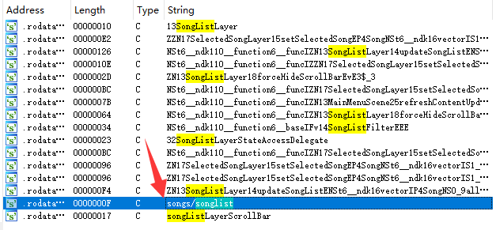
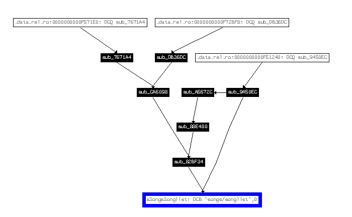
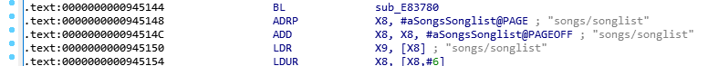
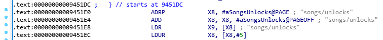
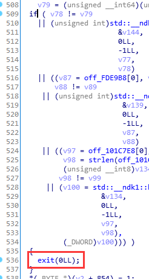
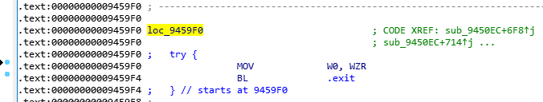
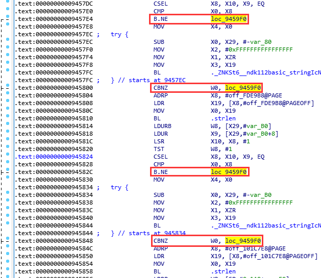
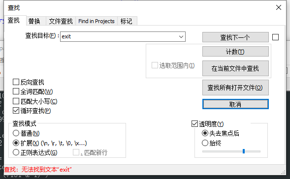

玩自制的入门操作，话不多说，直接开干。

 - 所用 IDA 版本：`IDA x64 Pro v7.0`
 - 所用二进制文件：`libcocos2dcpp.so`
 - 二进制文件版本：`3.12.6`

!!! 提示

    iOS 那边的 `Arc-mobile` 也可以用同样思路进行修改。

## 定位

首先字符串搜索 `songlist`，找到 `songs/songlist`，双击。

右键 `Xrefs graph to`，看看这个变量被引用的位置。

这几个函数里，总有一个是对 songlist 做哈希校验的，那就一个一个来看呗。让我们节约一点时间，假设大家运气都很好，一上来都打算来猜 `sub_9450EC` 这个函数。

可见，这个函数不仅仅用了 `songs/songlist`，还用到了 `songs/packlist` 和 `songs/unlocks` 等路径。那看来就是这个函数了！

嗯，F5。

观察这一长串 if 语句块：

最后这里是直接调用 `exit()` 函数。那看来就是这了。

回到 `IDA View`，看看 `exit()` 函数在哪。

找到调用 `exit()` 函数的标签 `loc_9459F0`，向上高亮所有跳转到这个标签的指令。

可以看到，都是一些 `CBNZ` 和 `B.NE` 指令，那就很好办了，全部改成 `NOP` 就行。

## 修改

直接上 Keypatch。

总共6处，全部改成 `NOP`，改完再 F5 一次，搜一下 `exit`。

看来已经不会触发这个 `exit` 了，收工。
