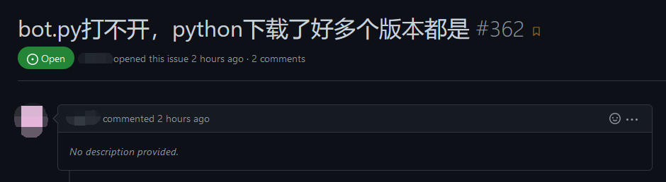
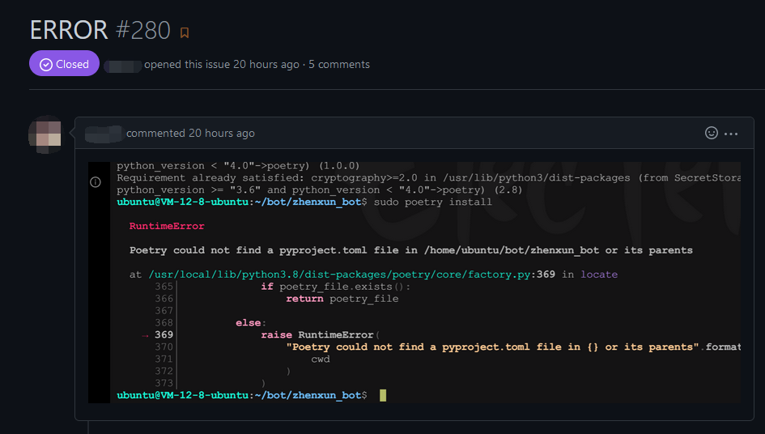

这篇文章致力于告诉读者如何像一个弱智一样提问，以及如何在提问时激怒你的回答者。

请注意，本文主要的讨论重点是 “如何像一个弱智”，而不是 “如何激怒你的回答者”，故诸如 `提问态度`、`搜索已存在的 issue` 等不在此文的讨论范围内。

## 开局一句话，内容全靠猜

之所以将其放在这篇博客中最显眼的位置，是因为该方法是激怒回答者最有效的方法。

该方法的关键在于：不要在提问中提供任何内容（例如**复现步骤**、**日志**、**环境**以及**软件版本**等），这些内容将有助于回答者更好地理解问题，因而无法体现你是一个弱智。

!!! example "例 1"

    

    

    

`开局一句话，内容全靠猜` 有一个孪生兄弟，那就是 `开局一张图，内容全靠猜`，例如：

!!! example "例 2"

    

提示：由于你认为回答者的思考频率永远和你是相同的，故在提问时无需**花时间组织好语言**，这种不明所以的问题可以起到火上浇油的作用。

你也许会见到一些提问者在描述自己想要的功能或 bug 的行为时**加入一些示范**，例如：

 - 所进行的操作
 - 期待的结果
 - 实际的结果

请不要学习他们，因为他们不是弱智。

## 询问不可思议的预备知识问题

一般来说，任何一个项目都是写给有一定预备知识的用户的。这些所谓的预备知识，一般是指使用该项目（或者部署、运行、修改等）所需的最基本的技能。或许对于不同水平的人来说，这些所谓的预备知识标准可能不尽相同，但是在某些特定的地方，这些预备知识是公认的。

 - 例如在世界上绝大部分开源项目中，`英语` 是预备知识
 - 例如在一个完全基于 Python 的项目中，`Python 的安装` 是预备知识
 - 例如在一个网络相关的项目中，`IP 地址和端口` 是预备知识
 - 例如在一个被用于电脑的项目中，`电脑的开关机` 是预备知识
 - 例如在数学中，`四则运算` 是预备知识

向弱智提供这些最基础的知识显然不是社区的义务之一，因此如果你想让回答者认为你是一个弱智（或者说，取悦你的回答者），那么当你遇到这些问题时，你应该立即询问他们，而不是**花 5 分钟自行学习这些预备知识**。例如：

!!! example "例 3"

    Q: apk 是什么？在哪里下载啊？系统禁止我安装怎么办啊？

像上述这种可以用一个并不复杂的句子描述的预备知识问题，你大多都是可以在**搜索引擎**（例如 [百度](https://www.baidu.com/) 或者 [Google](https://www.google.com/)）或者**论坛**（如 [Stack Overflow](https://stackoverflow.com/)）上找到这些问题的答案的。

向你的回答者询问这些预备知识问题或许也是一个激怒他们的方案，这可以让他们觉得：与其花时间为这个弱智解决 [怎么让电脑关机](https://www.google.com/search?q=%E6%80%8E%E4%B9%88%E8%AE%A9%E7%94%B5%E8%84%91%E5%85%B3%E6%9C%BA)、[怎么使用鼠标](https://www.google.com/search?q=%E6%80%8E%E4%B9%88%E4%BD%BF%E7%94%A8%E9%BC%A0%E6%A0%87)、[如何为手机充电](https://www.google.com/search?q=%E5%A6%82%E4%BD%95%E4%B8%BA%E6%89%8B%E6%9C%BA%E5%85%85%E7%94%B5) 这类问题，不如让他去搜索引擎上搜索答案来得快。

## 在查看文档前提出问题

一些开发者可能会在自己的项目主页的明显位置提供文档，这些文档里可能提供了你使用该项目的必要说明。作为想要成为弱智的人，你应该不要花时间**查看这些文档**。

如何知道自己已经变成弱智？（或者说如何发现自己可能已经激怒了其他回答者）

当你发现自己的回答者里有人让你去看文档时，例如：

!!! example "例 4"

    

此时你就已经变成弱智了。

## 询问不相关的问题

!!! warning "注意"

    这里特指 GitHub issue 中可能出现的情形。

GitHub 的 [issue](https://docs.github.com/articles/about-issues) 是用于向仓库中的项目提问、发起建议或寻求帮助的地方。如果你想让自己成为 issue 提问者中最靓的仔，你可以在 issue 中提出与原项目毫不相关的问题。

!!! example "例 5"

    Q: requests.exceptions.Timeout: HTTPConnectionPool(host='google.com', ... 是什么意思？

    A: 大陆访问不了，需要使用代理

    Q: 从哪里可以搞到代理啊？

## 自己选择的道路永远是正确的

在提出问题的时候，你的脑海中应当始终认为 “自己选择的道路永远是正确的”，因为你无需向回答者**描述你的根本问题**。

与之说法最接近的是 `X-Y 问题` ，这指的是：

!!! cite "X-Y 问题"

    你在提问时可能有一个高级层次问题 `X`，你觉得解决了 `Y` 这个低级层次问题便能解决 `X` 这个高级层次问题。于是你在社区询问 `Y` 问题的解决方案，最终社区帮你解决 `Y` 问题之后，发现 `Y` 问题的解决并不能帮助 `X` 问题的解决。

其次，与提出 `X-Y 问题` 类似的做法是擅自加入额外的猜测（可以视为是一种 “显式” 的 `X-Y 问题`），并要求回答者解答它，例如：

!!! example "例 6"

    Q: XXX 这个地方报错了，我觉得可能是 YYY 的问题，能帮我解决下 YYY 吗？

通过这种方式，你不仅可以让自己成为一个弱智，还可以禁锢回答者的思维，从而难以得出正确的答案。

## 试图让回答者替你做事

对于弱智而言，回答者永远是他们的奴隶。你可以要求回答者替你做一些你不想亲自动手的事情，例如：

!!! example "例 7"

    Q: TCP + TLS + Web 为啥需要 Web 前需要 HAProxy 啊，nginx 也有这种功能啊 非要前面 HAProxy，后面再弄个 nginx/httpd。 对于个人使用没必要吧。 当然你搭建商业的除外

    A: 不要再问这种问题了，你觉得可以就自己搭，搭成了可以写给教程 pr

    Q: nginx 的 stream 块不行吗

    A: 不要再问这种问题了，你觉得可以就自己搭，搭成了可以写给教程 pr

## 用描述错误取代提出问题

能通过这个途径成为弱智的人少之又少，因为很少有人能做到在提出问题的时候从不使用 [疑问句](https://baike.baidu.com/item/%E7%96%91%E9%97%AE%E5%8F%A5/847219)。

!!! example "例 8"

    Q: 我把后缀名改成 zip，然后 rar、7z 什么的都试过了，还是不行

    A: 能否直接说问题？

!!! warning "注意"

    如果你真的是为了单纯描述错误（而非提出问题），那么这条途径不适用于你，因为描述错误可以不使用疑问句。
