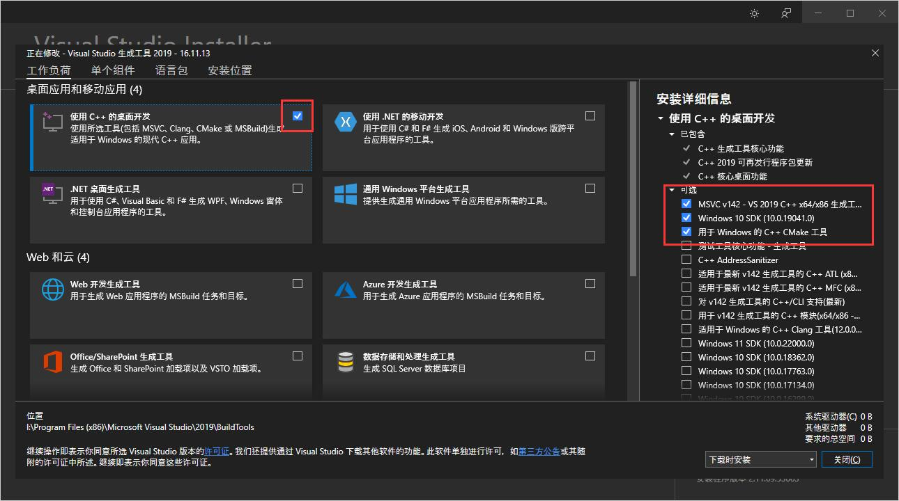
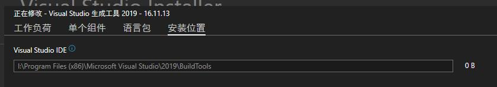

## 绪论

 > 历时 14 个小时，反复下载高达 60 GB，重新部署整个 Visual Studio 多达 5 次，从而打磨出的 dlib 安装终极解决方案，专注于解决 dlib 安装过程中出现的各种疑难杂症。

你是否有以下苦恼？

 - You must use Visual Studio to build a python extension on Windows
 - 对着十几个 GB 的 Visual Studio 发愁
 - Anaconda 装上的 dlib 没法调用 GPU
 - 不仅 GPU 占用率为 0，CPU 也跑不满
 - 装上了 Visual Studio，仍然无法编译 dlib
 - x64 和 x86 打架
 - 几个 CMake 一起打架
 - 英伟达 CUDA 驱动在 C 盘到处释放文件（lashi）
 - 明明装了 CUDA，CMakeList 却以各种各样的理由不让你用
 - 例如嫌弃你的 CUDA 版本太高或太低
 - 例如嫌弃你的 Visual Studio 版本太高或太低
 - CMakeList.txt 第 5 行经典报错
 - Permission Denied
 - Temp 文件夹写入不了了
 - error C2734: “GifAsciiTable8x8”: 如果不是外部的，则必须初始化常量对象
 - error C2065: “ssize_t”: 未声明的标识符
 - 历经千辛万苦装完了结果还是 `#!python dlib.DLIB_USE_CUDA == False`
 - ...

装 [dlib](https://github.com/davisking/dlib) 一直是机器学习领域的一个大难题，它要求开发人员拥有某些特定的 CUDA + Visual Studio + dlib + python 版本的组合，这些组合一旦有一个环节出了问题，就会导致整个 dlib 没法用，而 dlib 又是很多库（例如 [face_recognition](https://github.com/ageitgey/face_recognition) ）的依赖库。这些艰难险阻将极大地打击开发人员在机器学习领域攻坚的信心。

即使是有 `万能` 之称的 [Anaconda](https://anaconda.org) ，它也不能完全这个问题。因为它下载的 dlib 没有提供 GPU 支持，这直接造成了 `一核有难，万核围观` 的经典局面。而目前（2022 年 4 月底）唯一能在 Anaconda 仓库中找到的有关 CUDA 和 GPU 的软件包只提供了 Linux 的编译版本（[zeroae/dlib-cuda](https://anaconda.org/zeroae/dlib-cuda) 和 [hoan/dlib-gpu](https://anaconda.org/hoan/dlib-gpu) ）且均很长时间没有更新。

这使得手头没有 Visual Studio 的开发人员（其实就算有 Visual Studio 也差不多）在 Windows 平台上利用 CNN（卷积神经网络）进行人脸识别或者其他机器学习任务时，简直和坐牢一样。

这个方案的出现，就是为了用一个简单、直观、有效的方法，一次性解决这个问题。

## 拟议方案的前提条件

在所有步骤开始之前，请先确保你满足以下前提条件：

### 系统架构

为了避免不必要的麻烦，请在接下来的**所有步骤**中，均使用 64 位系统架构（amd64 或者 x64）。

### Conda

目前我的版本是 [Anaconda](https://anaconda.org) 1.9.0，其他版本**应该**不影响。同理，Python 版本**应该**也不影响。

### [Visual Studio](https://my.visualstudio.com/Downloads/Featured?mkt=zh-cn)

以下 Visual Studio 中，你至少需要拥有一个：

 - Visual Studio 2019
 - Build Tools for Visual Studio 2019
 - Visual Studio 2017
 - Build Tools for Visual Studio 2017

因为我不想下十几个 GB 的 Visual Studio 2019/2017，所以我使用的是 Build Tools for Visual Studio 2019。即使是这样，他仍然会占用我大约 4 GB 的磁盘空间（其中 C 盘固定占用约 2 GB），但这比起来已经足够小了。

!!! 危险 danger

    你可能想问 Visual Studio 2015（含）以下等不在此列的 Visual Studio 版本行不行，这里明确表示：

    ***不行！！！***

    ```C++
    #if _MSC_VER < 1910 || _MSC_VER >= 1930
    #error -- unsupported Microsoft Visual Studio version! Only the versions between 2017 and 2019 (inclusive) are
    ```

    另见：

     - [CUDA Installation Guide for Microsoft Windows](https://docs.nvidia.com/cuda/cuda-installation-guide-microsoft-windows/index.html)
     - [CUDA Compilers](https://gist.github.com/ax3l/9489132#nvcc)

以下 Visual Studio 工作负载中，**必须**全部拥有：

 - MSVC VS 2017（或 2019）C++ x64/x86 生成工具
 - Windows 10 SDK
 - 用于 Windows 的 C++ CMake 工具

!!! 危险 danger

    注意最后一个

     - 用于 Windows 的 C++ CMake 工具

    就算你已经有了 [Kitware 的 CMake](https://github.com/Kitware/CMake) 你仍然需要勾选，不然就算通过了 CXX 编译器测试阶段，在实际编译的时候仍然可能 broken。

如图所示：



记得修改安装路径，别一股脑全塞 C 盘了：



!!! 危险 danger

    请在退出 Visual Studio Installer 后立即检查你的临时文件夹，例如 `C:\Users\AkibaArisa\Temp`，Visual Studio Installer 可能会修改这个文件夹的权限，导致除了 `以管理员权限运行` 的程序以外，均无法写入该文件夹。

    你所需要做的就是检查这个临时文件夹的权限，如果发现有问题，则用以下方法修改这个文件夹的权限：

    右键该文件夹 - `属性` - `安全` - `编辑` - `Everyone` - 勾选 `完全控制` - `确认`

## 拟议方案的执行步骤

### 构建 Conda 环境

笔者的 PyCharm 能让新项目选择 Conda 环境并默认构建好，这里略过使用 IDE 构建的方法。


或者使用手动构建：

```cmd
conda create -n dlib_build_test python=3.10
```

然后进入虚拟环境：

```bat
conda activate dlib_build_test
```

### 安装 CUDA 和 cuDNN

不通过 Nvidia 官网，而是通过 Conda 安装 CUDA 和 cuDNN。

```bat
conda install cuda cudnn -c nvidia
```

接下来可能会等待一会，因为要下载很多东西。

安装后可以通过 `conda list` 命令确认安装的版本：

```hl_lines="3 29"
# Name                    Version                   Build    Channel
...
cuda                      11.6.2               h65bbf44_0    nvidia
cuda-cccl                 11.6.55              hd268e57_0    nvidia
cuda-command-line-tools   11.6.2               h65bbf44_0    nvidia
cuda-compiler             11.6.2               h65bbf44_0    nvidia
cuda-cudart               11.6.55              h5fb1900_0    nvidia
cuda-cuobjdump            11.6.124             h8654613_0    nvidia
cuda-cupti                11.6.124             h532822a_0    nvidia
cuda-cuxxfilt             11.6.124             h3f9c74b_0    nvidia
cuda-libraries            11.6.2               h65bbf44_0    nvidia
cuda-libraries-dev        11.6.2               h65bbf44_0    nvidia
cuda-memcheck             11.6.124             hea6bc18_0    nvidia
cuda-nvcc                 11.6.124             h769bc0d_0    nvidia
cuda-nvdisasm             11.6.124             he05ff55_0    nvidia
cuda-nvml-dev             11.6.55              h2bb381e_0    nvidia
cuda-nvprof               11.6.124             he581663_0    nvidia
cuda-nvprune              11.6.124             hb892de1_0    nvidia
cuda-nvrtc                11.6.124             h231bd66_0    nvidia
cuda-nvrtc-dev            11.6.124             hd7d06dc_0    nvidia
cuda-nvtx                 11.6.124             hee9d5a4_0    nvidia
cuda-nvvp                 11.6.124             h6a974fa_0    nvidia
cuda-runtime              11.6.2               h65bbf44_0    nvidia
cuda-sanitizer-api        11.6.124             ha4888a7_0    nvidia
cuda-toolkit              11.6.2               h65bbf44_0    nvidia
cuda-tools                11.6.2               h65bbf44_0    nvidia
cuda-visual-tools         11.6.2               h65bbf44_0    nvidia
cudatoolkit               11.3.1               h59b6b97_2
cudnn                     8.2.1                cuda11.3_0
...
```

显然，我安装的 CUDA 版本是 `11.6.2`，cuDNN 版本是 `8.2.1`。

安装完成后确认 `nvcc.exe` 的安装位置，并记住它。

```bat
(dlib_build_test) I:\Developer\Python\project\dlib_build_test>where nvcc
:: I:\ProgramData\Anaconda3\envs\dlib_build_test\bin\nvcc.exe
```

例如现在它在 `I:\ProgramData\Anaconda3\envs\dlib_build_test\bin\nvcc.exe`。

### 获取 dlib 源码

从 Releases 下载：（推荐）[v19.23](https://github.com/davisking/dlib/archive/refs/tags/v19.23.zip)

或者从 GitHub克隆：

```bat
git clone https://github.com/davisking/dlib.git
cd dlib
```

### 在构建之前

#### 进入 MSVC x64 编译环境

```bat
%comspec% /k "I:\Program Files (x86)\Microsoft Visual Studio\2019\BuildTools\VC\Auxiliary\Build\vcvars64.bat"
```

其中的路径需要根据你的 Visual Studio 的安装位置而改变，但最简单的方法其实是从开始菜单中找到 `x64 Native Tools Command Prompt for VS 2019` 的快捷方式，然后点击右键查看属性。


复制并粘贴其 `目标` 即可。

运行后，这个 bat 脚本将会自动把 MSVC 的环境变量设置到你的临时环境变量中（仅在当前控制台有效），这样就可以在构建 dlib 的时候使用 MSVC 的编译器了。

现在我们尝试一下重要的环境变量是否设置正确：

```bat
where cmake
:: G:\Tools for Windows\CMake\bin\cmake.exe
:: I:\Program Files (x86)\Microsoft Visual Studio\2019\BuildTools\Common7\IDE\CommonExtensions\Microsoft\CMake\CMake\bin\cmake.exe
where nmake
:: I:\Program Files (x86)\Microsoft Visual Studio\2019\BuildTools\VC\Tools\MSVC\14.29.30133\bin\Hostx64\x64\nmake.exe
where cl
:: I:\Program Files (x86)\Microsoft Visual Studio\2019\BuildTools\VC\Tools\MSVC\14.29.30133\bin\Hostx64\x64\cl.exe
```

!!! 提示 note

    运行 `where cmake` 的时候出现了两个 `cmake`，其中一个是 Kitware 的 cmake，另一个是 MSVC 的 cmake。而 dlib 在编译过程中会检查所有 cmake 的路径，如果不存在 MSVC 的 cmake，脚本会报错而停止。

#### 修改 dlib 源码

见 [Dlib failed to build due to many errors: error C2065 and C2338 · Issue #2463 · davisking/dlib](https://github.com/davisking/dlib/issues/2463)

打开 `dlib\dlib\external\pybind11\include\pybind11/numpy.h`，找到：

```C++ title="numpy.h" linenums="26"
#if defined(_MSC_VER)
#  pragma warning(push)
#  pragma warning(disable: 4127) // warning C4127: Conditional expression is constant
#endif
```

添加两行，改为：

```C++ title="numpy.h" linenums="26" hl_lines="4 5"
#if defined(_MSC_VER)
#  pragma warning(push)
#  pragma warning(disable: 4127) // warning C4127: Conditional expression is constant
#include <BaseTsd.h>
typedef SSIZE_T ssize_t;
#endif
```

### 开始构建

```bat
mkdir build
cd build
cmake .. -DDLIB_USE_CUDA=1 -DUSE_AVX_INSTRUCTIONS=1 -DCUDAToolkit_ROOT=%NVCC_PATH%
```

其中 `#!bat %NVCC_PATH%` 是你在之前获取的路径，例如 `I:\ProgramData\Anaconda3\envs\dlib_build_test\bin\nvcc.exe`。

基于我们做好的前期铺垫，理论上这里可以一次性构建成功，如果构建仍然没有成功，请仔细阅读 `CMakeError.log` 文件，分析其中出现的错误。在每次重新构建之前，请先删除 `build` 文件夹里的所有内容。

### 尝试编译

```bat
cmake --build .
```

同上，理论上是一次性构建成功。

### 尝试安装

```bat
python setup.py install --set DLIB_USE_CUDA=1 --no DLIB_GIF_SUPPORT
```

!!! 危险 danger

    必须添加 `--no DLIB_GIF_SUPPORT` 参数，否则会发生错误：`error C2734: “GifAsciiTable8x8”: 如果不是外部的，则必须初始化常量对象`

    见 [Dlib install errors out : error C2734: 'GifAsciiTable8x8' : 'const' object must be initialized if not 'extern' · Issue #2358 · davisking/dlib](https://github.com/davisking/dlib/issues/2358)

### 在安装之后

#### 卸载旧版本的 dlib

就算在上一步的 `python setup.py install` 没有任何报错，我们的 dlib 也**可能**还没有正确安装。

对于一些用户，他们可能是属于*中途*加入这个方案的。例如，他们在此之前已经从

```bat
conda install -c conda-forge dlib 
```

安装了不带 CUDA 的 dlib。

因为版本原因（Release 下载的是 `19.23` 版本，而 `conda install` 安装的是 `19.23.1` 版本），旧版本的 dlib 不会被使用，因此 `#!python dlib.DLIB_USE_CUDA` 的值将仍然是 `#!python False`。

此时卸载原来安装的 `dlib`

```bat
conda remove dlib
```

然后再进行一次上一步的安装操作

```
python setup.py install --set DLIB_USE_CUDA=1 --no DLIB_GIF_SUPPORT
```

现在 `#!python dlib.DLIB_USE_CUDA` 的值应当是 `#!python True`

#### 关闭 Windows 错误报告服务

这是一个比较玄学的东西。在启用了 CUDA 的 dlib 正确安装完成后，有些人在运行的时候可能会发生这个错误。具体体现如下：

这里有两份差不多的人脸检测 demo，其中一个使用 HOG，另一个使用 CNN。

=== "HOG"

    ```python title="detection.py" linenums="1" hl_lines="5"
    import cv2
    import imutils
    import dlib

    detector = dlib.get_frontal_face_detector()
    image = cv2.imread('image/test.jpg')
    resized_image = imutils.resize(image, width=600)
    rgb = cv2.cvtColor(resized_image, cv2.COLOR_BGR2RGB)
    
    results = detector(rgb, 1)
    for result in results:
        print(result)
    ```

=== "CNN"

    ```python title="detection.py" linenums="1" hl_lines="5"
    import cv2
    import imutils
    import dlib
    
    detector = dlib.cnn_face_detection_model_v1('model/mmod_human_face_detector.dat')
    image = cv2.imread('image/test.jpg')
    resized_image = imutils.resize(image, width=600)
    rgb = cv2.cvtColor(resized_image, cv2.COLOR_BGR2RGB)
    
    results = detector(rgb, 1)
    for result in results:
        print(result.rect)
        print(result.confidence)
    ```

当 dlib 使用 `#!python get_frontal_face_detector()`（HOG）进行人脸检测时，不会发生任何问题。

当 dlib 使用 `#!python cnn_face_detection_model_v1()`（CNN）进行人脸检测时，能顺利进行检测，任务管理器的 CUDA 使用率也会正常上涨。

但是在检测结束之后，这个脚本会卡住，打开任务管理器可以发现 C 盘使用率接近 100%。大约 1~2 分钟后 C 盘使用率恢复正常，脚本也正常结束。

事后调查发现，是 `Windows 错误报告` 正在向 C 盘写入大量内容（内存转储），写入的位置是 `C:\Users\AkibaArisa\AppData\Local\CrashDumps`，每次写入一个大小约为 1 GB 的 `.dmp` 文件，文件名与 python 有关。

实际上我们的 python 脚本并没有发生任何崩溃，而且也是正常结束的，因此这个错误报告纯属画蛇添足。

现在关闭掉 `Windows 错误报告服务`：

1. 首先使用 PowerShell 停用：

    （见 [Disable-WindowsErrorReporting (WindowsErrorReporting) | Microsoft Docs](https://docs.microsoft.com/en-us/locale/?target=https://docs.microsoft.com/en-us/powershell/module/windowserrorreporting/disable-windowserrorreporting?view=windowsserver2022-ps&viewFallbackFrom=win10-ps) ）    

    ```powershell
    PS C:\> Disable-WindowsErrorReporting
    # False
    ```
   
2. 然后在服务中停用：

    1. 打开 `服务`（运行 `services.msc` 或者使用任务管理器）。
    2. 找到 `Windows Error Reporting Service`，右键 `属性`。
    3. 将 `启动类型` 设为 `禁用`。
    4. 在 `服务状态` 处点击 `停止`。

如此一来，Windows 将不会再产生错误报告，我们使用了 `#!python cnn_face_detection_model_v1()` 的 python 脚本也将在检测完成后正常结束，不会一直搁这卡着。

## 结论

特定的 CUDA + Visual Studio + dlib + python 版本的组合目前仍然是 dlib 中的一大难题。如你所见，这个方案的阅读加实践的总时长可能超过了半个小时，奈何不同软件，不同平台之间的配套的确很困难，但我们仍将解决他们。相信这个方案可以帮助到更多的人。

## 致谢

感谢 dlib 的所有贡献者为我们带来了实用的机器学习工具；感谢所有在 GitHub dlib 仓库下提出和解决 issue 的开发者和研究人员，没有他们这篇文章将无从下手；也感谢我的毕设老师，选了一个这样的课题，把我憋出了一篇这样的文章。
