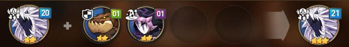
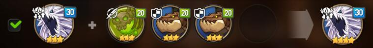
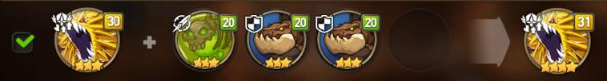
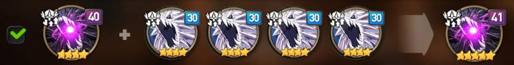
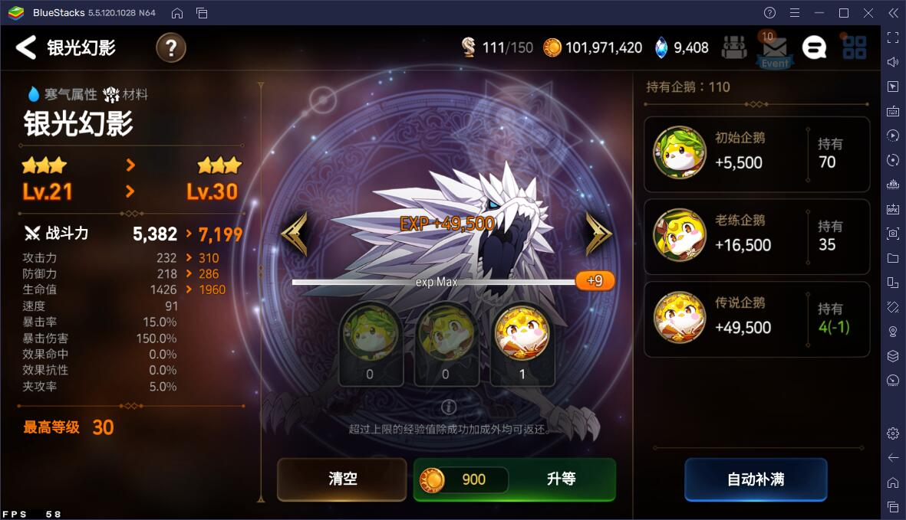
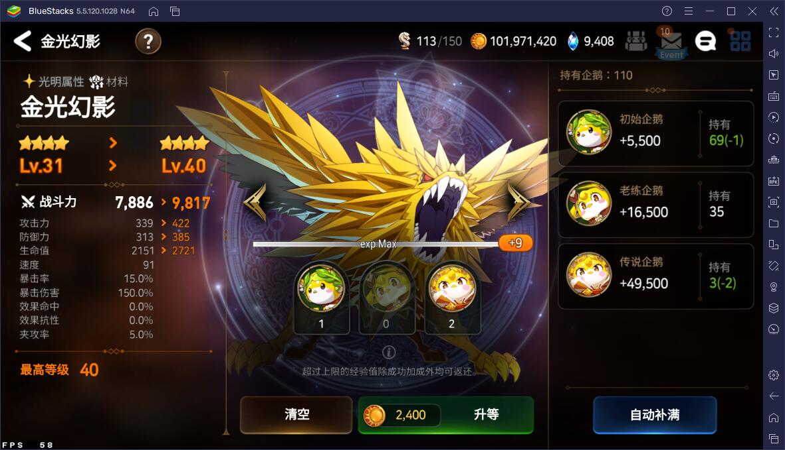
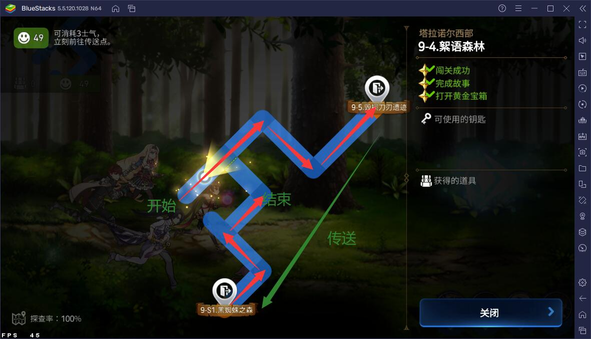

## 绪论

### 背景

有群友用**二星银狗**喂**二星银狗**。我一看你这不太奢侈了嘛，于是便有了这条博客。

### 本博客的行文结构

第二章主要介绍了各个素材在将一个角色升为六星的过程中所担当的身份。

第三章***才是本博客的主要部分***，主要介绍了将一个角色升为六星的最简洁方法。

第四章主要介绍了两种快速获取**二星狗粮**的方法。

## 各个素材的身份

这章主要介绍各个素材（狗/狗粮）在将一个角色升为六星的过程中所担当的身份。

### 二星狗粮（初始）

什么是**二星狗粮**？

**二星狗粮**就是冒险过程中掉落的二星小怪，等级一般为 1。

如果是从友情召唤那里抽来的，那么初始等级为 5。

**二星狗粮**目前主要有以下两个出路：

 - 直接喂给**20 级的二星银狗**（满级的初始银狗），使这个**20 级的二星银狗**变成**21 级的三星银狗**。
   
 - 自己吃企鹅，使自己变成**20 级的二星狗粮**，然后通过吃掉两个**二星狗粮**，使自己成为**21 级的三星狗粮**。
   

### 三星狗粮（21 级）

**三星狗粮**唯一的获取方法在上一节中已经介绍过了，就是**二星狗粮**自己吃掉同类。

**三星狗粮**目前主要有以下两个出路：

 - 直接喂给**30 级的三星银狗**（满级的三星银狗），使这个**30 级的三银金狗**变成**31 级的四星银狗**。
   
 - 直接喂给**30 级的三星金狗**（满级的初始金狗），使这个**30 级的三星金狗**变成**31 级的四星金狗**。
   

### 二星银狗（初始）

**二星银狗**的唯一任务就是想办法通过各种方式变成**31 级的四星银狗**。

那么第一步，就是通过吃掉 2 个**二星狗粮**，把自己变成**21 级的三星银狗**。

### 三星银狗（21 级）

**21级 的三星银狗**的唯一任务就是喂**企鹅**变成**30 级的三星银狗**（满级的三星银狗），然后通过吃掉 3 个**三星狗粮**，使自己成为**31 级的四星银狗**。

### 四星银狗（31 级）

**31 级的四星银狗**目前主要有以下两个出路：

 - 喂给你想要的初始四星角色，让她变成五星，任务就此终结（当然本文探讨的是怎么升六星）。
 - 喂给**40 级的四星金狗（满级的四星金狗）**，使这个金狗变成**41 级的五星金狗**。
   
   

### 三星金狗（初始）

**三星金狗**的唯一任务就是想办法通过各种方式变成**41 级的五星银狗**

那么第一步，就是通过吃掉 3 个**21 级的三星狗粮**，把自己变成**31 级的四星金狗**

### 四星金狗（31 级）

**31 级的四星金狗**目前主要有以下两个出路：

 - 喂给你想要的初始四星角色，让她变成五星，任务就此终结（这一点和**31 级的四星银狗**一模一样）。
 - 通过吃**企鹅**，把自己变成**40 级的四星金狗**，然后通过吃掉 4 个**31 级的四星银狗**，使自己成为**41 级的五星金狗**。
   

### 四星黑狗（40 级）

同**31 级的四星金狗**，喂成**41 级的五星黑狗**

### 所有的五星狗

用来给你的角色升六星。

## 如何快速升六星？

这才是这篇博客的主要部分。

### 材料准备

首先去准备非常多的**二星狗粮**（具体方法看第四章介绍）、**初始银狗**、**初始金狗**和非常多**企鹅**。

### 处理二星狗粮

将你的**二星狗粮**分成两部分，

一部分用来做这个：

剩下的拿来做这个（这里的消耗会很多，注意）：

现在，你拥有了很多**三星狗粮**和**21 级的三星银狗**

把这些**三星银狗**全部升到 30 级（建议用 1 个**传说企鹅**）：

然后用一些**三星狗粮**来喂他：

然后把你剩下的**三星狗粮**全部喂给**初始金狗**：

现在所有的**二星狗粮**应当已被处理完毕，接下来已经没有他的事了。

最复杂的部分已经阐述完毕，接下来的是非常简单的内容

### 制造五星金狗（或者黑狗）

把所有的**31 级的四星金狗**喂企鹅，喂到满级（建议用 1 个**传说企鹅** + 2 个**初始企鹅**）：

然后用刚刚做好的**31 级的四星银狗**来喂他：

**初始黑狗**在此时发挥作用，同样用**31 级的四星银狗**来喂他：

如法炮制，造 5 个这样的五星金（黑）狗即可。

## 二星狗粮的获取方式

由于**银狗**和**企鹅**的获取方式过于简单，而**金狗**和**黑狗**的获取方式过于困难，这里主要介绍**二星狗粮**的获取方式。

有主要以下两种方式：

### 刷冒险

个人推荐刷普通难度的 9-4（E1-9-1-4（絮语森林））。这个迷宫的好处就是，走完一遍路径刚好可以用完 50 体力。

用这个方式，基本上是 10 体力换大概 2~4 个**二星狗粮**，还是很赚的。

??? 温馨提示 note

    但是长时间刷迷宫建议用脚本刷，不然真的纯属精神污染。🤮

或者刷当前活动的支线，也是个不错的选择。

### 友情书签换

