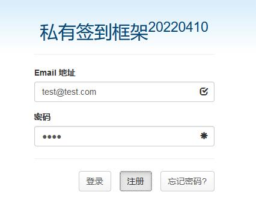
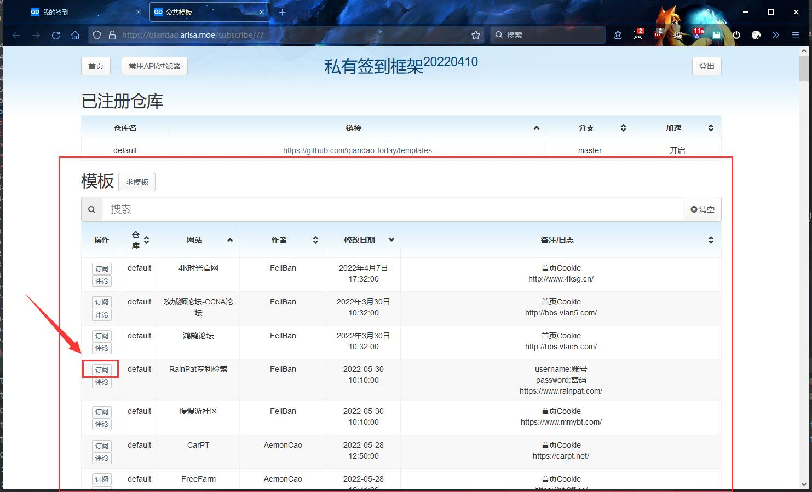
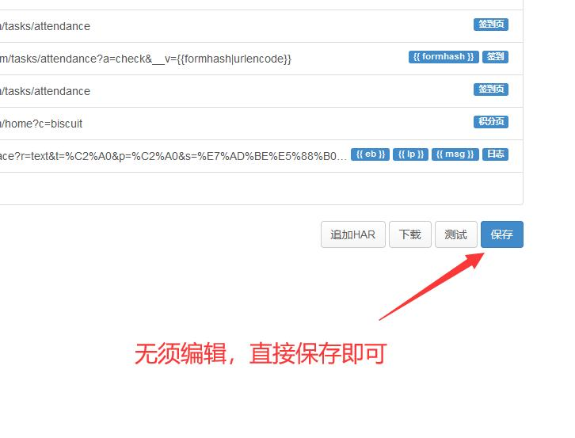
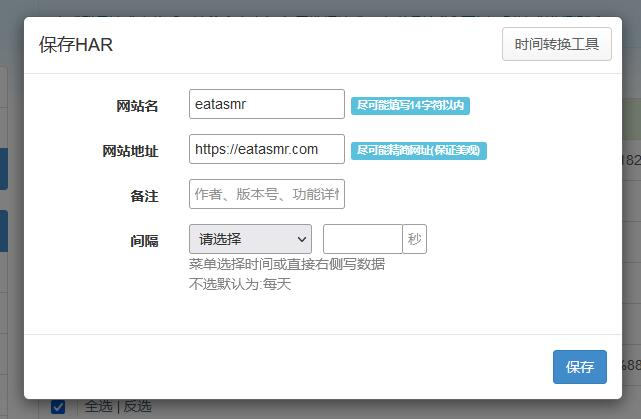
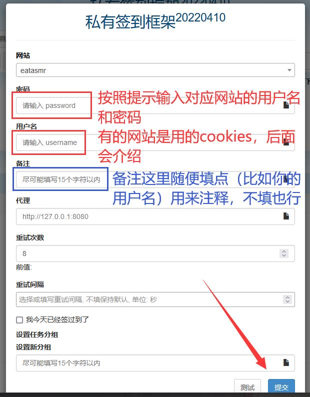
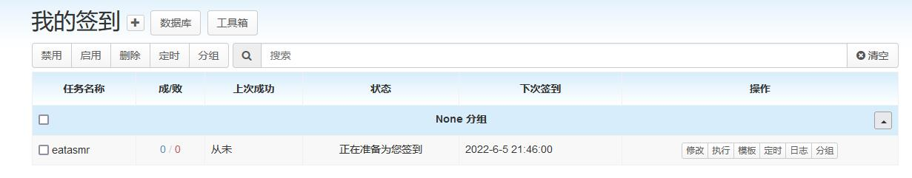
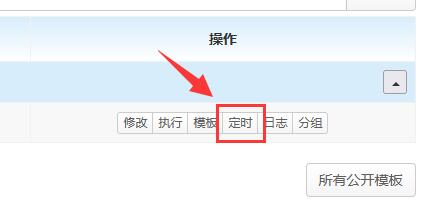
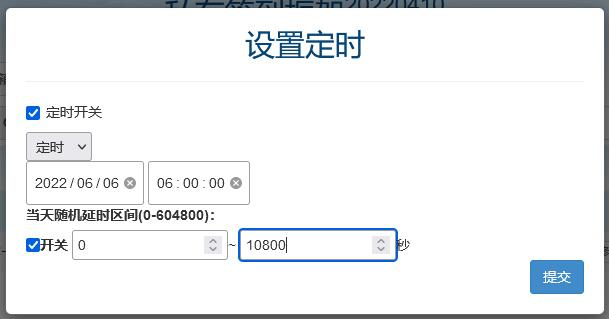
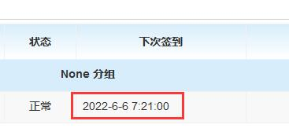

!!! abstract "摘要"

    我的服务器上搭建了一个 [自动签到服务](https://qiandao.arisa.moe/)，有群友说不会用，我就写了个指南。

    ~~多图警告~~

## 一、绪论

### 1.1 这是什么

现今很多网站或论坛都有签到功能，通过每日签到可以获取少量积分、金币等道具，某些网站或论坛连续签到可以获得更丰富的奖励。

那么问题来了，每次都要手动去网页上签到岂不是很浪费时间？这么多个网站，每次都去一个一个签岂不是很麻烦？万一断签了怎么办？于是就有了 `自动签到服务` 这个东西。

`自动签到服务` 的用途和他的名字一模一样，那就是通过我的服务器通过模拟登录、签到等操作，自动替你完成每日签到。

### 1.2 入口

本服务被搭建在 https://qiandao.arisa.moe/ 上。

### 1.3 许可证

本服务基于 [qiandao-today/qiandao](https://github.com/qiandao-today/qiandao/) 项目，该项目采用 MIT 许可证开源。

本服务所使用的模板均基于 [qiandao-today/templates](https://github.com/qiandao-today/templates)。

## 二、注册

在使用该服务前，需要先花5秒钟的时间在我的网站上注册一个账号。

右上角选择 `登录` 按钮，然后输入你自己的邮箱（无须验证邮箱）和密码，点击 `注册` 即可。

## 三、添加模板

注册完之后，你可以看到你的仪表盘。如下图：

但是现在你的仪表盘完全是**空的**，这是因为你还没有添加任何模板和签到任务。

那么现在来添加一些模板，如图点击 `公共模板`。

你可以看到很多公共模板，这些都是从 [qiandao-today/templates](https://github.com/qiandao-today/templates) 项目获取的。选中一个你想要添加的模板，点击左边的 `订阅`。

订阅之后你会看到一个用于编辑模板的界面，此时无须管他，直接保存即可。

随后会出现一个 `保存HAR` 的界面，这里也是直接点 `保存` 即可，不需要你改任何东西（想改也行）。

此时回到你的仪表盘，你会发现你的模板已经添加到了 `我的模板` 列表中。

## 四、添加任务

刚刚我们做的只是将一个模板从**公共模板库**中复制到你自己的**我的模板**中（这样便于后期自己自定义模板）。现在要做的就是基于这个模板创建一个签到任务。

点击模板末尾的 `新建` 按钮。

在这个界面里输入你在对应论坛上的用户名和密码（红框）。如果这里要求的是首页 Cookies，那么请参考 [这里](#cookies) 获取。

备注里随便填写一点东西（蓝框），用来在你自己的仪表盘上做备注，我自己填的是对应论坛上的用户名，因为我在同一个论坛上有好几个号，创建任务的时候需要用用户名区分。当然这里你留空也行。

如果你当天已经签到过一次了，为了避免重复签到，你可以把下面的 `我今天已经签过到了` 给勾上，这样点击提交之后就不会自动进行一次签到。

其他的东西都不需要管，最后点击 `提交`。提交之后，自动签到服务会立即尝试一次签到。

## 五、修改任务定时

默认情况下，下一次的签到时间会是上一次签到成功的时间加上24个小时。

如果你比较在意这个，或者是跟我一样有强迫倾向（例如想要统一在早上签到），那么你可以通过编辑任务的定时来实现。

以下是一个示例，我将会把刚刚添加的那个任务的定时修改成在 `每天早上 6:00 ~ 9:00` 进行，你可以根据自己的需求来修改。

首先点击任务末尾的 `定时` 按钮。

此时会出现一个定时界面修改框。

然后我们把 `定时开关` 和 `当天随机延时区间` 这两个勾给勾上，因为我们需要在每天早上的 6:00 ~ 9:00 之间的一个随机时间进行签到，而不是每次向后顺延24小时。

 - 定时开关：
    - **开：每天固定时间签到**
    - 关：上一次签到成功的时间顺延24个小时
 - 当天随机延时区间：
    - **开：每次随机向后延时**
    - 关：不随机延时，真正的固定时间

我做演示的时候，当天是 `2022年6月5日`，所以这里默认显示的日期也是 `2022年6月5日`。因为我们今天已经签到过一次了，希望他从明天开始，所以把这个日期改成 `2022年6月6日`。

因为我们需要在每天早上的 6:00 ~ 9:00 之间的一个随机时间进行签到，所以把后面的时间改为 `06:00:00`，延时区间改为 `0~10800`（也就是3个小时）。

最后我们改完是这样的：

点击 `提交` 即可。

刷新一下页面，可以看到这个任务的时间已经变成了早上6点到9点中间的一个随机值。

## 六、如何创建以 Cookies 作为登陆方式的签到任务

有很多类似于这样子的模板，它要求提供 Cookies，而不是用户名和密码。

下面将以 https://www.bilibili.com/ 为例，展示如何获取首页 Cookies。

首先进入 B 站首页，按下 ++f12++ 开启浏览器的开发者控制台。切换到 `网络` 选项卡（或者 `Network` 选项卡）。

按下 ++f5++ 刷新页面，此时这里应该会出现很多请求。选择第一个，查看它的请求头，找到 Cookies。

复制 Cookies 即可（注意是复制 Cookies 的内容，不要把 `Cookie` 这几个字母也复制过去了）
