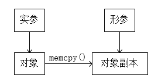
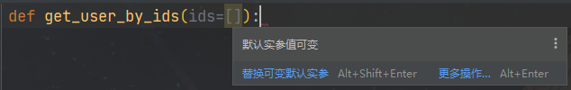

!!! abstract "摘要"

    这两天看到的一篇叫做 [《当年 1.6 亿美金估值的公司 —— Digg 是如何被一句 Python 函数可变默参毁掉的》](https://blog.csdn.net/csdnnews/article/details/126634939) 的文章，引发了我对 Python 默认参数可变的危险性的思考。

    这篇文章的内容讲述的是，当年曾可以与 Reddit 匹敌的科技网站 Digg，在它的新版本（v4）仓促上线时，因为 Python 默认参数可变的特性而导致了一个内存泄露问题，最终在新产品上线一个月之后修复了该 Bug。但一切已经晚了，这个 Bug 让 Digg 的用户迅速流失，最终在一年以后被 Beatworks 以 50 万美金的价格收购。

    这个故事也被亲身经历者 Will Larson 记载于 [《Digg's v4 launch: an optimism born of necessity.》](https://lethain.com/digg-v4/)。

    这篇文章并不分析这个悲剧的故事发生的前因后果，而是重点介绍与讨论 Python 默认参数可变的危险性。本文也将从这个角度来分析这个问题，以及探讨如何避免这个问题。

## 一、什么是默认参数可变

我们通过 Digg 在引发这次事故中的一行最关键的代码为例，介绍什么是默认参数可变：

```python
def get_user_by_ids(ids=[]):
    ...
```

在上面这个例子中，我们声明了一个函数 `get_user_by_ids`，它有一个默认参数 `ids`，默认值为一个空列表 `[]`。这个函数的作用是根据用户 ID 列表 `ids` 获取用户信息。

显然，我们的期望是，每次调用这个函数时，如果没有传入 `ids` 参数，那么 `ids` 的值就是一个空列表 `[]`，随后在函数体内对形参 `ids` 进行操作（如 `append` 方法），均是在这个空列表的基础上进行操作，例如：

```python
def get_user_by_ids(ids=[]):
    ids.append(1)
    print(ids)
```

期望的结果：

```
>>> get_user_by_ids()
[1]
>>> get_user_by_ids()
[1]
>>> get_user_by_ids()
[1]
```

然而实际的结果是：
```
>>> get_user_by_ids()
[1]
>>> get_user_by_ids()
[1, 1]
>>> get_user_by_ids()
[1, 1, 1]
```

可见，作为默认参数的列表 `[]` 在函数体内被修改后，会被保留下来，作为下一次调用时的默认值。这种将可变对象当作默认参数的做法，就叫做**默认参数可变**。

## 二、默认参数可变背后的原理

### 2.1 可变对象与不可变对象

在探讨这个原理之前，我们先复习一下什么是可变对象与不可变对象。

 - 可变对象（Mutable Object）：例如 `#!python dict`、`#!python list`、`#!python set` 等。当一个可变对象被修改时，会直接在内存原地址上修改内存的值，而对象的**地址保持不变**：
   ```python
   a = [1]
   id(a)  # 2681945788288
   a.append(2)
   id(a)  # 2681945788288，地址保持不变
   ```

 - 不可变对象（Immutable Object）：例如 `#!python int`、`#!python str`、`#!python tuple` 等。而当一个不可变对象被修改时，会先在内存中**创建一个新的对象**，然后将对象的地址指向新的内存地址，再把原来的那片内存进行垃圾回收：
   ```python
   a = '1'
   id(a)  # 2681895738544
   a = a + '2'
   id(a)  # 2681944549232，地址发生变化
   ```

推论：

 - 如果有多个对象的引用（即指针）指向同一个可变对象，那么使用其中任意一个引用对此对象进行修改，其他所有的引用都会产生相同的修改。
   
 - 如果有多个对象的引用指向同一个不可变对象，当使用其中任意一个引用对此对象进行修改，系统将会开辟一块新的内存区域用来存储修改过后的值，其他所有的引用仍然指向原来那片内存空间。
   

由此可见，第一个例子中的列表，在修改过后，对象的地址并没有发生变化，而第二个例子中的字符串，在修改过后，对象被分配了一个新的地址。

!!! example "思考"

    若在不可变对象 `my_tuple` 内保存一个可变对象 `my_list`，然后修改这个可变对象 `my_list` 的值，不可变对象 `my_tuple` 的地址会发生改变吗？
    
    留做习题答案略，读者自证不难。

### 2.2 默认参数的本质是什么

在 Python 中，一切皆对象。函数也是对象：

```python
def foo():
    pass

print(type(foo))  # <class 'function'>
```

函数对象有一个 `#!python __defaults__` 属性，它是一个元组，用于存储函数的默认参数：

```python
def foo(a, b=1, c=2):
    pass

print(foo.__defaults__)  # (1, 2)
```

因此，我们可以将函数的定义，看作成是一个类的实例化过程。

例如下面这个函数：

```python
def foo(a=[]):
    a.append(1)
    print(a)

foo()  # [1]
foo()  # [1, 1]
```

几乎等价于：

```python
class Foo:
    
    __defaults__ = ([],)

    def __call__(self, *args, **kwargs):
        a = args[0] if args else self.__defaults__[0]
        a.append(1)
        print(a)

foo = Foo()
foo()  # [1]
foo()  # [1, 1]
```

### 2.3 谁动了我的实参

!!! tips "形参和实参"

    这里复习一下形参和实参的区别。

     - 形参（Formal Parameter 或 Parameter）：在函数定义时，用于接收传入的参数的变量。形参用于描述（在函数内）期望被提供的值的名字。如 `#!python def calc(a: int, b: bool):` 中的 `a` 和 `b` 是形参。

     - 实参（Actual Parameter 或 Argument）：在函数调用时，传入函数的参数。实参被用于描述（调用函数时）提供给每个形参的值。如 `#!python result = calc(num, True)` 中，`num` 和 `#!python True` 是实参。

在 Python 函数中，所有的参数传递**在本质上都是传引用调用**。当我们调用函数时，传递的参数是对象的引用，而不是对象本身。

看到这里可能会有读者会很疑惑，既然本质上都是传引用调用，为什么在函数体内修改形参的值，位于函数体外部的实参（在绝大多数情况下）却不会改变呢？其实这里的关键在于，在调用函数时，**实参是可变对象还是不可变对象**。

前面已经说过，可变对象在修改时，会直接在内存原地址上修改内存的值。而不可变对象在修改时，会先在内存中创建一个新的对象，再将对象的地址指向新的内存地址。因此：

 - 当我们向函数内传递了一个对象的引用（即地址）时，形参立即成为了实参的指针。若实参是**可变对象**，形参和实参指向的是同一个内存地址，因此在函数体内修改形参的值，实参的值也会随之改变。这个过程的本质是：
   ```C++
   void foo(int &arg) 
   {
       int *param = &arg;                 // 使形参成为实参的指针
       *param += 1;                       // 对形参进行其他操作
   }
   ```
   

 - 而当实参是**不可变对象**时，形参和实参指向的仍然是同一个内存地址，但是*当我们尝试修改形参的值时，因为实参是不可变对象，不允许在原地址上进行修改，因此只能开辟一块新内存区域，保存形参被修改之后的值*。最终结果就是，形参和实参指向了两个不同的内存地址，因此在函数体内修改形参的值，实参的值并不会变化。这个过程的本质是：
   ```C++
   void foo(int &arg) 
   {
       int *param = new int;              // 开辟一块新内存区域
       memcpy(param, &arg, sizeof(int));  // 将实参的值复制到新内存区域
       *param += 1;                       // 对形参进行其他操作
   }
   ```
   
   （写起来有点像脱裤子放屁）

在大部分函数中，我们传入的实参都是不可变对象，即使我们传入了一个可变对象（例如字典或列表），绝大多数情况下，在函数体内我们都不会去尝试修改它的值。因此在函数体内修改形参的值时，位于函数体外部的实参看起来似乎永远不会改变，但实际上只是我们没有传入可变对象而已。

!!! warning "注意"

    需要注意的是，对于第二种情况，如果我们没有尝试修改形参的值，那么系统并不会开辟一块新的内存空间用于保存形参的新值。我们可以通过下面的代码来验证：
    
    ```python
    def foo(arg):
        print('形参 被修改前的地址是：', id(arg))
        arg += '1'
        print('形参 被修改后的地址是：', id(arg))
    
    a = '1'
    print('实参 在被定义的地址是：', id(a))
    foo(a)
    ```
    
    结果是：
    
    ```
    实参 在被定义的地址是： 2266061167536
    形参 被修改前的地址是： 2266061167536
    形参 被修改后的地址是： 2266065025712
    ```
    
    可见，当实参为不可变对象时，只有我们尝试修改形参，系统才会开辟一块新的内存空间用于保存形参的新值。

### 2.4 默认参数如何惨遭修改

从上一节我们已经知道，当传入的实参是可变对象时，在函数体内修改形参的值，实参的值也会随之改变。反之则不会改变。

如果上面一节理解透彻了，就知道默认参数是如何被修改的了——**将默认参数视为实参**即可。

当我们调用一个函数时，相当于执行函数 ”实例“ 的 `__call__` 方法。而在 `__call__` 方法中，我们将默认参数视为实参。因此在函数体内（即 `__call__` 方法）修改默认参数（即实参）的值，默认参数（即实参）的值也会随之改变。

也可以这样理解：在函数定义时，所有的形参默认值会被初始化，然后存到 `__defaults__` 的元组中。然而，这样的初始化只在函数被**定义**时发生（即类的实例化），而不是在被**调用**时发生（即方法的调用）。因此，如果我们在函数体内修改了默认参数的值，那么下次再调用函数时，这个默认参数的值就会被修改了。

## 三、默认参数可变带来的问题及其规避方法

### 3.1 Digg 的问题

我们再次回到 Digg 引发这次事故的那一行最关键的代码：

```python
def get_user_by_ids(ids=[]):
    ...
```

这里形参 `ids` 的默认值是一个空列表。在这种情况下，每次调用时，用户的 ID 和名字都被附加到默认列表中。几个小时后，这些列表开始在每次请求中检索数以万计的用户，甚至压垮了 memcache 集群，导致了页面崩掉。

事实上，不仅是 `[]` 作为默认值，如果通过调用 `#!python list()`、`#!python dict()` 等函数来构建默认值，即

```python
def get_user_by_ids(ids=list()):
    ...
```

也会带来同样的问题。

这同样是因为**函数默认值的初始化只在函数被定义时发生，而不是在被调用时发生**。当我们使用 `#!python list()` 内置函数作为默认值时，这个内置函数只会被调用一次，即在函数被定义时。因此这样的行为，在本质上和使用 `[]` 作为默认值是完全一样的。

### 3.2 如何规避

显而易见，避免这个问题的核心，就是不要把默认参数设置为可变对象。最简单的做法是将其设为 `#!python None`，然后在函数体内对其进行判断：

```python
def get_user_by_ids(ids=None):
    if ids is None:
        ids = []
    ...
```

这样，当我们传入的实参为 `#!python None` 时，执行到第 3 行，系统会开辟一块新的内存空间，并将其地址赋值给形参 `ids` 作为引用。当离开函数作用域时，这块内存空间会被释放，因此不会影响到下一次调用。

事实上，PyCharm 等内置了 lint 工具的 IDE 也会提示我们这样做：



自动修复后：


