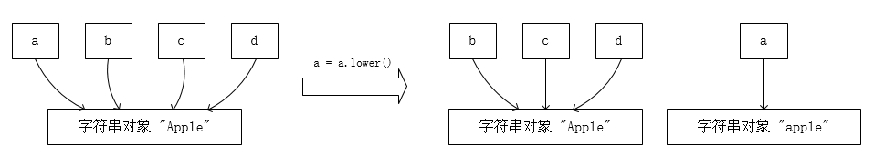

## 一、语句块的稀有用法

### 1.1 `#!python try` 语句块中 `#!python return` 和 `#!python finally` 的执行顺序

考虑下面这种情形，思考执行 `test()` 函数时会发生什么？

```python
def test():
    try:
        return 1
    finally:
        print('finish')
```

有经验的 Python 开发者对此应该很熟练，`#!python finally` 语句块在函数执行 `#!python return` 语句之后仍然会执行。对此，一种答案是函数返回 `1`，并在控制台输出 `finish`。

这种说法没有问题，但不是完全精确的，请先别着急寻找原因，让我们先看一下其他情形。

考虑下面这种情形，思考函数返回值是 `1` 还是 `2`。

```python
def test():
    try:
        return 1
    finally:
        return 2
```

这种情况可能会迷惑部分 Python 开发者，他们可能无法正确判断函数的返回值。

实际上，这个函数会返回 `2`。对此，我们看一下 Python [文档](https://docs.python.org/zh-cn/3/tutorial/errors.html) 中所述

!!! quote ""

    如果存在 `#!python finally` 子句，则 `#!python finally` 子句是 `#!python try` 语句结束前执行的最后一项任务。不论 `#!python try` 语句是否触发异常，都会执行 `#!python finally` 子句。以下内容介绍了几种比较复杂的触发异常情景：

     - 如果执行 `#!python try` 子句期间触发了某个异常，则某个 `#!python except` 子句应处理该异常。如果该异常没有 `#!python except` 子句处理，在 `#!python finally` 子句执行后会被重新触发。
     - `#!python except` 或 `#!python else` 子句执行期间也会触发异常。 同样，该异常会在 `#!python finally` 子句执行之后被重新触发。如果 `#!python finally` 子句中包含 `#!python break`、`#!python continue` 或 `#!python return` 等语句，异常将不会被重新引发。
     - 如果执行 `#!python try` 语句时遇到 `#!python break`、`#!python continue` 或 `#!python return` 语句，则 `#!python finally` 子句在执行 `#!python break`、`#!python continue` 或 `#!python return` 语句之前执行。
     - **如果 `#!python finally` 子句中包含 `#!python return` 语句，则返回值来自 `#!python finally` 子句的某个 `#!python return` 语句的返回值，而不是来自 `#!python try` 子句的 `#!python return` 语句的返回值。**

现在，我们已经掌握了关于 `#!python try` 语句块中 `#!python return` 和 `#!python finally` 的执行顺序的所有知识，来开始欢乐地做题吧：

请分析以下三个 `test()` 函数，并说明函数执行的最终结果（返回值？抛出异常？控制台输出？）

```python title="【1】raise 在返回之前还是之后执行"
def test():
    try:
        return 1
    finally:
        raise Exception('error')
```

```python title="【2】test2() 究竟会不会被执行"
def test2():
    print('test2!')
    return 2

def test():
    try:
        return test2()
    finally:
        raise Exception('error')
```

```python title="【3】在 except 中包含 return"
def test():
    try:
        return 1 / 0
    except ZeroDivisionError:
        return 2
    finally:
        return 3
```
 
??? success "答案"

    【1】中的函数最终以 `#!python raise Exception` 告终并且不会对外返回任何值。也就是说，抛出异常发生于返回结果之前，这是非常容易就能看出来的。

    【2】的结果可能会出乎很多人的意料，函数会先向控制台打印 `test2!`，然后接下来和【1】中的函数一样，抛出异常并且不会对外返回任何值。

    这意味着解释器会先将 `#!python return` 语句块中的结果（即 `test2()` 函数）计算并入栈，然后将 `#!python return` 语句块入栈，然后再将 `#!python finally` 语句块入栈。这就是为什么 `test2()` 函数会被执行的原因。

    【3】中的函数最终会返回 `3`，这在 Python 文档中并没有提及（属于是一个文档盲区），这同样可以用【2】的调用栈的思路来解释。

### 1.2 `#!python for` 语句块中，`#!python else` 语句块的作用

考虑以下情形，推测控制台的打印结果：

```python
for i in range(10):
    print(i)
    if i == 5:
        break
else:
    print('finish')
```

这个本来是一件很简单的事情，即控制台会逐行打印 `0` 到 `5`，然后结束，并且**不会**向控制台打印 `finish`。

令人遗憾的是，很多中文的 Python 教学书籍中往往忘记将 `#!python else` 子句的作用提及，这就导致了很多人对 `#!python for` 语句块中的 `#!python else` 子句的作用一知半解。

`#!python for` 语句块中的 `#!python else` 子句的作用是，当 `#!python for` 语句块中的 `#!python break` 语句没有被执行时，执行 `#!python else` 子句块中的语句。

部分网站上于该 `#!python else` 子句的用法也存在错误描述，例如 ~~“当 `#!python for` 语句的迭代行为没有正常结束时，执行 `#!python else` 子句块中的语句”~~，这是不正确的，因为你可以通过 `#!python return` 甚至是 `#!python raise` 语句来提前结束 `#!python for` 语句块的迭代行为，而这并不会导致 `#!python else` 子句块中的语句被执行。

### 1.3 `#!python while` 语句块中，`#!python else` 语句块的作用

同上，这次就不赘述了，直接说结论：当 `#!python while` 语句的循环条件为 `#!python False` 时，执行 `#!python else` 子句块中的语句。同理，`#!python return` 和 `#!python raise` 语句也不会导致 `#!python else` 子句块中的语句被执行。

例如：

```python
i = 0
while i < 10:
    print(i)
    i += 1
else:
    print('finish')
```

控制台会逐行打印 `0` 到 `9` 后，再打印 `finish`。

### 1.4 嵌套 `#!python for` 语句块中，`#!python break` 如何跳出全部循环

我们都知道，在 Python 中，如果在嵌套的 `#!python for` 循环中使用 `#!python break` 语句，只会跳出最近的一层循环，而不会跳出所有的循环。

这是一件很头大的事情，在某些情形下，我们希望该 `#!python break` 语句能够跳出所有的循环（例如在嵌套循环中寻找特定答案）。

于是我们可以利用先前提到的 `#!python for` 语句块中的 `#!python else` 语句块来实现这一目标。例如，我希望 `i` 和 `j` 都为 `5` 时跳出两层循环：

```python
for i in range(10):
    for j in range(10):
        print(i, j)
        if i == j == 5:
            break
```

上面的例子显然不能满足需求，该循环只会在 `#!python i == j == 5` 时跳出 `#!python for j in range(10)` 的单层循环。并且可以看到，控制台仍将继续打印后续循环的结果直到输出 `9 9` 才结束。

我们可以利用 `#!python else` 子句块来实现我们的目标：

```python
for i in range(10):
    for j in range(10):
        print(i, j)
        if i == j == 5:
            break
    else:
        continue
    break
```

这样，控制台最后一行的输出结果将会是 `5 5`。

## 二、可变对象

### 2.1 默认参数可变的危险性

```python
def test(a=[]):
    a.append(1)
    print(a)
```

在我的博客 [Python 默认参数可变的危险性](./220902-python-mutable-defaults.md) 中已经详细地讲述了这个问题，就不赘述了。

这里直接说结论：在这个例子中，每次调用 `test()` 函数时，函数形参 `a` 的默认值都会发生改变，即每次都会向该列表中追加整数 `1`。即：

```
>>> test()
[1]
>>> test()
[1, 1]
>>> test()
[1, 1, 1]
```

这是因为，函数定义时，所有的形参默认值会被初始化，然后存到 `__defaults__` 元组中。

然而，这样的初始化只在函数**被定义**时发生，而不是在**被调用**时发生。故每次被 `append(1)` 的本质上还是同一个列表。 

### 2.2 可变对象的拷贝

这是一个面试中经常被问到的问题，你的面试官闲的没事就会来考察你这个知识点。这个问题的关键在于你对 Python 可变对象的内存实现的理解。

考虑以下两个例子：

```python
a = [1, 2, 3]
b = a
b[0] = 0
print(a)  # [0, 2, 3]
```

```python
a = [1, 2, 3]
b = a.copy()
b[0] = 0
print(a)  # [1, 2, 3]
```

在第一个例子中，我们将 `a` 赋值给 `b`，然后修改 `b` 的第一个元素，这时 `a` 的第一个元素也被修改了。这是因为，`a` 和 `b` 都指向了同一个内存地址，所以修改 `b` 的值，也就是修改了 `a` 指向的内存地址中的值。

你甚至可以把上面两个例子改写成 C 语言的形式：

```c
int a[3] = {1, 2, 3};
int *b = a;
b[0] = 0;
printf("%d %d %d\n", a[0], a[1], a[2]);  // 0 2 3
```

```c
int a[3] = {1, 2, 3};
int b[3];
memcpy(b, a, sizeof(a));
b[0] = 0;
printf("%d %d %d\n", a[0], a[1], a[2]);  // 1 2 3
```

后者这样的行为被称为对象的（浅）拷贝，除了使用 `a.copy()` 外，你还可以使用以下的方式实现对象的浅拷贝：

```python
b = a[:]
b = list(a)
b = a * 1
b = a + []
b = [i for i in a]
```

!!! quote "（Python 文档）copy --- 浅层 (shallow) 和深层 (deep) 复制操作"

    Python 的赋值语句不复制对象，而是创建目标和对象的绑定关系。对于自身可变，或包含可变项的集合，有时要生成副本用于改变操作，而不必改变原始对象。

### 2.3 浅拷贝与深拷贝

在前面已经简单介绍了拷贝的概念，既然提到了拷贝，就不得不提到浅拷贝与深拷贝。

在 [Python 默认参数可变的危险性](./220902-python-mutable-defaults.md#21) 中我们已经知道：

 - 如果有多个对象的引用（即指针）指向同一个可变对象，那么使用其中任意一个引用对此对象进行修改，其他所有的引用都会产生相同的修改。
   
 - 如果有多个对象的引用指向同一个不可变对象，当使用其中任意一个引用对此对象进行修改，系统将会开辟一块新的内存区域用来存储修改过后的值，其他所有的引用仍然指向原来那片内存空间。
   

浅拷贝与深拷贝的相同点在于，它们都会创建并返回一个新的对象。它们的区别在于对可变对象的处理上。

若原对象中有一个元素是可变对象，浅拷贝会将该可变对象的引用直接存储在新对象中，而深拷贝会先将该可变对象拷贝一份到新的内存区域，再将该可变对象的副本的引用存储在新对象中。

或者使用 [文档](https://docs.python.org/zh-cn/3/library/copy.html) 中所述：

!!! quote "浅层与深层复制的区别"

    浅层与深层复制的区别仅与复合对象（即包含列表或类的实例等其他对象的对象）相关：

     - **浅层复制** 构造一个新的复合对象，然后（在尽可能的范围内）将原始对象中找到的对象的**引用**插入其中。
     - **深层复制** 构造一个新的复合对象，然后，递归地将在原始对象里找到的对象的**副本**插入其中。

以下是 3 种拷贝方式的对比：

```python
import copy

a = [1, 2, 3, [4, 5]]
b = a.copy()
c = copy.copy(a)
d = copy.deepcopy(a)

a[0] = 0
a[3][0] = 0

print(a)  # [0, 2, 3, [0, 5]]
print(b)  # [1, 2, 3, [0, 5]]
print(c)  # [1, 2, 3, [0, 5]]
print(d)  # [1, 2, 3, [4, 5]]
```

`#!python b = a.copy()` 和 `#!python c = copy.copy(a)` 是等价的，他们都是浅拷贝，而 `#!python d = copy.deepcopy(a)` 是深拷贝。

列表 `a` 中包含了 4 个元素，前三个元素 `1`, `2`, `3` 是不可变对象，第四个元素 `[4, 5]` 是可变对象。


上图，同一个颜色表示同一个地址。在浅拷贝中，原始对象 `a` 和副本 `b` 和 `c` 中第四个元素 `[4, 5]`（记为 `inner_list`）的地址是相同的，而在深拷贝中，原始对象 `a` 和副本 `d` 中第四个元素 `[4, 5]`（记为 `inner_list2`）的地址是不同的。

可以看到，当我们修改原始列表中一个不可变对象元素时，浅拷贝和深拷贝的结果都不会随之改变，而当修改的是一个可变对象时，浅拷贝的结果会随之改变，而深拷贝的结果不会随之改变。

### 2.4 在一行中同时定义和赋值多个变量

有一种看起来很酷的写法是：

```python
a = b = c = 0
```

但是这样写就有问题了：

```python
a = b = c = []
```

这同样是因为没有使用拷贝，上面这种写法相当于：

```python
a = []
b = a
c = a
```

这样写的隐患是，当我们修改 `a` 的值时，`b` 和 `c` 的值也会随之改变。

如果我们确实想定义三个空列表，那么可以这样写：

```python
a, b, c = [], [], []
```

## 三、Python 内存管理

### 3.1 整数缓冲区带来的整数变量地址问题

使用你的**交互式 Python 解释器**（不要使用 PyCharm 那个 Python 控制台），复制进以下代码：

```python
a = 1
b = 1
print(id(a))  # 1986116387056
print(id(b))  # 1986116387056
```

```python
a = 1000000
b = 1000000
print(id(a))  # 2119149214224
print(id(b))  # 2119149214384
```

为什么会不一样？这是因为 Python 解释器为了提高效率，对于一些常用的整数，会预先创建好，放在一个整数缓冲区中，当你需要使用这些整数时，直接从缓冲区中取出来使用，而不是重新创建。

这些被缓存的整数的范围是 `-5` 到 `256`。

!!! warning "注意"

    如果你将上面的代码存到 `.py` 文件里，再使用 `python` 命令运行，则可能不会产生预期的结果——即期望两个大数的 `id` 不同。这是因为 Python 解释器在运行时，会将代码编译成字节码，然后再执行字节码。而在编译过程中，Python 会自动对代码进行优化。

### 3.2 字符串内存重用

和上一小节一样，请使用你的交互式 Python 解释器运行：

```python
a = 'hello'
b = 'hello'
print(id(a))  # 2110320773168
print(id(b))  # 2110320773168
```

```python
a = 'hello!'
b = 'hello!'
print(id(a))  # 2119149796272
print(id(b))  # 2119149796336
```

它的具体实现可以看 [Intern selected string constants](https://hg.python.org/cpython/file/3.5/Objects/codeobject.c#l49)，可以看到，它使用了 [`all_name_chars()`](https://hg.python.org/cpython/file/3.5/Objects/codeobject.c#l11) 来检查字符串的每一个字符，后者实际上将会对所有 [能构成标识符的字符](https://hg.python.org/cpython/file/3.5/Objects/codeobject.c#l6)（字母、数字和下划线）返回 `true`。

个人推测这是为了优化 `__getattr__()`、`__setattr__()` 这两个魔法方法的调用，因为这些方法的参数都是字符串，并且这些字符串绝对都是标识符，如果不做这个优化，那么每次调用这些方法时，都会创建一个新的字符串对象，这样会造成大量的内存浪费。

### 3.3 内存泄露与引用计数

TODO

## 四、代码细节

### 4.1 空括号里的逗号

考虑以下两段代码：

```python
a = (1,)
print(type(a))  # <class 'tuple'>
```

```python
a = (1)
print(type(a))  # <class 'int'>
```

对于前者，`a` 对象的类型是 `tuple`，而对于后者，它的类型是 `int`。区别就在于那个逗号。

废话不多说直接看 [文档](https://docs.python.org/zh-cn/3/tutorial/datastructures.html#tuples-and-sequences)：

!!! quote "元组和序列"

    构造 0 个或 1 个元素的元组比较特殊：为了适应这种情况，对句法有一些额外的改变。用一对空圆括号就可以创建空元组；**只有一个元素的元组可以通过在这个元素后添加逗号来构建**（圆括号里只有一个值的话不够明确）。丑陋，但是有效。

### 4.2 元组定义时的优先级问题

考虑这个函数：

```python
def foo(self) -> tuple[int, int]:
    return 0, 0 if 'noinput' in self.type_list else super().foo()
```

这个函数的原始意图在于，它重写了父类的 `foo()` 方法，如果 `#!python self.type_list` 中没有 `'noinput'`，则直接调用父类的 `foo()` 方法进行返回，否则返回 `#!python (0, 0)`。无论如何，这个函数的返回值都应该是一个 `#!python tuple[int, int]` 类型。

然而这个函数是错误的，如果想让它按照期望工作，则必须得先在 `#!python 0, 0` 外面加一对圆括号。看下面两个例子：

```pycon
>>> a = 0, 0 if False else (1, 1)
>>> a
(0, (1, 1))
>>> b = (0, 0) if False else (1, 1)
>>> b
(1, 1)
>>>
```

我们可以看到，如果不加圆括号，那么会先计算 `#!python 0 if False else (1, 1)`，然后再构造元组，这就导致了 `a` 的值是 `#!python (0, (1, 1))`，而不是 `#!python (1, 1)`。

Python [文档](https://docs.python.org/zh-cn/3/tutorial/datastructures.html#tuples-and-sequences) 中指出，元组在被输入（或者说，被定义）时的圆括号可有可无，但如果元组是更大的表达式的一部分，那么圆括号是必须的。

这是我曾经制造的 [巨大 bug](https://github.com/Arcaea-Infinity/ArcaeaChartRender/commit/bbd56446a3ddedacd11cbceab30472dc8eadf6fa) 之一。

!!! failure ""

    在原来的 blog 的内容中，我认为这是 `#!python return` 语句与 `#!python if` 语句的优先级问题，但实际上这与 `#!python return` 语句无关，而是与元组的定义有关。

    感谢 [赵遂志 ZHAO Suizhi](https://github.com/zhaosuizhi) 在 [#12](https://github.com/zhanbao2000/blog/issues/12) 中及时指出了本小节中存在错误。

### 4.3 `#!python yield from` 和 `#!python return` 共存

考虑以下两段代码，

```python
def my_range(a):
    if a < 0:
        yield from (-x for x in range(-a))
    yield from (x for x in range(a))
```

```python
def my_range(a):
    if a < 0:
        yield from (-x for x in range(-a))
    return (x for x in range(a))
```

上面这两个例子是，我想构建一个自己的 `#!python range()`，叫做 `my_range()`，入参如果是负数的话，就从 `0` 往负数方向迭代。

我赌五毛钱，即使是有经验的开发者也会觉得这两段代码是等价的。

真的是这样吗？且不说结论，我们先看看这两段代码的执行结果：

首先是第一个函数：

```python
def my_range(a):
    if a < 0:
        yield from (-x for x in range(-a))
    yield from (x for x in range(a))

print(list(my_range(5)))  # [0, 1, 2, 3, 4]
print(list(my_range(-5)))  # [0, -1, -2, -3, -4]
```

完全没有问题，完全符合预期。

那么第二个函数：

```python
def my_range(a):
    if a < 0:
        yield from (-x for x in range(-a))
    return (x for x in range(a))

print(list(my_range(5)))  # []
print(list(my_range(-5)))  # [0, -1, -2, -3, -4]
```

？？？

我们看到了 `my_range(5)` 的执行结果的不同：使用 `#!python yield from` 语句的函数返回的生成器可以正常地像 `#!python range(5)` 一样迭代，而使用 `#!python return` 语句的函数返回的生成器却是个空的。那我们的 `#!python return (x for x in range(a))` 返回到哪里去了呢？

别急，我们可以在 `#!python try` 中找到它：

```python
try:
    next(my_range(-5))
except StopIteration as e:
    print(type(e.value))  # <class 'generator'>
    print(list(e.value))  # [0, -1, -2, -3, -4]
```

我们发现，`#!python return (x for x in range(a))` 返回的生成器被送到了 `#!python StopIteration` 异常的 `value` 属性中。

为了解释这个现象，我们首先必须了解一点：如果一个函数里包含 `#!python yield` 关键字（包括 `#!python yield from`），无论这个 `#!python yield` 在哪，有没有机会被执行，这个函数的返回值永远是生成器，例如：

```python
def foo():
    if True:
        return 1
    else:
        yield from ()

print(type(foo()))  # <class 'generator'>
```

这里的 `#!python yield from ()` 语句永远不会被执行，甚至看上去这个函数的返回类型应该是 `#!python int`，但是 `#!python foo()` 的返回值仍然是生成器。

既然返回的是一个生成器，那么该生成器必须指定一个迭代结束标志，即在迭代结束时抛出 `#!python StopIteration` 异常，意为不能产生下一项。任何一个规范的迭代器（生成器）在迭代结束时都将抛出 `#!python StopIteration` 异常，并由调用者处理，例如我们的 `#!python (x for x in range(a))` 生成器表达式。

而如果在生成器函数中强行 `#!python return`，这意味着迭代过程将被提前结束，于是我们本轮迭代成为了最后一轮迭代，由于此处使用了 `#!python return` 取代 `#!python yield`，故调用者无法获取最后一轮迭代的结果（调用者只能从 `#!python yield` 获知迭代结果）。

（请注意：函数中执行到 `#!python return` 意味着函数必须立即结束或执行 `#!python finally` 语句块（如果有的话），即便这是一个生成器函数）

原则上此时应该抛出 `#!python StopIteration` 异常通知生成器的调用者该迭代过程已经结束。雪上加霜的是，`#!python return` 之后没有任何可能来抛出一个 `#!python StopIteration` 异常。因此在这种复杂情况下，解释器会替我们抛出一个 `#!python StopIteration` 异常，函数返回的值将被用作异常构造器的 `value` 形参。

见 [文档](https://docs.python.org/zh-cn/3.10/library/exceptions.html#StopIteration)：

!!! quote "exception StopIteration"

    当一个 `generator` 或 `coroutine` 函数返回时，将引发一个新的 `#!python StopIteration` 实例，函数返回的值将被用作异常构造器的 `value` 形参。

现在我们可以解释 `#!python return` 时发生了什么了：由于函数中包含 `#!python yield` 关键字，故解释器认为该函数永远返回的是一个生成器。当我们直接使用 `#!python return XXXX` 试图以 `XXXX` 作为返回结果时（无论 `XXXX` 是何种类型），解释器会认为该生成器提前结束，并替我们抛出一个 `#!python StopIteration` 异常，将 `XXXX` 的值保存在异常实例的 `value` 属性中。

同时，对调用者而言，它获取的迭代结果是在 `#!python return XXXX` 语句之前所有通过 `#!python yield` 产生的结果。在我们的第二个 `my_range()` 函数中，我们没有通过 `#!python yield` 产生任何值就直接 `#!python return` 了，因此调用者获得的就是一个空的生成器。

这个 `#!python return XXXX` 语句就像一个小丑🤡一样，它想让 `XXXX` 作为它所在函数的返回值，可未曾想到解释器只是将这个可怜的值分配给了一个异常实例的一个属性。而同处一个屋檐下的 `#!python yield` 制造的每一个值，都会被函数的调用者全盘接纳。甚至当 `#!python yield` 无法被执行以至于它无法制造任何值时，解释器宁可为调用者返回一个空的生成器，也不愿意将 `#!python return` 的值交给调用者。而造成这一切的，仅仅是这个函数中存在一个 `#!python yield` 关键字💔。

这同样也是我曾经制造的 [巨大 bug](https://github.com/Arcaea-Infinity/ArcaeaChartRender/commit/9f40ec1a519197a3f8193207edf5a2cd7e96d2ff) 中的一个。


### 4.4 仅限位置形参

```python
def foo(a, b, /, c, d):
    print(a, b, c, d)
```

这是 Python 3.8 新增的一个 [特性](https://docs.python.org/zh-cn/3.8/whatsnew/3.8.html#positional-only-parameters)，即仅限位置形参。

在 Python 中，`/` 符号在函数定义中的作用是指定位置参数。在 `/` 之前的参数必须作为位置参数传递，不能作为关键字参数传递。这意味着，这些参数只能按照它们在函数定义中的顺序提供，而不能通过参数名来指定。

例如，对于上述函数，`a` 和 `b` 必须作为位置参数，而 `c` 和 `d` 可以作为位置参数或关键字参数。

因此以下调用方式是正确的：

```python
foo(1, 2, 3, 4)
foo(1, 2, c=3, d=4)
```

而以下调用方式是错误的：

```python
foo(a=1, b=2, c=3, d=4)  
# TypeError: foo() got some positional-only arguments passed as keyword arguments: 'a, b'
```

## 五、运算符

### 5.1 正负数在整数除法中求商的不同及其余数的值

先说结论：[运算结果总是向负无穷的方向舍入](https://docs.python.org/zh-cn/3/library/stdtypes.html#numeric-types-int-float-complex)。

```python
print(7 / 3)  # 2.3333333333333335
print(7 // 3)  # 2
print(7 % 3)  # 1
```

```python
print((-7) / 3)  # -2.3333333333333335
print((-7) // 3)  # -3
print((-7) % 3)  # 2
```

何为舍入规则？舍入规则是指在整数除法中，当商（暂时视为浮点数）为负数时，对于商的取整的不同做法。在 Python 中采用**向下取整**。

<div markdown>

{ align=right width=40% }

几乎所有的计算系统中，$a$ 除以 $n$ 得到商 $q$ 和余数 $r$ 均满足以下式子：

$$
q\in Z, a = n q + r, |r| < |n|
$$

右边是🔴商（$q$）和🟢余数（$r$）作为被除数（$a$）的函数时的图像。左侧是除数为正的情况，右侧除数为负。从上至下分别使用了：向零取整、向下取整和欧几里德除法。

以上面的例子为例，当计算 `-7 // 3` 时，直接计算得 `-2.333`，根据**向下取整**将其舍入为 `-3`，故 `-7 // 3 == -3`。由于 `(-3) * 3 + 2 == -7`，故 `-7 % 3 == 2`。Python、Java、Ruby、Mathematica 和 MATLAB 等采用的就是这种方式。

在 C、C#、Go 和 Kotlin 等语言中，使用的是**向零取整**（又称为截断除法），即放弃小数位，当计算 `-7 // 3` 时，将浮点商 `-2.333` 舍入为 `-2`，故 `-7 // 3 == -2`。由于 `(-2) * 3 + 1 == -7`，故 `-7 % 3 == 1`。

<div style="clear:both"></div>

</div>


每个语言的设计者都可以自由地选择自己的舍入规则，从而使计算结果五花八门。在整数除法中由于舍入规则的不同而导致的这种奇葩现象，也可以等价地看作另一个问题，即——*不同编程语言下整数取模运算的符号是跟随被除数还是除数*。[约四成的编程语言取模结果与除数符号一致](https://zh.wikipedia.org/wiki/%E6%A8%A1%E9%99%A4)，~~基本可以认为是五五开，因此请不要将某一特定编程语言的结果当作教条~~。

Python 之父 Guido van Rossum 在 [The History of Python](http://python-history.blogspot.com/2010/08/why-pythons-integer-division-floors.html) 表达了自己的看法，即为什么 Python 采用了这种舍入规则。他的观点是：

=== "原文 🇬🇧"

    In mathematical number theory, mathematicians always prefer the latter choice (see e.g. [Wikipedia](http://en.wikipedia.org/wiki/Modulo_operation)). For Python, I made the same choice because there are some interesting applications of the modulo operation where the sign of a is uninteresting. Consider taking a POSIX timestamp (seconds since the start of 1970) and turning it into the time of day. Since there are 24*3600 = 86400 seconds in a day, this calculation is simply t % 86400. But if we were to express times before 1970 using negative numbers, the "truncate towards zero" rule would give a meaningless result! Using the floor rule it all works out fine.

    Other applications I've thought of are computations of pixel positions in computer graphics. I'm sure there are more.

=== "翻译 🇨🇳"

    在数论中，数学家总是倾向于后一种选择（即将商向下取整），见 [维基百科](https://zh.wikipedia.org/wiki/%E6%A8%A1%E9%99%A4)（译者注：可见 Mathematica 和 MATLAB 都采用了这种方式）。对于 Python 来说，我也做了同样的选择，因为在取模操作的一些应用中，除数的符号才是关键的，而不是被除数的符号。例如考虑把一个 POSIX 时间戳换算成一天的时间。因为一天有 `24 * 3600 = 86400`秒，所以这个计算理论上应该就是 `t % 86400`。但是，如果我们要用负数来表示 1970 年以前的时间，那么**截断除法**的规则就会得到一个负数的秒数，这是毫无意义的。而向负无穷的方向舍入商的话，一切都会很顺利。

    我想到的其他应用是计算机图形中像素位置的计算。我相信还有更多这样的例子。

### 5.2 `#!python is` 和 `#!python ==` 运算符的区别

直接说结论：`#!python is` 运算符用于判断两个对象是否是同一个对象，`#!python ==` 运算符用于判断两个对象是否相等。

你可以在任意对象中重载 `#!python __eq__` 魔法方法，从而使这个对象支持 `==` 运算。

```python
a = 1
b = 1
print(a is b)  # True
print(a == b)  # True
```

```python
a = 1000
b = 1000
print(a is b)  # False
print(a == b)  # True
```

这两个例子复习了我们在 [3.1 整数缓冲区带来的整数变量地址问题](#31) 中讨论过的问题。显然 `a == b` 是不需要解释的，而第一个例子中 `#!python a is b` 的结果是 `#!python True`，而第二个例子中 `#!python a is b` 的结果是 `#!python False`，这是因为 `1000` 是大整数，超过了缓存所应用范围，故第二个例子中 `a` 和 `b` 的地址不同，即不是同一个对象。

```python
a = []
b = []
print(a is b)  # False
print(a == b)  # True
```

这里 `#!python a is b` 结果是 `#!python False` 的原因更简单，列表不是整数也不是字符串，系统不会为他们采用缓存机制，因此 `a` 和 `b` 的地址肯定是不同的。或者说，Python 中绝大部分对象的地址都是不同的，除非你明确赋值 `a = b`。

## 六、系统

### 6.1 `#!python os.listdir()` 在不同系统上的排序

直接说结论，如果在 Windows 上执行 `#!python os.listdir()`，那么得到的结果是**按照文件名的字母顺序排序**的，而在 Linux 上执行 `#!python os.listdir()`，得到的结果是**乱序**的。

=== ":simple-windows: Windows"

    ```powershell
    PS D:\> mkdir test | cd test
    PS D:\test> ni 2 | ni 1 | ni 9 | ni 5
    PS D:\test> python
    Python 3.10.2 (tags/v3.10.2:a58ebcc, Jan 17 2022, 14:12:15) [MSC v.1929 64 bit (AMD64)] on win32
    Type "help", "copyright", "credits" or "license" for more information.
    >>> import os
    >>> os.listdir('.')
    ['1', '2', '5', '9']
    >>>
    ```

=== ":simple-linux: Linux"

    ```bash
    pi@raspberrypi:~ $ mkdir test && cd test
    pi@raspberrypi:~/test $ touch 2 && touch 1 && touch 9 && touch 5
    pi@raspberrypi:~/test $ python3
    Python 3.7.3 (default, Jan 22 2021, 20:04:44) 
    [GCC 8.3.0] on linux
    Type "help", "copyright", "credits" or "license" for more information.
    >>> import os
    >>> os.listdir('.')
    ['1', '2', '9', '5']
    >>> 
    ```

在 Linux 下的排序方式很奇怪，既不是按照文件名的字母顺序排序，也不是按照创建或修改时间排序。总之你可以将其视为乱序。

如果你使用了 `#!python os.listdir()` 的程序强烈依赖于文件名的字母顺序排序，那么你需要在 Linux 上执行 `#!python os.listdir()` 之后先使用 `#!python sorted()` 对结果进行排序。

### 6.2 `#!python os.path.join()` 采用不同的分隔符

在 Windows 上，`#!python os.path.join()` 采用的是两个反斜杠 `\\` 作为分隔符，而在 Linux 上，`#!python os.path.join()` 采用的是正斜杠 `/` 作为分隔符。

=== ":simple-windows: Windows"

    ```python
    os.path.join('a', 'b')
    # 'a\\b'
    ```

=== ":simple-linux: Linux"

    ```python
    os.path.join('a', 'b')
    # 'a/b'
    ```

这个问题通常不会对程序造成太大影响，因为我们使用 `#!python os.path.join()` 传入需要以路径作为参数的函数时，一定是在同一个操作系统内进行的。
