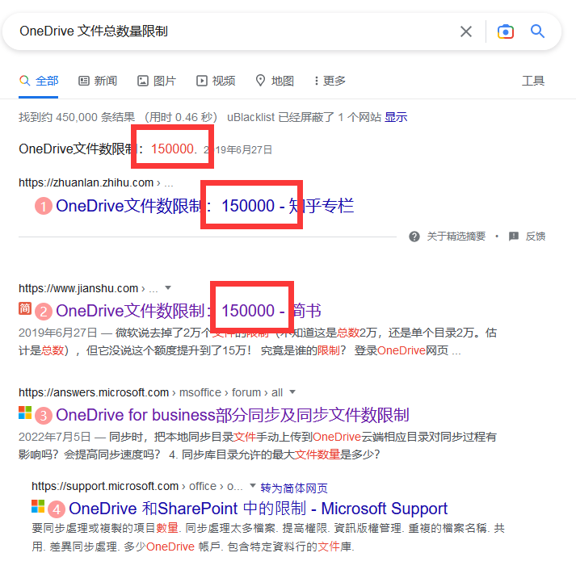

## 一、前言

### 1.1 什么是 Hentai@Home

不少人应该知道 [E-Hentai](https://e-hentai.org/)，这是世界上最大的漫画网站之一。作为承担这个网站巨大负载的一部分，E-Hentai 提供了一个名为 [Hentai@Home](https://e-hentai.org/hentaiathome.php) 的项目（以下简称 H@H），它的目的是利用用户的电脑协助 E-Hentai 服务器缓存图片，从而减轻服务器的负担。

H@H 是一个可以比作 SETI@home 项目和 BitTorrent 之间交叉的项目。

所有参与的用户都运行一个小型的基于 Java 的客户端，从 E-Hentai 的中心服务器下载画廊的图像并缓存到他们的电脑，并将这些缓存传递给其他浏览 E-Hentai 画廊的人。这使 E-Hentai 能够使用较少的中心服务器带宽提供更多的图像。

### 1.2 什么是 SharePoint

虽然狭义上来说，SharePoint 只是大伙们用于白嫖微软来存储并分发文件的一个网盘，但是实际上，我们在此过程中用到的仅仅是 SharePoint 的 OneDrive 功能。

SharePoint 实际上是一个企业级的协作平台，它可以帮助企业管理、存储、共享和保护信息，同时还可以帮助企业更好地与客户、供应商和合作伙伴进行沟通和协作。

在此篇博客中，我们仅仅将 SharePoint 作为一个网盘来使用。

### 1.3 什么是 Rclone

[Rclone](https://rclone.org/) 是一个开源的命令行工具，它可以用于在本地和各种云存储之间同步文件。它支持 50 多种云存储，包括 Dropbox、Google Drive、OneDrive、Amazon S3、Backblaze B2、OpenStack Swift、Hubic、Yandex Disk 等等。

借助 Rclone 我们可以将 SharePoint 的 OneDrive 挂载到本地，从而实现将 H@H 的缓存目录放在 SharePoint 上。

## 二、准备工作

在开始之前，为了节约时间，我假设你已经：

 - [x] 具有扎实的 Linux 和 Windows 的命令行知识
 - [x] 拥有具有大容量 SharePoint 的 Microsoft 账号
 - [x] 了解 H@H 的工作原理，并且具有运行 H@H 的经验
 - [x] 拥有云服务器，并且它同时与 H@H 和 SharePoint 连接状况良好
 - [x] 拥有 [CET4](http://cet.neea.edu.cn/cet/) 证书，并且笔试成绩至少为 425 分（或在其他测试中取得同等效力的成绩）

!!! tip "提示"

    如果你不具备以上条件中的任意一个，我建议你先去完成这些准备工作。这些工作不是本篇博客的讨论范围，且互联网上已经有充分多的其他文章来讲解这些内容。

### 2.1 安装 Rclone

Rclone 提供了相当丰富的安装方式，包括但不限于：

 - 通过包管理器安装 
 - 通过二进制文件安装
 - 通过源码安装
 - 通过 docker 安装
 - 通过安装脚本安装

你可以查看它的 [文档](https://rclone.org/install/)，或是使用下面的步骤来安装：

#### 直接下载

[https://rclone.org/downloads/](https://rclone.org/downloads/)

视你的系统，选择 `.deb` 或 `.rpm` 文件，下载后直接使用 `dpkg -i` 或 `rpm -i` 安装即可。

#### 使用包管理器

=== "Debian/Ubuntu"

    ```bash
    sudo apt install rclone
    ```

=== "CentOS"

    ```bash
    sudo yum install rclone
    ```

### 2.2 获取 OneDrive 的 `client_id` 和 `client_secret`

请参考这篇博客：[创建微软OneDrive API](https://333rd.net/zh/posts/tech/%E5%88%9B%E5%BB%BA%E5%BE%AE%E8%BD%AFonedrive-api/)

最终你将拿到你的 `client_id` 和 `client_secret`。

!!! warning "注意"

    请及时记录你的 `client_secret`，它只会在生成的时候显示一次。

## 三、分水岭

之所以称之为分水岭，是因为有些 Microsoft 账号无法取得 OAuth 授权。这将导致后面的步骤截然不同。

请根据以下步骤，来得知你应该走分水岭的哪一侧：

首先，在你的电脑上 [下载](https://rclone.org/downloads/) Rclone（因为必须使用浏览器进行 OAuth），然后执行下面的命令，并按照你的实际 `client_id` 与 `client_secret` 填入：

```powershell
./rclone authorize "onedrive" -- "client_id" "client_secret"
```

此时，Rclone 会在浏览器中打开一个网页，要求你登录你的 Microsoft 账号。

1. 如果你能正常在控制台中看到你的 token：

    ```
    token = {"access_token":"xxxxxxxxxxxxxxxxxx","expiry":"yyyyyyyyyyyyyyyy"}
    ```

    记录该 token 备用。然后按照 [四、创建 Rclone remote](#rclone-remote) 继续。

2. 如果你在网页中看到如下错误：

    ```
    Failure!
    Error: Auth Error
    Description: No code returned by remote server
    ```

    请按照 [通过 WebDAV 解决 Rclone 挂载 SharePoint 时遇到 Error: Auth Error](./221113-rclone-sharepoint-oauth-failed.md) 的方法，来解决这个问题，解决之后请直接跳过第四节从而阅读 [五、测试并挂载 remote](#remote)。

## 四、创建 Rclone remote

至此，你已经取得了三样东西：

 - 你的 `client_id`
 - 你的 `client_secret`
 - 你的 `access_token`

在你的云服务器上执行：

```bash
rclone config
```

会出现：

```
e) Edit existing remote
n) New remote
d) Delete remote
r) Rename remote
c) Copy remote
s) Set configuration password
q) Quit config
e/n/d/r/c/s/q>
```

选择 `n`，新建一个，并将该新 remote 命名，假设我们命名为 `od4hath`。

之后会出现：

```
Type of storage to configure.
Enter a string value. Press Enter for the default ("").
Choose a number from below, or type in your own value

22 / Microsoft OneDrive
   \ "onedrive"

Storage>
```

不同版本 Rclone 的数字可能不同，我这里的 Microsoft OneDrive 对应的是 22，所以输入 22。

之后将要求输入你的 `client_id` 和 `client_secret`：

```
OAuth Client Id
Leave blank normally.
Enter a string value. Press Enter for the default ("").
client_id>
```

复制你的 `client_id` 即可。

```
OAuth Client Secret
Leave blank normally.
Enter a string value. Press Enter for the default ("").
client_secret>
```

复制你的 `client_secret` 即可。

之后会出现：

```
Edit advanced config? (y/n)
y) Yes
n) No (default)
```

选择 `n`，不需要编辑高级配置。

```
Remote config
Use auto config?
 * Say Y if not sure
 * Say N if you are working on a remote or headless machine
y) Yes (default)
n) No
y/n>
```

因为我们是在云服务器上配置，所以选择 `n`。此时 Rclone 会要求你输入你的 `access_token`：

```
For this to work, you will need rclone available on a machine that has
a web browser available.

For more help and alternate methods see: https://rclone.org/remote_setup/

Execute the following on the machine with the web browser (same rclone
version recommended):

        rclone authorize "onedrive"

Then paste the result below:
result>
```

复制你先前保存的 `access_token` 即可。

之后会出现：

```
Choose a number from below, or type in an existing value
 1 / OneDrive Personal or Business
   \ "onedrive"
 2 / Sharepoint site
   \ "sharepoint"
 3 / Type in driveID
   \ "driveid"
 4 / Type in SiteID
   \ "siteid"
 5 / Search a Sharepoint site
   \ "search"
Your choice>
```

视你自己情况而定。

之后你将获得一个已经配置好的 remote。

## 五、测试并挂载 remote

### 5.1 测试 remote

我们可以使用

```bash
rclone lsd od4hath:
```

来测试你的 remote 是否配置正确。

上述命令的含义是列出 `od4hath` 这个 remote 的根目录下的所有文件夹。

一般来说，如果这是一个全新的 OneDrive，那么你应该会看到一个名为 `Form` 的文件夹。这就代表你的 remote 已经配置成功了。

### 5.2 挂载 remote

创建一个新文件夹用于挂载，具体路径完全取决于你个人：

```bash
mkdir /root/rclone
mkdir /root/rclone/od4hath
```

然后再在你的 OneDrive 网页版中，于根目录下创建一个文件夹，命名为 `Hath`。

使用以下命令挂载：

```bash
rclone mount od4hath:Hath /root/rclone/od4hath --allow-other --transfers 4 --buffer-size 32M --vfs-read-chunk-size 128M --vfs-read-chunk-size-limit 0M --vfs-cache-max-size 8000M --vfs-cache-max-age 3360h --allow-non-empty --dir-cache-time 3360h --vfs-cache-mode full --umask 000 --vfs-cache-mode full --no-modtime --vfs-cache-poll-interval 30m
```

其中，`od4hath:Hath /root/rclone/od4hath` 指的是将名为 `od4hath` 的 remote 中的 `Hath` 文件夹挂载到本地的 `/root/rclone/od4hath` 目录。

如果你想挂载整个 remote 而不是其中某个文件夹，你可以使用：

```bash
rclone mount od4hath: /root/rclone/od4hath
```

这样 `/root/rclone/od4hath` 目录便指向了整个 remote。

命令行参数的含义请参阅 rclone [文档](https://rclone.org/commands/rclone_mount/)

请注意 `--vfs-cache-max-size` 参数的值为本地磁盘缓存大小，请勿设置过大。`--transfers` 与 `--buffer-size` 参数的乘积为每次传输的最大数据量，请根据你主机上的内存大小酌情设置。其中 `--buffer-size` 指示每个打开的文件描述符将使用这么多内存进行缓冲，`--transfers` 指示并行运行的文件传输数量。

如果你的 rclone 程序经常被 Killed，除了尝试减小 `--transfers` 和 `--buffer-size` 参数的值之外，你还可以：

 - 设置 `--use-mmap` 参数
 - 通过 `systemd` 的 `MemoryHigh` 和 `MemoryMax` 选项，在不触发 OOM Killer 的情况下限制 rclone 的内存使用量。（见 [How to set a memory limit?](https://forum.rclone.org/t/how-to-set-a-memory-limit/10230/12)）

### 5.3 测试挂载是否成功

现在，使用你的命令行，向该目录下随便写入一个文件：

```bash
touch /root/rclone/od4hath/test
```

在你的网页版 OneDrive 中查看 `Hath` 文件夹，你应该会看到一个名为 `test` 的文件。

!!! danger "危险"

    在这之后，千万不要直接在网页版 OneDrive 中随便删除已经挂载的文件和文件夹，这可能会导致意料之外的错误。

## 六、与 H@H 一同工作

现在停止你正在运行的 H@H 服务器，然后在网页版 H@H 控制台中选择 `Reset Static Ranges`。

!!! danger "危险"

    如果你的 `Static Ranges` 数量并不少（例如数千个），那么你或许可以试试将旧的缓存文件夹移入挂载目录。

    我并没有进行尝试，因为在这篇博客写好之前我的 `Static Ranges` 只有 40 个。我**不能确保**这样做是否会导致意料之外的错误。

    如果你移动文件夹之后一切工作正常，且 H@H 仪表盘中 `Trust` 值并没有夸张地减小，那么你可以放心地继续使用这种方法。

在挂载目录中添加一个 `cache` 文件夹作为缓存文件夹：

```bash
mkdir /root/rclone/od4hath/cache
```

编辑你的 H@H 服务器启动参数，加上一条额外的 `--cache-dir`，例如：

```bash
java -jar HentaiAtHome.jar --cache-dir=/root/rclone/od4hath/cache
```

然后运行即可。

## 七、注意事项

### 7.1 文件总数量限制

不少的云盘服务商都有文件总数量的限制，如果你在网上搜 `OneDrive 文件总数量限制`，你会发现搜索的结果是 `150000` 个。



因为这是 OneDrive 个人版的限制，而我们用的是 OneDrive for Business，它应该参考 SharePoint 的数量限制：


即 3000 万个。

或者参考微软 [文档](https://learn.microsoft.com/zh-cn/office365/servicedescriptions/sharepoint-online-service-description/sharepoint-online-limits#items-in-lists-and-libraries)。

按照每个文件平均 350 KB 来计算，3000 万个文件大约占用 10 TB 的空间，这已经超过了大多数人的 SharePoint 容量。

因此，我们可以可以在 H@H 控制台中分配尽可能多的空间，而不必担心文件数量的限制。

### 7.2 H@H 仪表盘中 `Trust` 值骤降

正常，降到负数也是正常的。

这是因为你重置了所有的 `Static Ranges`，尽管 E-Hentai 中心服务器已经通知整个 H@H 网络不再从你原有的 `Static Ranges` 获取任何资源，但总有部分缓存的客户端未收到该通知并继续连接到你的 H@H 程序，直到这些客户端被告知文件 404。

这些 404 状态码是你的 `Trust` 骤降的原因。

别担心，如果你的挂载文件夹配置正确，那么这个值会在很短的时间内恢复至正常水平。一般来说，一台日本的服务器，将在 4 小时内将 `Trust` 值上升至正数，在 8 小时内开始分配新的 `Static Ranges` 并分发文件，在 12 小时内 `Trust` 值将到达 800 以上。
