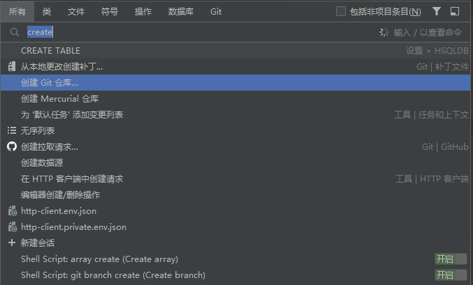
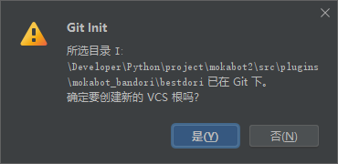
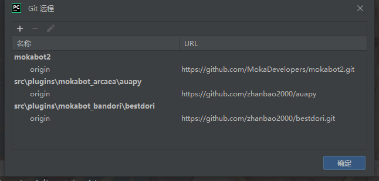
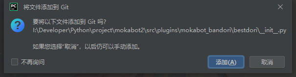
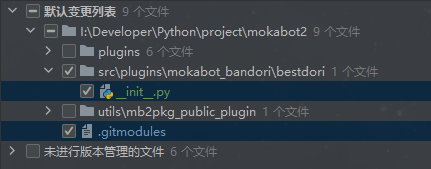
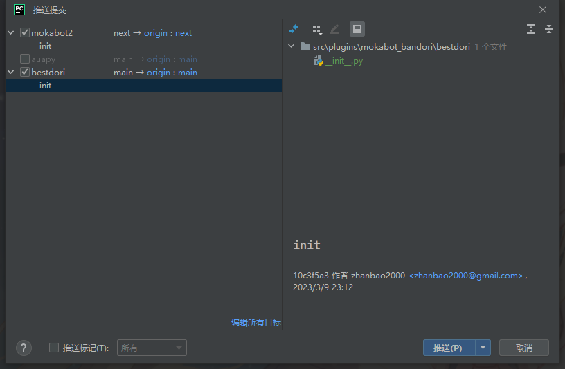
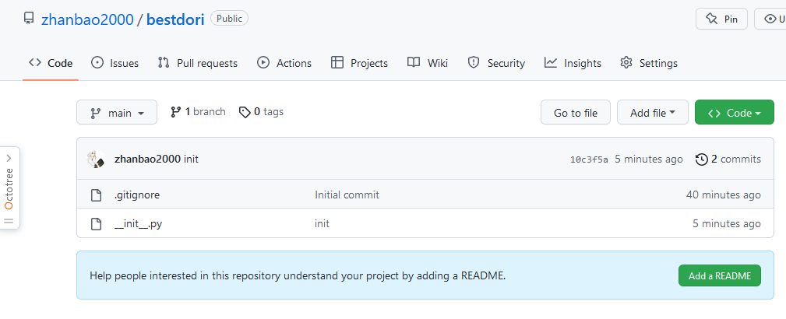
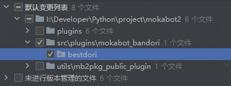
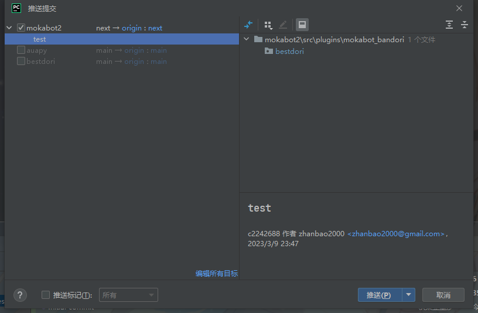
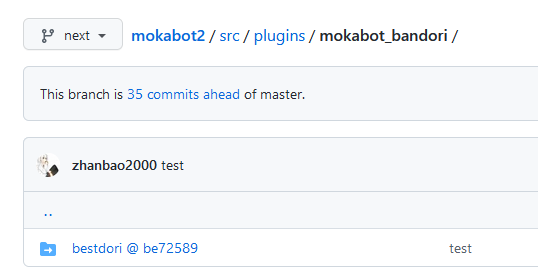

## 现状

截至 2023 年 3 月，JetBrains 全家桶仅对 Git Submodule 功能提供很有限的支持。在 PyCharm 中甚至根本看不到 Git Submodule 的身影。

本文通过 `git` 命令行和 PyCharm 新建 Git 仓库的方法，来曲线救国地解决这个问题。

## 步骤

### 1. 在 GitHub 上新建一个仓库

由于 `git submodule` 命令只能接远程仓库作为参数，因此此步骤需要我们在 GitHub 上新建一个仓库，用于存放我们的子模块。

如果你需要导入的子模块已经存在于 GitHub 上，那么你可以直接跳过这一步。

### 2. 将远程仓库以子模块形式添加到目标目录

**进入目标目录中**，然后使用 `git submodule add` 命令将远程仓库以子模块形式添加到主项目的目标目录。

`git submodule add` 命令的语法为：

```bash
git submodule add <远程仓库地址> <子模块目录>
```

因此我们执行：

```bash
cd src/plugins/mokabot_bandori
git submodule add https://github.com/zhanbao2000/bestdori.git bestdori
```

此时 `src/plugins/mokabot_bandori` 目录下会多出一个 `bestdori` 目录，这就是我们的子模块。

### 3. 在 PyCharm 中导入该 Git 仓库

目前为止，`git` 命令行已经知道这是一个子模块了，但是目前 PyCharm 还不知道这是一个子模块，甚至不知道这是一个 Git 仓库。

双击 ++shift++，输入 `create`，找到 `创建 Git 仓库`。

（由于主项目已经建立过本地的 Git 仓库，PyCharm 的 Git 工具栏将不再出现这个选项，因此只能在搜索里找到）



仓库目录选择我们的子模块目录 `bestdori`。

这里会提示是否要创建新的 VCS 根，选择 `是`。



### 4. 检查远程仓库映射是否成功

此时打开 Git 工具栏中的 `管理远程..` 选项



可以看到刚刚的子模块 `bestdori` 已经成功映射到远程的 `origin` 了，那么说明操作成功。

### 5. 将子模块的变更提交到本地

随意进行一些变更，例如，在 PyCharm 中，在 `bestdori` 目录下新建一个文件。



PyCharm 会提示你是否要添加至 `git`，这里选 `是`，当然你也可以稍后自行添加。

添加一些内容后，进行提交。



可以看到一共有两个文件的变更，一个是我们刚刚在子模块中创立的 `__init__.py`，另一个是主项目的 `.gitmodules`，直接提交即可。

这两个文件将会**分别提交到独立的本地 Git 仓库中**。

之所以会有 `.gitmodules`，那当然是因为我们刚刚添加了新的子模块，这个文件只会在子模块被添加时更新一次。

### 6. 将子模块的变更推送到远程仓库

在 Git 工具栏中，点击 `推送..`。



可以看到共有两个仓库各一处变更，一处是子模块的 `__init__.py`，另一处是主项目的 `.gitmodules`，没有问题，直接推送即可。



推送后去 GitHub 上看，可以看到子模块 `bestdori` 的远程仓库已经成功推送了。

### 7. 将子模块的变更推送到主项目的远程仓库

再次进入提交页面，可以看到 `bestdori` 整个文件夹被列了出来。



勾选他，提交，然后推送。



可以看到刚刚的这次提交是属于主项目的，这一步的意义在于，通知主项目的 Git 远程仓库，子模块的远程仓库已经更新了。

推送后查看主项目的远程仓库：



可以看到主项目的远程仓库中已经正确识别了这是一个子模块，并且子模块的推送版本也是最新的。

!!! tips "提示"

    之后每次想要对子模块进行一些更改，并使主项目同步变更，只需重复步骤 5 ~ 9 即可。
