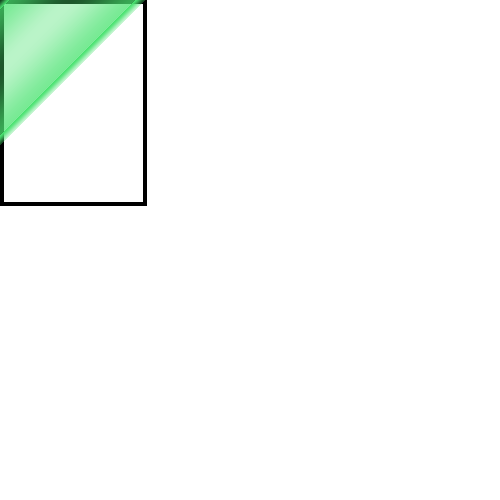
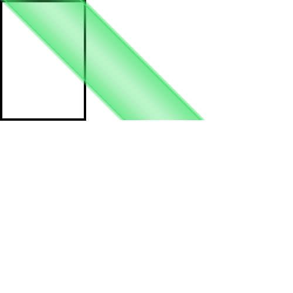
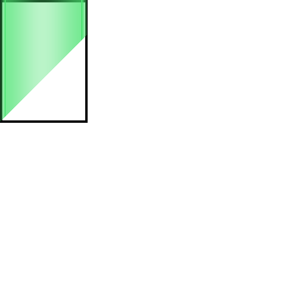
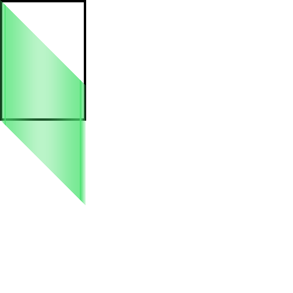

## 一、背景

在渲染邦邦谱面时，需要渲染绿条。绿条不一定是个矩形，在起点和终点不一致时，是个变换过后的平行四边形，而素材文件只有一个矩形。这就需要我们用 Pillow 将素材文件进行变换，使其变成一个平行四边形。

<figure markdown>
  
  <figcaption>longNoteLine.png</figcaption>
</figure>

## 二、渲染方法

可以使用 [`#!python img.transform`](https://pillow.readthedocs.io/en/stable/reference/Image.html#PIL.Image.Image.transform) 和 [`#!python Image.AFFINE`](https://pillow.readthedocs.io/en/stable/reference/Image.html#PIL.Image.Image.transform) 来实现。

即：

```python
img2 = img.transform(bg.size, Image.AFFINE, (1, -0.5, 0, 0, 2, 0))
```

其中：

 - `#!python bg.size` 是最终图像的裁剪大小，在变换完成后，Pillow 会将图片裁剪至该大小。
 - `#!python Image.AFFINE` 是变换类型，这里是仿射变换。
 - `#!python (1, -0.5, 0, 0, 2, 0)` 是变换矩阵，用于描述仿射变换的参数。

## 三、变换矩阵

$$
\begin{bmatrix}
xScale & xSkew & xTranslate \\
ySkew & yScale & yTranslate \\
0 & 0 & 1 \\
\end{bmatrix}
$$

对应的 Python 代码为：

```python
matrix = (xScale, xSkew, xTranslate, ySkew, yScale, yTranslate)
```

即直接将矩阵的各值按行展开，然后按顺序放入一个元组中。

## 四、矩阵各值对 Pillow 实际图像的影响

这里使用了以下脚本来展示矩阵各值的几何含义：

```python hl_lines="13"
from PIL import Image, ImageDraw

bg = Image.new('RGBA', (500, 500), (255, 255, 255, 0))
img = Image.open('longNoteLine2.png').convert('RGBA')

# 绘制原图轮廓，以便观察变换
outline = Image.new('RGBA', bg.size, (255, 255, 255, 0))
draw = ImageDraw.Draw(outline)
draw.rectangle((0, 0, 0 + img.size[0], 0 + img.size[1]), fill=(0, 0, 0, 0), width=4, outline=(0, 0, 0, 255))
bg.alpha_composite(outline, (0, 0))

# 进行变换
img2 = img.transform(bg.size, Image.AFFINE, (1, 0, 0, 0, 1, 0))

bg.alpha_composite(img2, (0, 0))
bg.show()
```

我将不断调整矩阵的值，并展示变换后的图像。

!!! warning "注意"

    在 Pillow 中，采用的是左上角为原点的坐标系，而不是数学中的左下角为原点的坐标系。

### 4.1 x 轴缩放系数 `xScale`

`#!python (1, 0, 0, 0, 1, 0)`：

什么都不修改时，图像不变：


`#!python (2, 0, 0, 0, 1, 0)`：

`xScale == 2`，将图像在 x 轴方向上缩小至原来的 1/2。


`#!python (0.5, 0, 0, 0, 1, 0)`：

`xScale == 0.5`，将图像在 x 轴方向上放大至原来的 2 倍。


### 4.2 x 轴旋转系数 `xSkew`

`#!python (1, 1, 0, 0, 1, 0)`：

`xSkew == tan(45°) == 1`，保持**上底边**位置不变，将平行四边形**下底边**在 x 轴**负**方向倾斜至 45°。



`#!python (1, -1, 0, 0, 1, 0)`：

`xSkew == tan(-45°) == -1`，保持**上底边**位置不变，将平行四边形**下底边**在 x 轴**正**方向倾斜至 45°。



### 4.3 x 轴平移系数 `xTranslate`

`#!python (1, 0, 100, 0, 1, 0)`：

`xTranslate == 100`，将图像在 x 轴**负**方向上平移 100 像素。


`#!python (1, 0, -100, 0, 1, 0)`：

`xTranslate == -100`，将图像在 x 轴**正**方向上平移 100 像素。


### 4.4 y 轴旋转系数 `ySkew`

`#!python (1, 0, 0, 1, 1, 0)`：

`ySkew == tan(45°) == 1`，保持**左底边**位置不变，将平行四边形**右底边**在 y 轴**负**方向斜切至 45°。



`#!python (1, 0, 0, -1, 1, 0)`：

`ySkew == tan(-45°) == -1`，保持**左底边**位置不变，将平行四边形**右底边**在 y 轴**正**方向斜切至 45°。



### 4.5 y 轴缩放系数 `yScale`

`#!python (1, 0, 0, 0, 2, 0)`：

`yScale == 2`，将图像在 y 轴方向上缩小至原来的 1/2。


`#!python (1, 0, 0, 0, 0.5, 0)`：

`yScale == 0.5`，将图像在 y 轴方向上放大至原来的 2 倍。


### 4.6 y 轴平移系数 `yTranslate`

`#!python (1, 0, 0, 0, 1, 100)`：

`yTranslate == 100`，将图像在 y 轴**负**方向上平移 100 像素。


`#!python (1, 0, 0, 0, 1, -100)`：

`yTranslate == -100`，将图像在 y 轴**正**方向上平移 100 像素。


