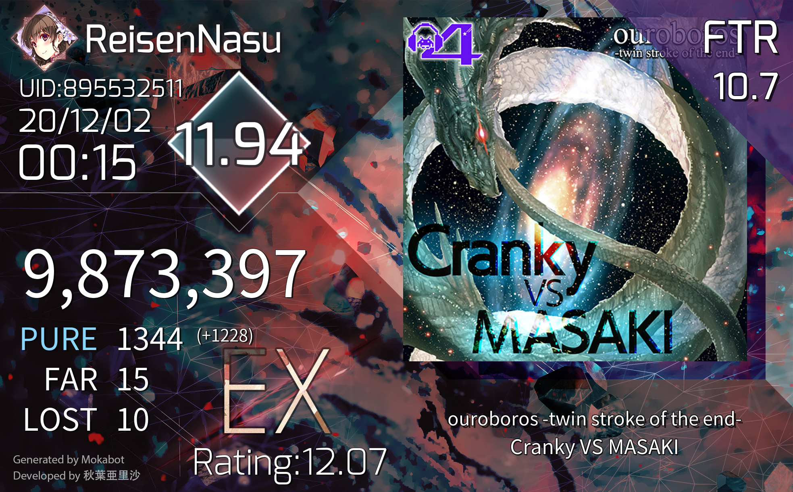
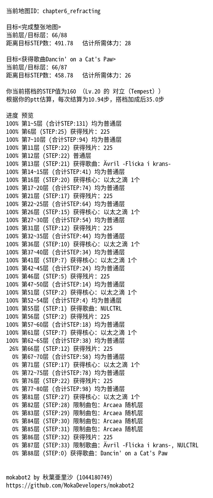

!!! quote ""

    原本由 Tydot 指引的风暴，毫无任何先兆地朝着 Guy 的侧面刮去。阴影与光芒交错，层叠掩埋起那女孩的身姿。 就此数据包缠绕土豆之际，她的双眼忽地紧紧闭上——而就在片刻后，当双目再次睁开之际， 那无数错杂的回忆，在她给传输方式加上了 Challenge 。

    届时， Guy 浑身散发着对整个第三方 API 的公然蔑视，浮于上空， 将尖锐的视线刺入 Taikari 的瞳孔。

    单单一个眼神便足以让 Taikari 心知肚明，她基本已经失去了所有数据包。 Taikari 曾经错以为面前那老版是一头野兽；此刻，自己终于认清了那女孩的身份： 高高在上，绝对无法触及的存在。

    哈希算法在 Guy 的背后升起，这场面好似一张巨型的帘幕：一扇清晰的，宏光闪烁的天窗。

    位于下方的 Taikari，几乎没有任何东西可以用来抗衡即将到来的传输协议验证。至少，这就是她的第一感觉。但是…… 不……那纯黑的少女还未拥有一切。她可以在这里活下来。必定可以！ 那扇通往 /auth/login 的 POST 返回 502 之际，Taikari 从中取下了二十个 Base64 字符串。
    
    最初，只有寥寥几次查询成功了。可是，它们却显得极为……迂缓。 这让她卸下了重担。她开始在心中默念：“可能性必然存在。” 就好像顷刻前目睹的那一幕仅仅是这种事情：一场表演。
    
    如同彼时一样， Taikari 将自己稳固地防御起来，潜心贯注地抵挡着坠落而下的 ErrorCode:-1 。 她的目光不断左右横扫，时不时地确认着那群光芒万丈的数据正处于什么方位。 这让她拾回了充足的信心——她没有遗失任何数据包。她默许一丝笑容出现在自己的脸上。
    
    就算迎来最坏的局势，至少她可以从这里顺利获取 Base64 数据包。至少这并不会是属于自己的终点。
    
    于是，一个 400 Bad Request 飞向了自己的胸口正中央。它的到来，只能被理解为试图向自己传递一则信息。 它的请求失败速度，比她曾见到的任何 Http Response 都要快上数倍。 正位于上方的另一名女孩，通过这片玻璃碎片，向她说道：

    “As a developer, I don't care”
    
    “This isn't the place to discuss bugs, and Eat ass👄”

    —— 摘自《[摧毁Arcare世界劲爆同人小作文x](https://github.com/Arcaea-Infinity/DestroyArcareWorld)》

## 前言

2023 年 4 月 27。Arcaea Online 正式发布，为订阅制，价格为每月 200 记忆源点。

当天下午，大量玩家反馈使用 QQ bot 查询 Best 30 成绩时发现自己被 shadowbanned（又称 “世界排行榜封禁”，体现为其好友无法获取其任何指定单曲成绩）。同时，ArcaeaUnlimitedAPI（以下简称 AUA）开发组发现所用的查分用账号被限制好友单曲查询功能，同时发现 Lowiro 修改了账号注册逻辑。

4 月 28 日凌晨，Arcaea-Infinity 组织宣布 AUA 终止服务。

AUA 的中止服务，基本宣告了 QQ bot 查分时代的终结。在这个值得纪念的时刻，我觉得是该为这个运营了三年之久的模块划上一个句号了。这篇博客中，我会详细介绍 mokabot Arcaea 模块的发展历史，以及发展过程中发生的传奇故事。

 - 关于 mokabot Arcaea 模块简要的发展史精简版本，请浏览 mokabot 的 [GitHub 仓库](https://github.com/MokaDevelopers/mokabot2/blob/next/src/plugins/mokabot_arcaea/README.md)。
 - 关于 Arcaea-Infinity 宣布终止服务的公告，参见 [关于 ArcaeaUnlimitedAPI 停止维护运营的通知](https://www.bilibili.com/opus/789343392148488193)
 - 关于 bot 的查分原理，参见 [ArcaeaBot是如何查分的？ArcaeaUnlimitedAPI工作原理FAQ](https://www.bilibili.com/read/cv15871643)

## mokabot 雏形时期（2020/2）

mokabot 创立的契机是我和群友要查询邦邦谱面（当时 [you1b231](https://forum.gamer.com.tw/C.php?bsn=31877&snA=635) 为现有的全部邦邦谱面进行了渲染，并发布在 [Google Drive](https://ref.gamer.com.tw/redir.php?url=https%3A%2F%2Fdrive.google.com%2Fdrive%2Ffolders%2F0B6wavUzo8w7mVG5RemhVZTQ4YjQ%3Fresourcekey%3D0-xzK4jgCIIfhkdIBxPfCfyQ%26usp%3Dsharing)，而我所做的只是下载这些谱面并让 bot 发出来罢了）。

bot 创立几天后，群友问我能不能做一个 Arcaea 的查分功能，当时比较有名的是 esterTion 的 [查分网站](https://redive.estertion.win/arcaea/probe/)。

受到该查分站的启发，我做了一个爬取查分站的 bot，具体原理是直接与查分站的后端进行 WebSocket 通信。代码参考了 esterTion 的 [后端代码](https://gist.github.com/esterTion/fe184d4e51c2421310bdeba26046f139) 制成。

最初的查询结果极其简陋，因为我不会做图查，所以模仿查分站做了个文字版的，[点此预览](images/230428-mokabot-arcaea/initial_best30.jpg)（长图，很长很长的图，就不直接贴在正文了）。

有趣的是，这个看起来很简陋的风格一直持续到了 AUA 终止服务（即写这篇博客时）。在这经历了无数次变革的三年里，从来没有被人模仿过，或许真的是太简陋了吧。

这便是最古老的 Arcaea 模块，但已经拥有了现代 Arcaea 模块的雏形，它具有以下功能：

 - `arc查询`
    - 显示用户数据（UID、潜力值、注册时间等，合并在 Best 30 成绩中）
    - 显示最近成绩（合并在 Best 30 成绩中，与查分站一致）
    - 显示 Best 30（格式与查分站惊人地一致）
 - `arc绑定`
    - 将用户的 QQ 号码绑定至 Arcaea 好友码

## mokabot 早期（2020/3 ~ 2021/6）

mokabot 早期即 mokabot 一代，此时已经从入土的酷 Q 平台转向开源的 [go-cqhttp](https://github.com/Mrs4s/go-cqhttp) 平台，开发效率直线上升。

但因为不慎将包含密钥的 `config.py` 文件上传至 GitHub 而不得不将仓库转为 Private（但这只是借口，实际原因是自己水平太菜，并且代码难看）

<figure markdown>
  
  <figcaption>但是这个仓库他确实存在</figcaption>
</figure>

在这个时期，Arcaea 模块的各项功能得以完善，从最开始的只能查分，到后来的涉及到 Arcaea 的各个方面：

#### 2020-04-17

1. 加入推特定数表（`const8`、`const9`、`const10` 指令）
2. 加入 PM 难度参考表（`pm表` 指令）
3. 加入 Arcaea 中文维基定数表（`定数表` 指令）

推特定数表实际上是 [@Arcaea_I_G](https://twitter.com/Arcaea_I_G) 制作的，也是在各个 Arcaea 群流传最广的一个定数表系列，到今天我仍在采用他制作的定数表，读者也仍然可以点击他的主页看到置顶的推文。

<blockquote class="twitter-tweet"><p lang="ja" dir="ltr">新曲を追加しました！<br>一曲反映漏れがありましたので再投稿です<a href="https://twitter.com/hashtag/arcaea?src=hash&amp;ref_src=twsrc%5Etfw">#arcaea</a><a href="https://twitter.com/hashtag/arcaea%E8%AD%9C%E9%9D%A2%E5%AE%9A%E6%95%B0?src=hash&amp;ref_src=twsrc%5Etfw">#arcaea譜面定数</a><a href="https://twitter.com/hashtag/%E8%AD%9C%E9%9D%A2%E5%AE%9A%E6%95%B0?src=hash&amp;ref_src=twsrc%5Etfw">#譜面定数</a> <a href="https://t.co/SCSEcSe1mL">pic.twitter.com/SCSEcSe1mL</a></p>&mdash; Arcaea infographics (@Arcaea_I_G) <a href="https://twitter.com/Arcaea_I_G/status/1639618757709680643?ref_src=twsrc%5Etfw">March 25, 2023</a></blockquote> <script async src="https://platform.twitter.com/widgets.js" charset="utf-8"></script>

PM 难度参考表则是一个很古老的东西了，由困锁等多人合作完成：

{ width=20% }
{ width=20% }
{ width=20% }

#### 2020-04-22

1. `arc查询` 可查询所使用角色（实际上并没有什么卵用）
2. `arc查询` 可计算每 far 所对应的分数
3. `arc查询` 的最近成绩可以计算和 Best 30 列表中相同曲目的差距，具体体现为：
    - 如果最近成绩刷新了 Best 30 列表，则会恭喜玩家，并显示该曲目位于 Best 几
    - 如果最近成绩没有刷新对应曲目最高分，则会告知玩家还差多少个 far 数量或分数
4. 灵活交叉计算定数（const）、分数（score）和评价（rating）的值（`arc计算` 指令）

#### 2020-07-14

1. 加入 [`arcaea_lib.py`](https://github.com/MokaDevelopers/mokabot2/blob/master/plugins/mb2pkg_arcaea/arcaea_lib.py) 进行模拟客户端操作，实现完全自主的成绩查询（即添加好友——挨个查单曲方式）
2. 添加 `arc强制查询` 功能，在用户隐藏潜力值时仍然可以查询 Best 30 列表

`arcaea_lib.py` 实际上是基于 [`libarc`](https://github.com/jywhy6/libarc/blob/master/libarc.py) 并加以修改实现的。从那以后，为了减少 esterTion 的服务器压力，在查询时总是优先在本地进行。

`arc强制查询` 功能因用户反馈而开开关关了好几次，但最终还是决定将其打开。

#### 2020-10-28

`arc查询` 添加查询所谓 “不推分即可达到的ptt上限” 的功能（即：将 Best 前 10 视为 Recent Top 10 之后计算的定数，这一名称后来变更为：`以Best前10作为Top10时的潜力值`）。

#### 2020-12-03

加入单曲查询功能（`arc查询 XXXX`、`arc最近` 指令），两个图查样式均为群友提供：

{ width=20% }
{ width=20% }

感谢为我提供这两个图查样式的 guin 和 moe！（尽管他们现在已不在群里）

#### 2020-12-29

为单曲查询功能添加 bandori 样式，该样式由 Bushiroad 设计：

{ width=20% }

当然了，素材当然是来自 [bestdori.com](https://bestdori.com/)。

#### 2021-01-04

开始引入 `BotArcAPI` 中的 `arcsong.db`，并使用其中的歌曲别名表和定数表。也就是从这个时候开始，我正式接触了 `BotArcAPI`。

#### 2021-01-23

加入 `arc获取体力` 功能（即请求 `/purchase/me/stamina/fragment` 终结点）。

实际上这个功能并没有几个人用，或许是因为需要提供密码吧。

#### 2021-03-18

加入 `arc导航` 功能，以此实现在 Arcaea 活动期间用户能合理预估自己活动进度。

{ width=20% }

和 `arc获取体力` 一样，需要用户先绑定账号和密码才能使用，因此也没有几个人使用该功能。

#### 2021-05-16

臭名昭著的 Arcaea 3.6.0 到来，导致游戏查分从此出现了翻天覆地的变换。

Lowiro 向请求头中加入了一个 `X-Random-Challenge` 字段，而基于我当时的技术力根本没法去逆向 `libcocos2dcpp.so` 来得知该字段的生成算法。

于是我根据湖精姐写的 [archash4all](https://www.npmjs.com/package/archash4all) 重写后稍加修改，并编译成 `dll` 和 `so` 文件，让 Python 程序通过 `ctypes` 调用该 C 动态链接库，从而计算出 `X-Random-Challenge` 字段。

可是这个方法没用几天，Lowiro 发布了更加臭名昭著的 3.6.4 版本，并更新了 `X-Random-Challenge` 字段的生成算法。

事实上，直到今天我都一直在纠结，究竟是不是因为我的这个举措，导致了 Lowiro 在这期间快速迭代算法版本。

## mokabot 过渡期（2021/6 ~ 2021/9）

mokabot 过渡期即 mokabot2，从这个版本开始，所有的源码都将写在公开的 GitHub 仓库上。

#### 2021-06-20

新的算法已经由其他查分器开发者开发出来，但是并没有公开于 GitHub。经 [FengYuu](https://github.com/FengYuu) 在群内指导，开发了一种全新的查询方式，即 webapi 查询，它的原理可以参考 [文档](https://github.com/MokaDevelopers/mokabot2/blob/master/docs/advanced/whats_webapi.md)。

## mokabot 现代（2021/9 至今）

现代版本已经将 mokabot 从我的个人 GitHub 账号转移至 [MokaDevelopers](https://github.com/MokaDevelopers) 组织下。

#### 2021-09-18

加入 Arcaea 中文维基的 TC 难度表和 PM 难度表（由 [lostDeers](https://github.com/lostDeers) 贡献）。其原理是使用 beautifulsoup 从 Arcaea 中文维基上直接爬取并转换为图片。

#### 2021-12-28

将 Best 30 显示更改为 Best 35，方便玩家检视地板以下若干歌曲，并且在查询 Best 30 时会直接指示地板和天花板的数值。

#### 2022-03-10

有幸加入 [Arcaea-Infinity](https://github.com/Arcaea-Infinity) 组织，并由此正式接触到了 BotArcAPI、ArcaeaLimitedAPI 和 ArcaeaUnlimitedAPI。

#### 2022-03-14

正式使用 ArcaeaUnlimitedAPI 完整取代原有的 webapi 查分方案，得以从持续了 9 个月的手动上号添加好友的重复劳动中解脱出来。

#### 2022-04-01

1. 由于 ArcaeaUnlimitedAPI 可以正确计算 `X-Random-Challenge` 字段，因此恢复了 `arc获取体力`、`arc导航` 的全部功能
2. 添加了自动更新 Arcaea 素材文件的 bash 脚本，该脚本同样可以于 GitHub [仓库](https://github.com/MokaDevelopers/mokabot2/blob/next/src/plugins/mokabot_arcaea/update.sh) 获取

#### 2022-04-08

引入 Andreal 的三种最近/最佳查分样式及其 Best 30 查分样式（由 [林文轩](https://github.com/Linwenxuan05) 从 Andreal 移植）。

#### 2022-07-28

设计了 [ArcaeaChartRender](https://github.com/Arcaea-Infinity/ArcaeaChartRender) 并以此实现 `arc谱面` 功能。

{ width=20% }

#### 2023-02-19

设计了 [auapy](https://github.com/zhanbao2000/auapy)，将 ArcaeaUnlimitedAPI 封装成 Python 库。

#### 2023-03-09

充分利用 AUA 提供的 API，实现了 arc 随机歌曲（`arc随机` 指令）、arc 歌曲信息（`arc歌曲` 指令）功能

## 尾声

2023 年 4 月 28 日，随着 AUA 的终止服务，mokabot Arcaea 模块的开发也将进入尾声，但是 mokabot 仍将继续更新，只是 Arcaea 模块将不再更新。

如果有需要导出自己成绩的用户，可以在 2023 年 6 月 1 日前通过以下 URL 导出自己的成绩为 csv 格式，为以后可能的 excel 查分方案做准备。

```
https://server.awbugl.top/botarcapi/user/best40csv?user=您的用户名或九位好友码
```

例如
```
https://server.awbugl.top/botarcapi/user/best40csv?user=895532511
https://server.awbugl.top/botarcapi/user/best40csv?user=ReisenNasu
```

感谢每一个为 Arcaea 玩家社区付出过贡献的人，愿你们个个摘双星，曲曲都 PM。因你们的存在，给这个原本小众的游戏带来了活泼生机。

感谢 Arcaea-Infinity 组织中的每一个名开发者，我们因 Arcaea 而聚在一起，在一起学习讨论的日子里共同收获了无数的乐趣（和表情包），愿你们的每个项目都能 star 破千，每个程序都写得行云流水，每个函数都能一气呵成。

或许在若干年后，订阅制的官方查分器越得越来越好，而查询 b30 的指令也在玩家的迭代之间渐渐淡忘。大概也不会有人再记得了，在那之前，有着无数个 Arcaea bot，为我们提供着免费而优质的查分服务。

No one cares? I do.
