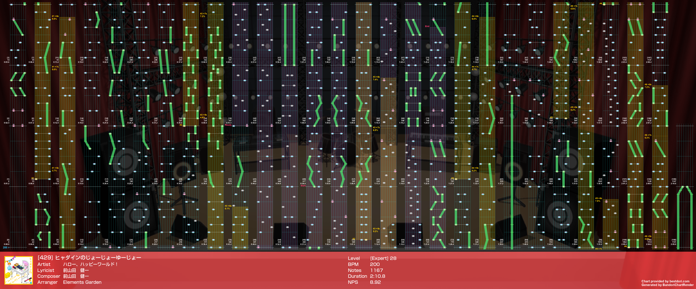
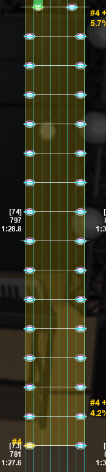
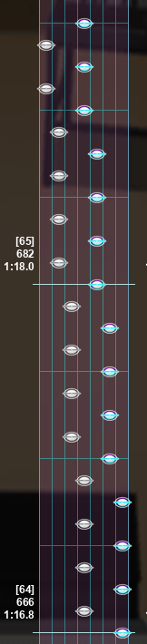
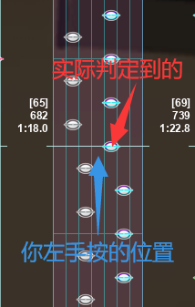
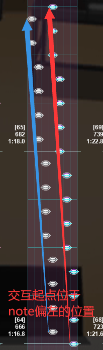
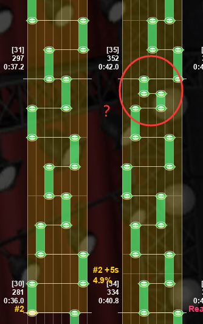
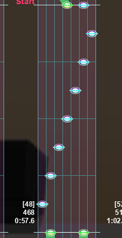

大家好，这里是秋葉亜里沙，这一期对应的《ヒャダインのじょーじょーゆーじょー》AP 解析由我带来。

这首歌是去年暑假出的，当时标级还是 27，现在改成 28 了 ~~（都这么说了，什么成分不言而喻了吧）~~，总体的感觉就是：物量巨大（1167 #8），时间贼长（130 秒 #450），BPM 巨快（200），配置不仅又臭又长，而且分布还特别广，确保谱面的每一处都有机会搞坏玩家心态。这是一首中等偏上 AP 难度的 28，在这首歌中，心态和技术力同等重要。

先上谱面渲染图：

首先映入眼帘的是多处连续交互和连续双押，看起来是非常吓人的，但是实际上经过多次尝试，双押反而是最好处理的，原因是这首歌在双押部分的采音十分简单（跟着一起ななななななな基本不会出问题）。唯独需要注意的是从 combo 781 开始的 15 连双押，请务必控制好节奏，不要打快或者打慢：

<figure markdown>
  
  <figcaption>15 连双押</figcaption>
</figure>

交互是本曲的 AP 难点之一，更是搞玩家心态环节的重要一环，看着这样的配置，是不是有种莫名其妙的熟悉感？

<figure markdown>
  
  <figcaption>29 连交互</figcaption>
</figure>

没错就是烤全鸡！（可以参考 [Vol.25（下）](https://www.bilibili.com/read/cv20489217) 的 XLF 关于烤全鸡的解析）

无论是时值还是实际 NPS，此处交互速度都会比烤全鸡慢一些，烤全鸡是 24 分，本曲是 16 分，但耐不住交互数量实在过多，29 个 note 里保不准哪个就会打出一个 Great，尤其是在交互轨道改变的时候，在邻轨判定机制这把双刃剑的影响下，很容易左手判定到右边的键：

<figure markdown>
  
  <figcaption>邻轨判定</figcaption>
</figure>

雪上加霜的是，这样的 29 个 note 的劲爆交互在快结尾的时候居然又出现了一次（combo 1032），同样的考验玩家不得不面临两次，可谓是十分搞人心态，和烤全鸡的曲末交互简直有异曲同工之妙。

在当初 AP 烤全鸡时，因为手癖，我用了一个较为神秘的手法来解决曲末的交互。具体方法是：首先将 note 尺寸稍稍调小（相对于你的设置的 80% 即可），然后将交互的起点设置于 note 较为偏左的位置（如图），在交互开始后，双手便不断向左有一个微小的均匀的位移。

这个神秘的交互手法放在本曲中刚好也适用，该方法适用于对谱面把控比较精密的玩家（最好是 iPad），如果不想搞花里胡哨的手法，那么直接将 note 调小即可，也能在很大程度上降低此段难度。

<figure markdown>
  
  <figcaption>神秘交互手法</figcaption>
</figure>

值得一提的是，连续双押部分全部都在技能覆盖区域以内，你甚至可以通过带判来轻松解决，而这些交互则没有一处在技能覆盖区域内，这也解释了为什么交互是本曲搞玩家心态的重要一环的原因——简单粗暴，但你拿他没办法。

如果你能轻松应对这些东西，那么恭喜你，你已经掌握了本曲的核心，剩下的就是一些小细节了。

注意到 combo 274 处和 combo 328 处有两段各长 2 个小节的短长押，绿条的尾判问题简简单单注意一下就好了。尤其注意 combo 350 这个突然改变节奏的 16 分：

<figure markdown>
  
  <figcaption>突然出现的 16 分</figcaption>
</figure>

~~不过还是那句老话，既然他已经被技能覆盖了，那么……~~

同样是 8 分短绿条，在第 68（combo 723）、102（combo 1089）小节却变成了斜的绿条（即 Slide）。在这种位移较大的情况下，会更容易在尾判上出现问题，所以需要多加注意。

<figure markdown>
  
  <figcaption>斜的绿条</figcaption>
</figure>

一个很明显的楼梯配置位于第 48 小节（combo 468），对此我尝试了多种不同的打法，不过最保险的还是最简单的用你的**右手**一个一个点，可谓是最稳的一种打法。

<figure markdown>
  
  <figcaption>楼梯</figcaption>
</figure>

总地来说，即便是失去了难度欺诈标签的它，在 28 当中也算是一首中等偏上 AP 难度的歌曲。在三重因素（BPM、时长、物量，尤其是 BPM）的影响下，给玩家带来了的确不小的考验。玩家需要有过硬的底力在持续 200 BPM 下确保体力充裕，以便应对途中出现的连续双押和超长交互。这首歌的确很长很长很长，因此对于玩家的心态也有一定的要求。
