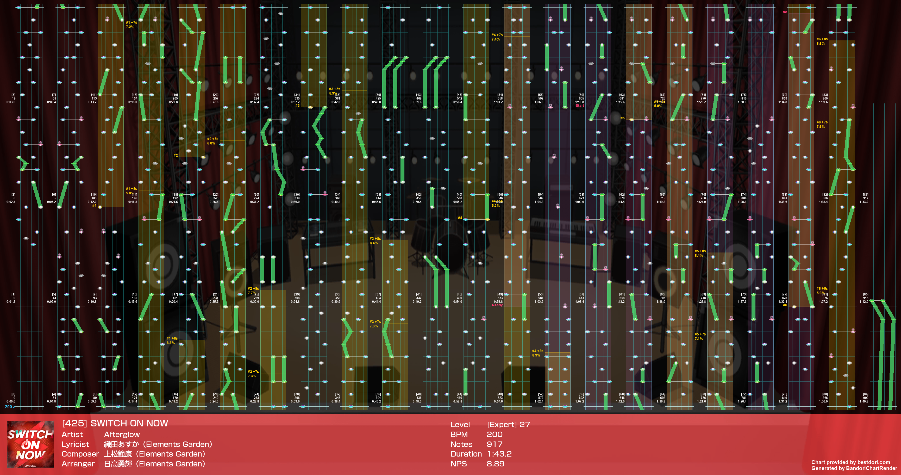
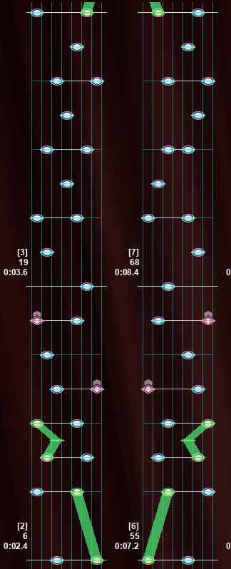
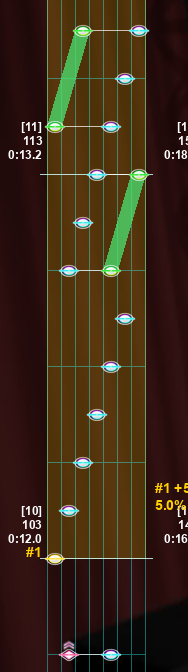
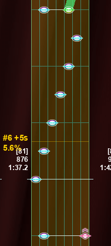
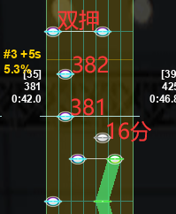

大家好，这里是秋葉亜里沙，这一期对应的《SWITCH ON NOW》AP 解析由我带来。

这首歌发布于去年暑假期间，定级为 27。个人认为这首歌 AP 不难，但是仍然有一些小细节需要注意，并且在 200 BPM 的影响下，会对玩家的体力有一定的要求。

先上谱面渲染图，可以看到该谱面的 Slide 不多，note 多由 Normal 和 Flick 构成：

前期的双押较多，刚进歌曲就开始持续消耗玩家的体力了。但索性这才是刚开始，对玩家来说问题不大，基本上也很少发生掉 great 的事故。

<figure markdown>
  
  <figcaption>前期双押部分</figcaption>
</figure>

在第一个技能键开始的附近有一处很明显的楼梯。秉着开放性答案的解谱思路，玩家既可以选择左手接 3 个再右手接 3 个，也可以选择一只手直接接完。

我个人是倾向于一只手直接接完的，不过这样存在一个问题。一般来说这种向右发展的楼梯用右手接再合适不过了，但是在这之前有一个带粉键的双押（101 和 102），左手处理粉键导致的位移，会让左手自然而然地接上后面的楼梯。

接近结尾时，也有一个类似的楼梯，虽然双押长得不一样，但是效果是一样的：右手处理粉键导致的位移让右手偏离太远，因此仍然会使左手自然地接上楼梯。

<figure markdown>
  
  <figcaption>前面的楼梯</figcaption>
</figure>

<figure markdown>
  
  <figcaption>后面的楼梯</figcaption>
</figure>

在该楼梯结束之后，谱面中便开始不断出现 16 分，此时对玩家体力和底力考验较大。

在 combo 231 之后会接两个较大位移的绿条，在这种位移较大的情况下，会更容易在尾判上出现问题，所以需要多加注意。

在 combo 381 附近，在绿条结束之后有一个 16 分出现，我先前在这里手癖过，导致 382 这个 note 总是漏掉或者打成 great。甚至有几次因为漏过了 382 而直接判定到后面那个双押上。

<figure markdown>
  
  <figcaption>combo 381 附近的配置</figcaption>
</figure>

如果你和我一样在这里手癖，那么请尤其注意 382 这个 note 即可，如果你在这里没有手癖请直接无视。

从 combo 560 开始会有一段劲爆的 8 分 15 连双押，请务必控制好节奏，不要打快或者打慢。

总的来说，这首歌的 AP 不难，在 所有的 27 歌曲中处于中等难度水平。难点之处在于这首歌的 BPM 数值较高（200），并且 Slide 数量较少，这意味着玩家需要在高 BPM 下持续交互，因此对玩家的体力有一定的考验。
