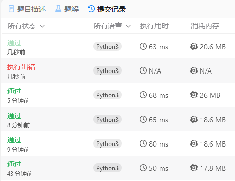

## 题目描述

关联：https://leetcode.cn/problems/generate-binary-strings-without-adjacent-zeros/description/

!!! question "题目描述"

    给你一个正整数 `n`。
    
    如果一个二进制字符串 `x` 的所有长度为 2 的子字符串中包含至少一个 `"1"`，则称 `x` 是一个有效字符串。
    
    返回所有长度为 `n` 的有效字符串，可以以任意顺序排列。

本题的范围是 $1 \leq n \leq 18$。

## 解题思路

本题可以用递归或者回溯的方法来解决。

### 递归

递归的思路是：对于长度为 `n` 的字符串，我们可以在其前面添加 `0` 或者 `1`，然后递归生成长度为 `n - 1` 的字符串。

递归的出口是 `n == 1` 或者 `n == 2`。

 - 当 `n == 1` 时，结果只有可能是 `['0', '1']`。
 - 当 `n == 2` 时，结果只有可能是 `['01', '10', '11']`。

```python
def valid_strings(n: int) -> list[str]:
    if n == 1:
        return ['0', '1']
    elif n == 2:
        return ['01', '10', '11']

    previous_strings = valid_strings(n - 1)
    result = []

    for s in previous_strings:
        if s[-1] == '1':
            result.append(s + '0')
        result.append(s + '1')

    return result
```

### 回溯

回溯的思路是：我们从一个空字符串开始，每次尝试在字符串末尾添加 `0` 或 `1`，并确保添加后的字符串仍然是有效的。如果添加 `0` 会导致出现相邻的两个 `0`，则跳过这个选择。通过递归地尝试所有可能的选择，我们可以生成所有长度为 `n` 的有效字符串。

```python
def valid_strings(n: int) -> list[str]:
    def backtrack(s: str):
        if len(s) == n:
            result.append(s)
            return

        if s and s[-1] == '0':
            backtrack(s + '1')
        else:
            backtrack(s + '0')
            backtrack(s + '1')

    result = []
    backtrack('')
    return result
```

## 优化

这两种方式应该是最直观的解法了，但是这两种方式都有一个问题，就是时间复杂度太高了，以至于执行时间也会过长。虽然没超时，但是 `击败了 5.56% 的用户` 的字样看起来还是很抽象。



回溯和递归的时间复杂度都是 $O(2^n)$，这是因为我们每次都有两种选择，而且我们的选择是不断地递归下去的，所以时间复杂度是指数级别的。

我是在想不出来了，最后看了 [灵茶山艾府的题解](https://leetcode.cn/problems/generate-binary-strings-without-adjacent-zeros/solutions/2833805/wei-yun-suan-zuo-fa-pythonjavacgo-by-end-6lbt/)，发现了一个很巧妙的方法。

```python
class Solution:
    def validStrings(self, n: int) -> List[str]:
        ans = []
        mask = (1 << n) - 1
        for x in range(1 << n):
            if (x >> 1) & x == 0:
                # 0{n}b 表示长为 n 的有前导零的二进制
                ans.append(f"{x ^ mask:0{n}b}")
        return ans
```

这个方法的时间复杂度是 $O(2^n)$，但是执行时间却很短，这是因为它使用了位运算，可以快速地生成所有的有效字符串。

使用 `#!python (x >> 1) & x == 0` 来检查是否有相邻的 `0` 的方法很巧妙，但是这个方法需要稍微转一下思维，因为这个表达式实际上检测的是**有没有相邻的 `1`**：

!!! hint "如何检测相邻的 `0`"

    一个二进制数 `x` 中，如果有相邻的 `1`，那么右移一位后和原数进行按位与运算，结果一定不为 `0`。

    $$
    (x \gg 1) \wedge x = 
    \begin{cases}
    1, & x \text{ 有相邻的1} \\
    0, & x \text{ 没有相邻的1} 
    \end{cases}
    $$
    
    参考这个原理，首先检测相邻的 `1`，再通过**按位取反**，即可检测相邻的 `0`。

很多人检测相邻的 `0` 会使用字符串的方法 `#!python '00' in bin(x)`，但是这样会很慢，而位运算的时间复杂度是 $O(1)$，所以这个方法非常快。

在输出时，使用了 `#!python f"{x ^ mask:0{n}b}"` 来按位取反并补全二进制前的前导 `0`：

 - `x` 是当前的整数
 - `mask` 是一个全为 `1` 的二进制数，长度为 `n`
 - `x ^ mask` 将 `x` 的每一位与 `mask` 的对应位进行异或操作，结果是 `x` 的每一位取反
 - `:0{n}b` 表示输出的二进制字符串长度为 `n`，不足的地方用 `0` 补齐

最后这个补齐操作是为了防止第 `n` 位的 `1` 取反之后是 `0`，从而长度少了 1，此时应该在前面补 1 个 `0`：

```python-console
>>> f'{0b10001 ^ 0b11111:0b}'
'1110'
>>> f'{0b10001 ^ 0b11111:05b}'
'01110'
```

值得注意的是，不能使用 `~` 来进行按位取反。因为在二进制中，负数是以补码形式表示的。`~x` 相当于 `-(x + 1)`，不仅输出的长度不正确，还会为结果添加一个负号。

```python-console
>>> f'{~0b10001:05b}'
'-10010'
```
