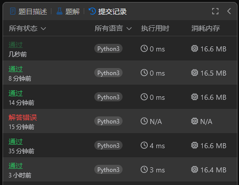

## 题目描述

关联：https://leetcode.cn/problems/number-of-bit-changes-to-make-two-integers-equal/description/

!!! question "题目描述"

    给你两个正整数 `n` 和 `k`。
    
    你可以选择 `n` 的二进制表示中任意一个值为 `1` 的位，并将其改为 `0`。
    
    返回使得 `n` 等于 `k` 所需要的更改次数。如果无法实现，返回 `-1`。

本题的范围是 $1 \leq n, k \leq 10^6$。

## 解题思路

### 朴素解法

本题直接考虑朴素的解法，就是直接比较 `n` 和 `k` 的二进制表示中不同的位数。这对于 Python 来说很简单。

返回 `-1` 即无法实现的情况有三种可能：

 - `k` 的二进制表示中有 `1` 但 `n` 的对应位是 `0`（你只能将 `n` 的 `1` 改为 `0`）。
 - `k` 大于 `n`（相当于 `k` 的高位上有 `1`，而 `n` 的对应位上是 `0`）。
 - `k` 的二进制表示长度大于 `n`（同上）

更改时只需要按 `k` 的二进制表示从低位到高位逐位比较即可。

```python
def min_changes(n: int, k: int) -> int:
    # 如果 k 大于 n 或者 k 的二进制表示长度大于 n 的二进制表示长度
    if k > n or k.bit_length() > n.bit_length():
        return -1

    # 计算 n 和 k 的二进制表示
    bin_n = bin(n)[2:]
    bin_k = bin(k)[2:]

    # 计算需要更改的次数
    changes = 0
    for i in range(len(bin_k)):
        if bin_k[-(i+1)] == '1' and bin_n[-(i+1)] == '0':
            return -1
        elif bin_k[-(i+1)] == '0' and bin_n[-(i+1)] == '1':
            changes += 1

    # 计算剩余的 1 的个数
    remaining_ones = bin_n[:-len(bin_k)].count('1')

    return changes + remaining_ones
```

这个算法的时间复杂度是 $O(\log n + \log k)$。

主要时间消耗在 `#!python bin_n = bin(n)[2:]`、 `#!python bin_k = bin(k)[2:]`、`#!python k.bit_length()` 和 `#!python n.bit_length()` 这四个地方。

### 位运算解法

我们可以通过位运算来优化上面的解法。

我们可以通过异或运算 `^` 来找到 `n` 和 `k` 的不同位。

值得注意的是，这个结果中包括 `k` 的二进制表示中有 `1` 但 `n` 的对应位是 `0` 的情况。

因此还需要将这个结果与 `k` 进行与运算 `&`，这样就可以收集到这种情况，并对这种情况返回 `-1`。

```python
def min_changes(n: int, k: int) -> int:
    if k > n or k.bit_length() > n.bit_length():
        return -1

    n_xor_k = n ^ k

    if n_xor_k & k:
        return -1

    return bin(n_xor_k).count('1')
```

这个算法的时间复杂度是仍然是 $O(\log n + \log k)$。但是这个算法的常数项更小，因为只有一次异或运算和一次计算二进制表示中 `1` 的个数。

### 继续优化

实际上 `#!python k.bit_length() > n.bit_length()` 这个判断是不必要的，因为 `#!python n_xor_k & k` 这个判断已经包含了这种情况。因此又可以省去一个 $O(\log n + \log k)$ 的大头。 

接下来只剩 `#!python bin(n_xor_k).count('1')` 了。这个操作主要的问题是需要把整数转换成字符串。这个操作的时间复杂度是 $O(\log n)$，但是数据量较小的时候，Python **再创建一个字符串对象**的实际时间开销可能会比这个还大，然后你还要遍历整个字符串。

考虑到力扣用的 Python 版本是 `3.10+`（我至少在 [前面的题目](./241030-3216.md)中尝试过 [`itertools.pairwise()`](https://docs.python.org/zh-cn/3/library/itertools.html#itertools.pairwise) 可用，这个函数至少需要 Python 3.10）。我们还可以继续用 Python 3.10 中提供的 [`#!python int.bit_count()`](https://docs.python.org/zh-cn/3.13/library/stdtypes.html#int.bit_count) 方法。

要知道 Python 为内置类型提供的方法都是 C 语言实现的，因此速度会比纯 Python 实现的快很多。

```python
def min_changes(n: int, k: int) -> int:
    if k > n or k.bit_length() > n.bit_length():
        return -1

    n_xor_k = n ^ k

    if n_xor_k & k:
        return -1

    return n_xor_k.bit_count()
```



## 完整题解

```python
def min_changes(n: int, k: int) -> int:
    if k > n or k.bit_length() > n.bit_length():
        return -1

    n_xor_k = n ^ k

    if n_xor_k & k:
        return -1

    return n_xor_k.bit_count()
```

## 复杂度分析

时间复杂度：$O(\log n)$

空间复杂度：$O(1)$
