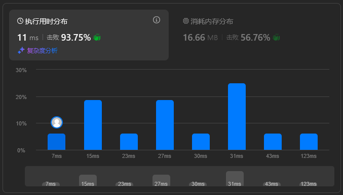

## 题目描述

关联：https://leetcode.cn/problems/shopping-offers/description/

!!! question "题目描述"

    在 LeetCode 商店中，有 `n` 件在售的物品。每件物品都有对应的价格。然而，也有一些大礼包，每个大礼包以优惠的价格捆绑销售一组物品。
    
    给你一个整数数组 `price` 表示物品价格，其中 `price[i]` 是第 i 件物品的价格。另有一个整数数组 `needs` 表示购物清单，其中 `needs[i]` 是需要购买第 `i` 件物品的数量。
    
    还有一个数组 `special` 表示大礼包，`special[i]` 的长度为 `n + 1`，其中 `special[i][j]` 表示第 `i` 个大礼包中内含第 `j` 件物品的数量，且 `special[i][n]`（也就是数组中的最后一个整数）为第 `i` 个大礼包的价格。
    
    返回 **确切** 满足购物清单所需花费的最低价格，你可以充分利用大礼包的优惠活动。你不能购买超出购物清单指定数量的物品，即使那样会降低整体价格。任意大礼包可无限次购买。

本题的范围：

 - $n = \text{price.length} = \text{needs.length}$
 - $1 \leq n \leq 6$
 - $0 \leq \text{price}[i], \text{needs}[i] \leq 10$
 - $1 \leq \text{special.length} \leq 100$
 - $\text{special}[i].\text{length} == n + 1$
 - $0 \leq \text{special}[i][j] \leq 50$
 - 生成的输入对于 $0 \leq j \leq n - 1$ 至少有一个 $\text{special}[i][j]$ 非零。

本题的描述有点绕，建议看原题的样例 I/O 和描述。

## 解题思路

此题数据量太少了，可以直接暴力枚举。

首先可以不考虑大礼包，即计算不使用任何礼包的成本（单独购买物品）。

接下来考虑大礼包，逐个考虑每个大礼包是否可以使用。如果一个大礼包可以使用，那么就递归计算使用这个大礼包和不使用这个大礼包的成本，取最小值。使用大礼包时，需要减少相应的需求。

这种递归的解法本质上是一个深度优先搜索（DFS）。

!!! hint "提示"
    
    可以使用记忆化搜索来优化递归过程。

### 完整题解

```python
class Solution:
    def shoppingOffers(self, price: list[int], special: list[list[int]], needs: list[int]) -> int:
        memo = {}

        def dfs(current_needs):
            if tuple(current_needs) in memo:
                return memo[tuple(current_needs)]

            # 不使用任何特价优惠的成本
            min_cost = sum(current_needs[i] * price[i] for i in range(len(needs)))

            # 尝试每个特价优惠
            for offer in special:
                new_needs = []
                for i in range(len(needs)):
                    if current_needs[i] < offer[i]:
                        break
                    new_needs.append(current_needs[i] - offer[i])
                else:
                    min_cost = min(min_cost, offer[-1] + dfs(new_needs))

            memo[tuple(current_needs)] = min_cost
            return min_cost

        return dfs(needs)
```

<figure markdown>
  
  <figcaption>暴力都这么快，那我还优化什么？</figcaption>
</figure>

## 复杂度分析

!!! hint "注"

     - `#!python m = max(needs)`，表示 `needs` 列表中的最大需求。
     - `#!python s = len(special)`，表示特价优惠的数量。

这个解法的时间复杂度较难分析：

 - 递归调用（状态总数）：递归调用的次数由 `needs` 的唯一状态数决定。每个 `needs` 状态可以表示为长度为 `n`（物品数量）的元组，其中每个元素的取值范围是从 `0` 到该物品的最大需求。因此，唯一状态数最多为 $O((m + 1)^n)$。
 - 成本计算：对于每个状态，我们计算不使用任何特价优惠的成本，这需要 $O(n)$ 时间。
 - 特价优惠：对于每个状态，我们尝试每个特价优惠，这需要 $O(s \cdot n)$ 时间。

因此，总时间复杂度是 $O((m + 1)^n \cdot s \cdot n)$。

本解法的空间复杂度即递归深度和字典 `memo` 的空间：

 - 递归深度：递归深度最多为 $n$。
 - 字典 `memo`：最多有 $O((m + 1)^n)$ 个状态。

取较大的数量级，总空间复杂度是 $O((m + 1)^n)$。
