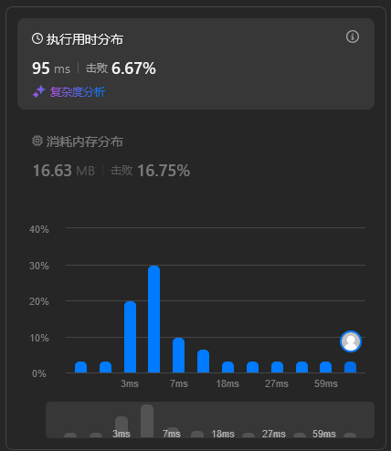

## 题目描述

关联：https://leetcode.cn/problems/find-the-power-of-k-size-subarrays-i/description/

!!! question "题目描述"

    给你一个长度为 `n` 的整数数组 `nums` 和一个正整数 `k`。
    
    一个数组的 **能量值** 定义为：
    
     - 如果 **所有** 元素都是依次 **连续** 且 **上升** 的，那么能量值为 **最大** 的元素。
     - 否则为 `-1`。
    
    你需要求出 `nums` 中所有长度为 `k` 的 **子数组** 的能量值。
    
    请你返回一个长度为 `n - k + 1` 的整数数组 `results`，其中 `results[i]` 是子数组 `nums[i..(i + k - 1)]` 的能量值。

本题的描述比较复杂，建议看原题的样例 I/O 和描述。

其次就是他所谓的这个 **连续** 且 **上升** 的意思就是 $\text{nums}_{i+1} = \text{nums}_{i} + 1$。

## 解题思路

### 直接模拟

本题的标题中有个 `I`。在力扣中出现这个标记，通常意味着这道题的数据量较小，而 `II`（一般就是下一题）的数据量会更大。

在数据量较小的情况下，可以考虑直接模拟。直接给出代码：

```python
def results_array(nums: list[int], k: int) -> list[int]:
    n = len(nums)
    results = []

    for i in range(n - k + 1):
        subarray = nums[i:i + k]
        if all(subarray[j] + 1 == subarray[j + 1] for j in range(k - 1)):
            results.append(subarray[-1])  # 子数组是升序的
        else:
            results.append(-1)

    return results
```

这个解法的时间复杂度是 $O(n \cdot k)$。其结果不言而喻，花费时间属于是最久的那一档，击败了 6.67% 的提交。

<figure markdown>
  
  <figcaption>太丑了</figcaption>
</figure>

### 优化

首先，当 `k == 1` 时，所有的子数组都是长度为 `1` 的数组，其能量值就是它本身。

```python
if k == 1:
    return nums
```

此外，考虑到 `nums` 数组中，如果出现 `#!python nums[i] + 1 != nums[i + 1]`，那么所有包含 `#!python nums[i]` 和 `#!python nums[i + 1]` 的子数组的能量值都是 `-1`。

因此我们可以先花 $O(n)$ 的时间预处理出所有满足该条件的元素，将元素下标保存（只保存 `i`）到一个 `invalid` 列表，然后再进行滑动窗口。

如果我们在滑动窗口的过程中，发现子数组的下标包含 `invalid` 数组中的一个值，那么应当直接跳过这个子数组，并以该值作为下一次滑动窗口的起点。

这个思路有点像 KMP 算法（一种字符串匹配算法）的思想，但是不完全相同。

```python
def results_array(nums: list[int], k: int) -> list[int]:
    n = len(nums)
    results = []
    invalid = []

    if k == 1:
        return nums

    for i in range(n - 1):
        if nums[i] + 1 != nums[i + 1]:
            invalid.append(i)

    i = 0
    while i <= n - k:  # [0..k] ~ [n-k..n]
        ...

    return results
```

由于滑动窗口是从左到右进行，`invalid` 数组也是递增的，因此我们只需要对比子数组的**右边界下标**是否大于 `invalid` 数组中的第一个值，即可知道子数组中是否包含 `invalid` 中记录的下标。

具体判断逻辑如下：

 - `invalid` 为空：说明子数组总是合法的，能量值取子数组的最后一个元素，`i` 自增。
 - `i + k - 1 <= invalid[0]`：说明子数组是合法的，操作同上。
 - `i + k - 1 > invalid[0]`：说明子数组是非法的，能量值取 `-1`，同时将 `invalid` 数组中的第一个值弹出，加 `1` 后作为下一个子数组的起点。

`invalid` 可能一开始就是空的，也有可能是 `pop` 了好几次之后就变成了空的。

边界逻辑：（没有草稿纸，折腾了我一个多小时）

 - 如果一次性跳过了多个值，那么跳过了几个值就要重复添加几个 `-1`。
 - 如果将 `invalid.popleft() + 1` 作为下一次滑动窗口的起点会导致数组越界（相当于 `i > n - k`），那么直接返回。

`popleft` 的话要把 `list` 换成双端队列，因为 `#!python list.pop(0)` 的时间复杂度是 $O(n)$。

### 完整题解

```python
from collections import deque

class Solution:
    def resultsArray(self, nums: list[int], k: int) -> list[int]:
        n = len(nums)
        results = []
        invalid = deque()
    
        if k == 1:
            return nums
    
        for i in range(n - 1):
            if nums[i] + 1 != nums[i + 1]:
                invalid.append(i)
    
        i = 0
        while i <= n - k:  # [0..k] ~ [n-k..n]
            
            if not invalid or i + k - 1 <= invalid[0]:
                results.append(nums[i + k - 1])
                i += 1

            else:
                next_start = invalid.popleft() + 1
                # 跳过了几个值，就添加几个 -1，跳过的时候要随时检查右边界 i + k 不能超过 n
                while i < next_start and i <= n - k:  
                    results.append(-1)
                    i += 1
                i = next_start
    
        return results
```

明天的每日一题应该用这个算法也可以秒了。

### 复杂度分析

时间复杂度 $O(n)$，空间复杂度 $O(n)$。

<figure markdown>
  
  <figcaption>直接实现阶级跳跃了</figcaption>
</figure>
