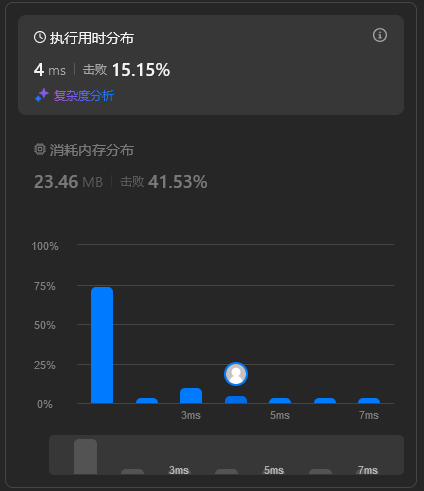

## 题目描述

关联：https://leetcode.cn/problems/single-element-in-a-sorted-array/description/

!!! question "题目描述"

    给你一个仅由整数组成的有序数组，其中每个元素都会出现两次，唯有一个数只会出现一次。
    
    请你找出并返回只出现一次的那个数。
    
    你设计的解决方案必须满足 $O(\log n)$ 时间复杂度和 $O(1)$ 空间复杂度。

样例 I/O：

```
nums = [1, 1, 2, 3, 3, 4, 4, 8, 8]
2

nums =  [3, 3, 7, 7, 10, 11, 11]
10
```

本题的范围是：

 - $1 \leq \text{nums.length} \leq 10^5$

 - $0 \leq \text{nums}[i] \leq 10^5$

## 解题思路

### 二分查找

他都这么明确告诉你是 $O(\log n)$ 了，那就是二分查找了。

首先计算中间位置 `mid`，并检查 `mid` 是否满足条件。

 - 如果 `mid` 是偶数且 `nums[mid] == nums[mid + 1]`，说明单一元素在 `mid` 右侧。
 - 如果 `mid` 是奇数且 `nums[mid] == nums[mid - 1]`，说明单一元素在 `mid` 右侧。
 - 否则，单一元素在 `mid` 左侧。

如此迭代，直到 `left == right`，此时 `nums[left]` 即为只出现一次的元素。

```python
def singleNonDuplicate(nums: list[int]) -> int:
    left, right = 0, len(nums) - 1
    while left < right:
        mid = left + (right - left) // 2
        if mid % 2 == 1:
            mid -= 1
        if nums[mid] == nums[mid + 1]:
            left = mid + 2
        else:
            right = mid
    return nums[left]
```

本来我都准备提交了，然后我看到了：



这个已经是最极致的解法了，但是很奇怪，怎么会有 70% 多的人用的是 0 ms 的解法，于是继续优化。

### 库函数

看了下大伙的题解才恍然大悟，哪有什么继续优化，都是用的库函数。

他们都使用了 Python 标准库的 [`bisect.bisect_left()` 函数](https://docs.python.org/zh-cn/3.13/library/bisect.html#bisect.bisect_left)。Python 使用库函数的话是非常快的，因为它们都使用 C 语言实现，自然 `bisect.bisect_left()` [也是如此](https://github.com/python/cpython/blob/450db61a78989c5a1f1106be01e071798c783cf9/Modules/_bisectmodule.c#L236-L264)。

以灵茶山艾府的解法为例，本题用 `bisect.bisect_left()` 的话是这样的：

```python
class Solution:
    def singleNonDuplicate(self, nums: list[int]) -> int:
        check = lambda k: nums[k * 2] != nums[k * 2 + 1]
        k = bisect_left(range(len(nums) // 2), True, key=check)
        return nums[k * 2]
```

`#!python bisect_left(a, x, key=None)` 的作用是在 `a` 中找到 `x` 合适的插入点以维持有序。`key` 指定带有单个参数的 [key function](https://docs.python.org/zh-cn/3/glossary.html#term-key-function) 用来从数组的每个元素中提取比较键。

`check` 函数的作用是检查在 `nums` 数组中，索引 `2k` 和 `2k + 1` 处的元素是否不相等。如果不相等（返回 `#!python True`），说明单一元素在 `2k` 之前。

本解法使用 `bisect_left` 函数在 `#!python range(len(nums) // 2)` 范围内找到第一个使 `check` 函数返回 `#!python True` 的位置。

## 复杂度分析

时间复杂度 $O(\log n)$，空间复杂度 $O(1)$。
