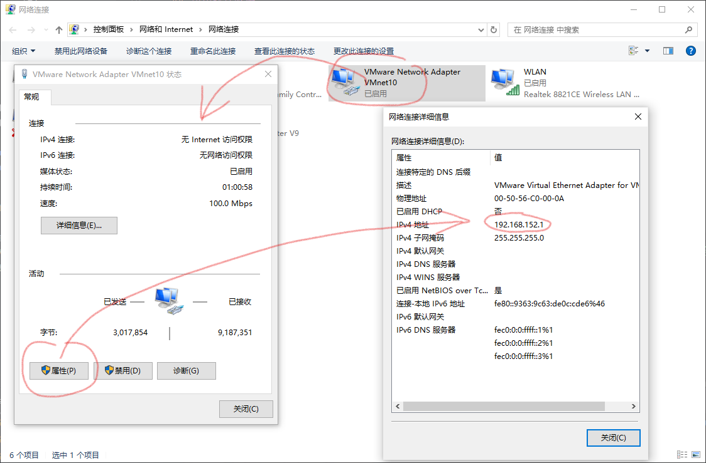

## 所用软件版本

 - VMware® Workstation 17 Pro 17.6.1 build-24319023
 - Ubuntu Server 24.04.1 AMD64

## 步骤

### 1. 修改虚拟网络编辑器

打开 `编辑-虚拟网络编辑器`，添加一个新的虚拟网络：


选择 `NAT 模式` 或者 `仅主机模式` 均可。我所使用的虚拟机无需联网，因此在这里选择的是 `仅主机模式`。

如果你需要 DHCP 分配虚拟机 IP，则在你刚刚添加的虚拟网络中，将 `使用本地 DHCP 服务将 IP 地址分配给虚拟机` 勾选。如果你的虚拟机使用静态 IP，那么勾不勾选都可以。

检查你的 Windows 网络适配器：



属性中显示的 `192.168.152.1` 即是此虚拟网络的网关地址。

### 2. 为每个虚拟机启用该网络

右键虚拟机，点击 `设置-网络适配器`，将网络连接设置为刚刚你创建的虚拟网络：


然后为每个你需要组网的虚拟机都如此设置。

### 3. 虚拟机配置网络

启动虚拟机，编辑 `/etc/netplan/50-cloud-init.yaml`

```bash
sudo nano /etc/netplan/50-cloud-init.yaml
```

此时你的配置文件应该是这样的（全新系统离线安装）：

```yaml
# This file is generated from information provided by the datasource.  Changes
# to it will not persist across an instance reboot.  To disable cloud-init's
# network configuration capabilities, write a file
# /etc/cloud/cloud.cfg.d/99-disable-network-config.cfg with the following:
# network: {config: disabled}
network:
    ethernets: {}
    version: 2
```

选择以下步骤中的其中一个，这取决于你启用了 DHCP 还是静态地址：

#### 3.1 DHCP

修改 `ethernets` 项：

```yaml
network:
    ethernets:
        ens33:
            dhcp4: true
    version: 2
```

重启 `netplan`：

```bash
sudo netplan apply
```

你现在可以看到你虚拟机的 IP 地址：

```bash
ip addr
# 或者 ip route
```


这里的 `192.168.152.128` 即是这台虚拟机分配的 IP 地址。

#### 3.2 静态 IP

修改 `ethernets` 项：

```yaml hl_lines="6 10 12"
network:
    ethernets:
        ens33:
            dhcp4: no
            addresses:
              - 192.168.152.200/24
            optional: true
            routes:
              - to: default
                via: 192.168.152.1
            nameservers:
              addresses: [192.168.152.1]
    version: 2
```

将 `192.168.152.200/24` 改成你想静态分配的 IP 地址，将 `192.168.152.1` 改为你的虚拟网络的网关。

重启 `netplan`：

```bash
sudo netplan apply
```

你现在可以看到你虚拟机的 IP 地址：

```bash
ip addr
# 或者 ip route
```


这里的 `192.168.152.200` 是你静态分配的 IP 地址。

### 4. 测试连接

#### 4.1 虚拟机与宿主机通信

在宿主机上 Ping 你的虚拟机：

```cmd
ping 192.168.152.200
```


#### 4.2 虚拟机与虚拟机通信

在虚拟机上 Ping 另外一台虚拟机：

```bash
ping 192.168.152.201
```


### 5. 使用主机名互联

通过为每个虚拟机分配其唯一的主机名，并将其记录到 `hosts` 文件中，我们可以不用每次都记录他们的 IP 地址。

#### 5.1 修改主机名

首先查看主机名：

```bash
hostnamectl
# 或 hostname
```


可以发现我这里的主机名已经是 `master` 了，这是因为我在安装系统时指定过主机名。如果你也是这么做的，那么你可以直接跳到 [5.2 修改 hosts 文件](#52-hosts)。

使用如下命令修改主机名，并重启：

```bash
sudo hostnamectl set-hostname master --static  # master 改为你要改的主机名
sudo reboot
```

#### 5.2 修改 hosts 文件

```bash
sudo nano /etc/hosts
```

根据你其他虚拟机的主机名，将其编辑后追加到 hosts 文件：

```
192.168.152.200 master
192.168.152.201 worker1
192.168.152.201 worker2
```

不要把虚拟机自己的主机名加进去了。

#### 5.3 测试

同 [4. 测试连接](#4)

将 IP 地址改为主机名，能互相 Ping 通即可。


