## 所用软件版本

 - VMware® Workstation 17 Pro 17.6.1 build-24319023
 - [Ubuntu Server 24.04.1 AMD64](https://ubuntu.com/download/server/thank-you?version=24.04.1&architecture=amd64&lts=true)
 - [Hadoop 3.4.0](https://www.apache.org/dyn/closer.cgi/hadoop/common/hadoop-3.4.0/hadoop-3.4.0.tar.gz)
 - [Java SE Development Kit 8u212](https://www.oracle.com/java/technologies/javase/javase8-archive-downloads.html#license-lightbox)

!!! warning "警告"

    注意，对于 Hadoop 3.4.0，请不要使用高版本 JDK（例如 23、21 等），请降级使用 JDK 1.8（即 Java 8），否则会产生以下各种错误：
    
     - [Hadoop Installation, Error: getSubject is supported only if a security manager is allowed](https://stackoverflow.com/questions/79016199/hadoop-installation-error-getsubject-is-supported-only-if-a-security-manager-i)
     - [\[HADOOP-19212\] \[JDK23\] org.apache.hadoop.security.UserGroupInformation use of Subject needs to move to replacement APIs - ASF JIRA](https://issues.apache.org/jira/browse/HADOOP-19212)
     - [Hadoop Java Versions - Hadoop - Apache Software Foundation](https://cwiki.apache.org/confluence/display/HADOOP/Hadoop+Java+Versions)
     - [Failed to retrieve data from /webhdfs/v1/?op=LISTSTATUS: Server Error解决](https://blog.csdn.net/qq_40797864/article/details/104980048)
     - [hadoop的 nodemanager和resourcemanager无法启动_resourcemanager和nodemanger不启动-CSDN博客](https://blog.csdn.net/onebigday/article/details/122989179)

## 集群架构

|           | HadoopMaster                                | HadoopWorker1     | HadoopWorker2     |
|-----------|---------------------------------------------|-------------------|-------------------|
| Static IP | `192.168.152.200`                           | `192.168.152.201` | `192.168.152.202` |
| hostname  | `master`                                    | `worker1`         | `worker2`         |
| username  | `arisa`                                     | `arisa`           | `arisa`           |
| password  | `arisa`                                     | `arisa`           | `arisa`           |
| HDFS      | NameNode<br/>SecondaryNameNode<br/>DataNode | DataNode          | DataNode          |
| YARN      | ResourceManager<br/>NodeManager             | NodeManager       | NodeManager       |

## 一、配置虚拟机

首先从 Ubuntu 官网下载 [Ubuntu 24.04.1 AMD64](https://ubuntu.com/download/server/thank-you?version=24.04.1&architecture=amd64&lts=true) 镜像。

创建虚拟机时选择 `自定义`。

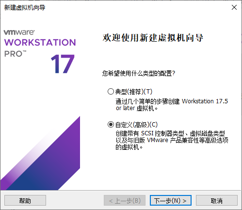

加载你下载的 Ubuntu 镜像。

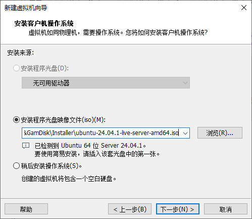

Hadoop 集群至少需要 3 台虚拟机，因此我们创建 3 台虚拟机，名字分别为：

 - `HadoopMaster`
 - `HadoopWorker1`
 - `HadoopWorker2`

请在创建虚拟机时注意修改虚拟机名字。

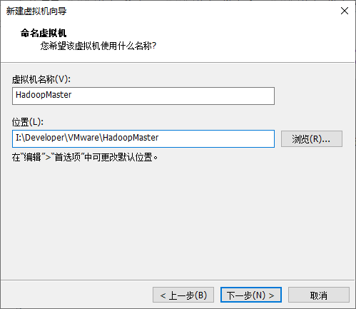

虚拟机性能设置随意，内存 4 GB 即可。

网络类型暂时先选择 `不使用网络连接`，我们稍后会在 [四、配置网络](#_4) 中配置网络。

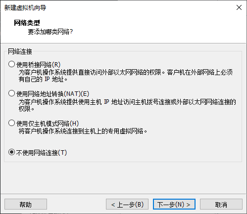

磁盘空间随意，分配 10~20 GB 即可。

创建完成后启动虚拟机，进入系统安装环节。

## 二、Ubuntu 系统安装

启动虚拟机，并等待自动初始化，直到出现语言选择界面。

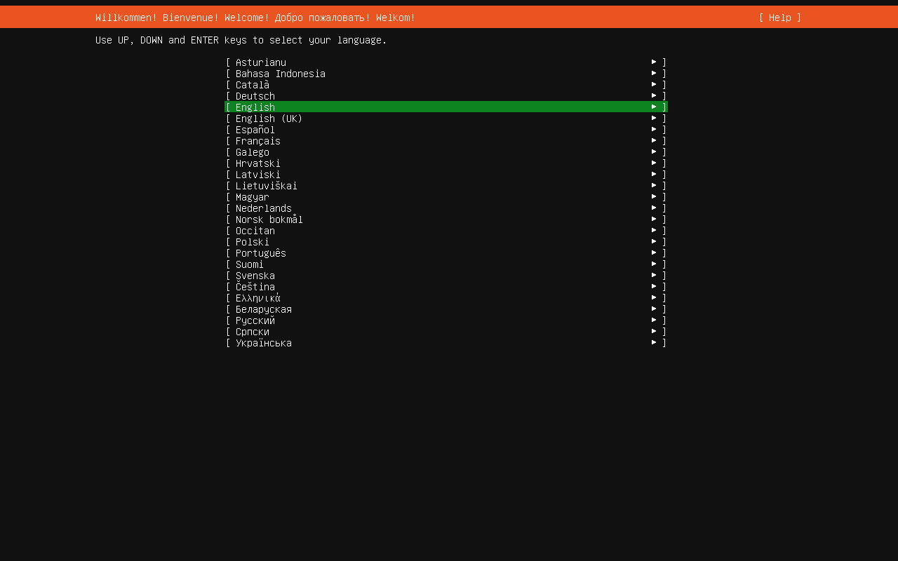

一路回车，不需要改动网络相关设置（会提示你没有网络等）和硬盘分区设置（只有你自己知道你在做什么的时候才更改），直到看到设置用户名的界面时，如下设置：

 - 姓名：`arisa`
 - 主机名：`master`（对于其他两台虚拟机，分别设置为 `worker1` 和 `worker2`，见 [集群架构](#_2)）
 - 用户名：`arisa`
 - 密码：`arisa`
 - 确认密码：`arisa`

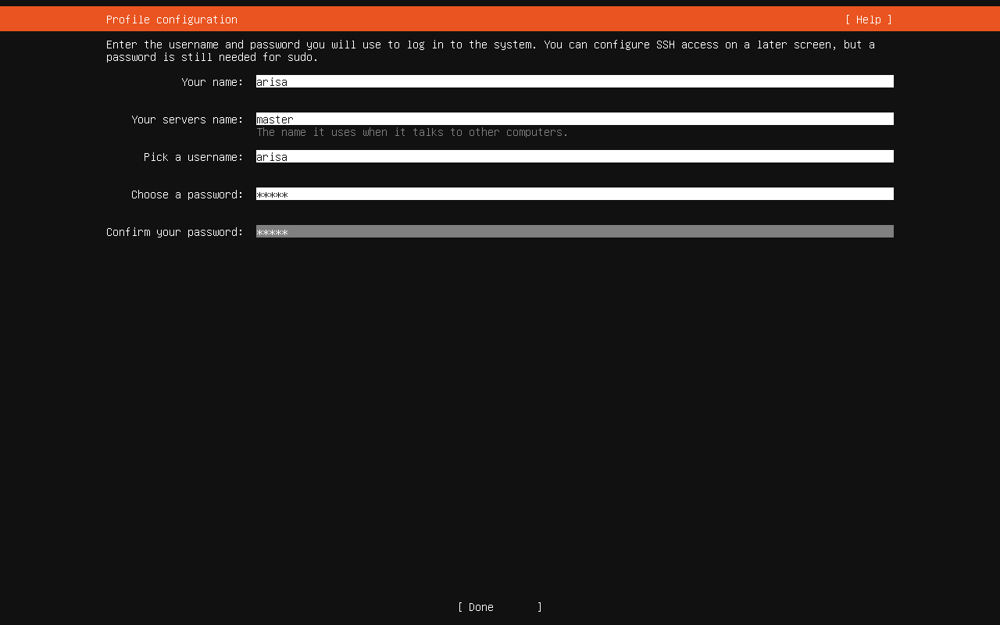

确认后一路继续，注意在这里勾选 `Install OpenSSH server`，以便我们后续通过 SSH 连接虚拟机。

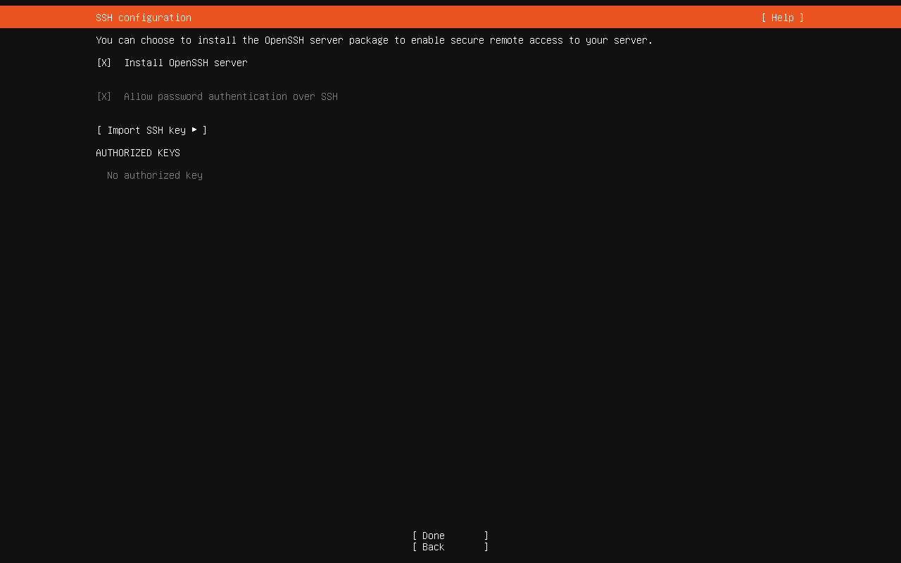

安装完成后卸载 CD/DVD 镜像，并重启虚拟机。

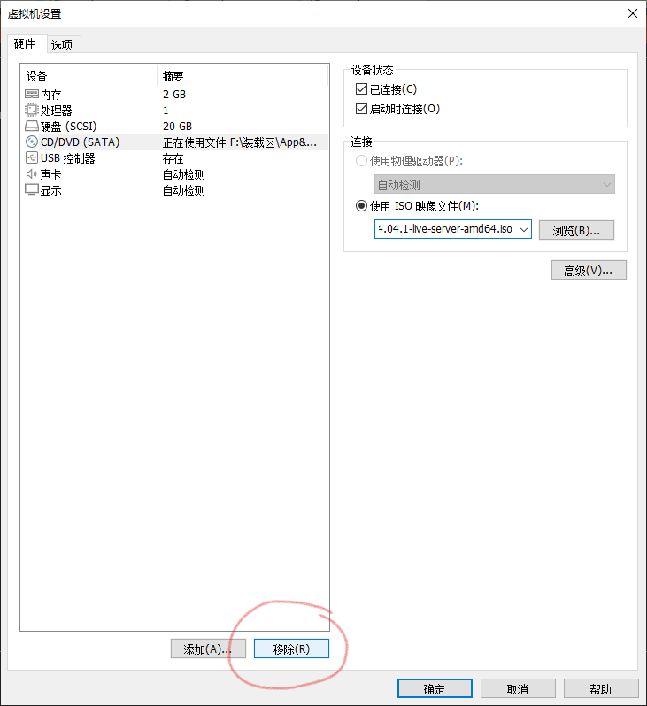

重启过程中以及后续启动可能会卡在 `systemd-networkd-wait-online.service`，这是因为我们没有配置网络连接。耐心等待即可。

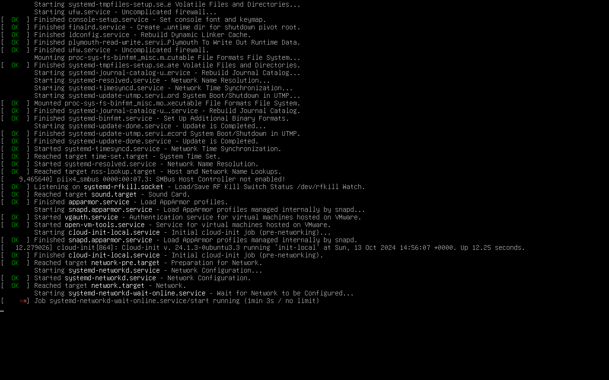

## 三、配置 root 账户

使用如下命令行为系统添加 root 账户：

```bash
sudo passwd root
```

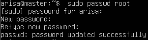

此时我们可以通过

```bash
su root
```

切换至 root 账户以便后续使用。

## 四、配置网络

按照 [Ubuntu 24.04 多虚拟机组网](./241012-ubuntu-2404-multi-vm-networking.md) 的说明进行网络配置。

需要注意的是，请使用静态 IP 地址，不要使用 DHCP。并确保每台虚拟机的 IP 如 [集群架构](#_2) 所示。

|           | HadoopMaster      | HadoopWorker1     | HadoopWorker2     |
|-----------|-------------------|-------------------|-------------------|
| Static IP | `192.168.152.200` | `192.168.152.201` | `192.168.152.202` |
| hostname  | `master`          | `worker1`         | `worker2`         |

!!! warning "警告"

    此外，如果你在编辑 `/etc/hosts` 时看到了诸如 `127.0.1.1 master` 这样的行，请将 `127.0.1.1` 替换为当前主机的静态 IP。

    因为在稍后编辑 `yarn-site.xml` 时，我们会将 `ResourceManager` 的地址设置为 `master:18088`。在 HadoopMaster 虚拟机上，这个接口需要暴露给公网，我们希望 `master:18088` 表示 `192.168.152.200:18088`（此处相当于 `0.0.0.0:18088`），而不是 `127.0.1.1:18088`。

!!! warning "警告"

    你还需要修改自己宿主机的 `hosts` 文件，指定 `master`、`worker1` 和 `worker2` 的 IP 地址。

    因为通过 HDFS Web UI 上传文件时，Web UI 会通过主机名访问 worker 节点。如果不修改宿主机的 `hosts`，那么上传文件时会导致 CORS 错误或者找不到主机。

!!! warning "警告"

    同理，在宿主机的浏览器上使用 `master` 作为域名访问 HDFS Web UI 时，不要启用代理软件，否则流量会从代理走，导致 CORS 错误或者找不到主机。

## 五、分发 SSH 公钥

Hadoop 主节点通过 SSH 控制所有节点（**包括主节点自己**），因此我们需要为所有节点分发 HadoopMaster 的 SSH 公钥。

在 HadoopMaster 上生成 SSH 密钥：

```bash
ssh-keygen -t rsa
```

将生成的公钥分发给自己：

```bash
cat ~/.ssh/id_rsa.pub >> ~/.ssh/authorized_keys
```

将公钥分发给其他节点：

```bash
ssh-copy-id -i ~/.ssh/id_rsa.pub arisa@worker1
ssh-copy-id -i ~/.ssh/id_rsa.pub arisa@worker2
```

在 HadoopMaster 上测试是否可以 SSH 登录到其他节点：

```bash
ssh arisa@worker1
```

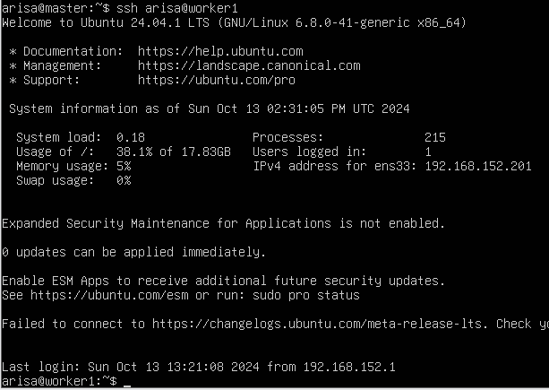

## 六、（可选）重新分配磁盘空间

如果你能忍受磁盘空间只分配了一半，那么你可以跳过这部分。

参考资料：[ubuntu的ubuntu--vg-ubuntu--lv磁盘扩容 - 厚礼蝎 - 博客园](https://www.cnblogs.com/guangdelw/p/17822292.html)

输入：

```bash
df -h
sudo fdisk -l
```

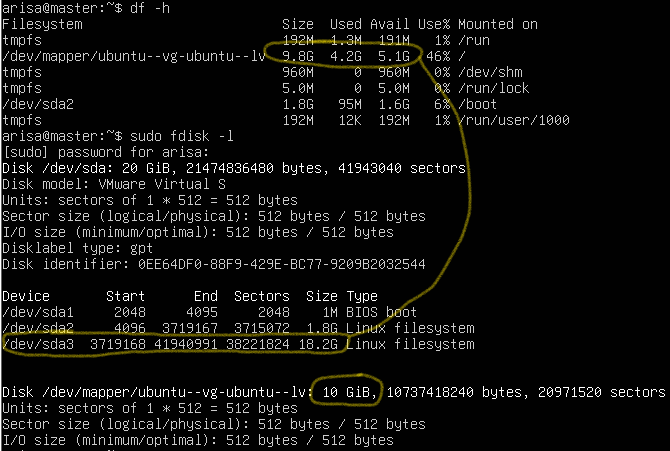

可以发现 `/dev/sda3` 的空间虽然有 18 GB，但是只分配了 9.8 GB 出去。说明有 10 GB 空闲。

输入：

```bash
sudo vgdisplay
```

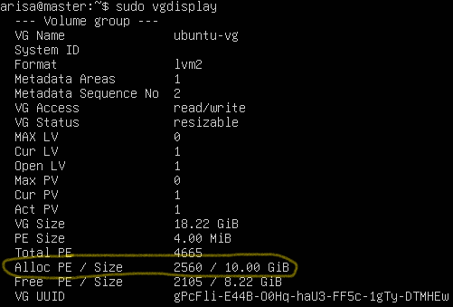

如果看到 Free PE / Size > 0，表示还有扩容空间。

输入：

```bash
sudo lvresize -l +100%FREE /dev/mapper/ubuntu--vg-ubuntu--lv
sudo resize2fs /dev/mapper/ubuntu--vg-ubuntu--lv
```

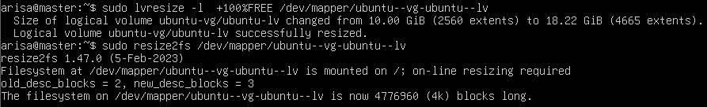

再次使用 `df -h` 查看磁盘空间，可以发现已经扩容成功。

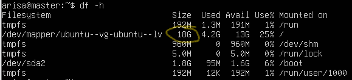

## 七、安装并配置 Java

下载 [Java SE Development Kit 8u212](https://www.oracle.com/java/technologies/javase/javase8-archive-downloads.html#license-lightbox)。

将压缩包复制到 `/usr/lib/jvm`，解压并删除原压缩文件：

```bash
sudo mkdir /usr/lib/jvm
sudo cp jdk-8u212-linux-x64.tar.gz /usr/lib/jvm
cd /usr/lib/jvm/
sudo tar -xzvf jdk-8u212-linux-x64.tar.gz
sudo rm jdk-8u212-linux-x64.tar.gz
```

在 `/etc/profile`、`~/.bashrc` 或 `~/.profile` 中的任意一个文件中添加：

```bash
export JAVA_HOME=/usr/lib/jvm/jdk1.8.0_212
```

## 八、安装 Hadoop

下载 [Hadoop 3.4.0](https://www.apache.org/dyn/closer.cgi/hadoop/common/hadoop-3.4.0/hadoop-3.4.0.tar.gz)。

解压：

```bash
tar -xzvf hadoop-3.4.0.tar.gz
mv hadoop-3.4.0 hadoop
```

Hadoop 共有 4 个配置文件和 1 个环境脚本需要修改：

 - 配置文件 [`core-site.xml`](#81-core-sitexml)
 - 配置文件 [`hdfs-site.xml`](#82-hdfs-sitexml)
 - 配置文件 [`mapred-site.xml`](#83-mapred-sitexml)
 - 配置文件 [`yarn-site.xml`](#84-yarn-sitexml)
 - 环境脚本 [`hadoop-env.sh`](#85-hadoop-envsh)

他们都位于 `./hadoop/etc/hadoop` 目录下。

!!! note "提示"

    值得注意的是，安装分布式系统时，他们的配置文件无需单独配置，以上 5 个文件可以在主节点配置好后直接复制到其他节点而无需更改。

    而唯一需要手动变更的地方是 [在 HadoopMaster 中指定从节点的主机名](#87-hadoopmaster)。

### 8.1 配置 `core-site.xml`

这个 xml 文件是 Hadoop 集群的核心配置，是关于集群中分布式文件系统的入口地址和分布式文件系统中数据落地到服务器本地磁盘位置的配置。

分布式文件系统（Hadoop Distributed FileSystem，HDFS）是集群中分布式存储文件的核心系统，其入口地址决定了 Hadoop 集群架构的主节点，其值为 `hdfs://master:9000`。故而，我们将 HadoopMaster 节点称为集群架构中的主节点。

```xml title="core-site.xml（部分）" linenums="1" hl_lines="10"
<configuration>

	<property> 
		<name>fs.defaultFS</name> 
		<value>hdfs://master:9000</value> 
	</property> 

	<property> 
		<name>hadoop.tmp.dir</name> 
		<value>/home/arisa/data</value> 
	</property> 
    
</configuration>
```

!!! warning "警告"

    我们将 `hadoop.tmp.dir` 设置为 `/home/arisa/data`，而这个目录不存在，记得要在**每个节点**上都创建这个目录。

```bash
mkdir /home/arisa/data
```

### 8.2 配置 `hdfs-site.xml`

```xml title="hdfs-site.xml（部分）" linenums="1"
<configuration>

	<property> 
		<name>dfs.replication</name> 
		<value>2</value> 
	</property> 

</configuration>
```

这里唯一设置的 `dfs.replication` 的值是 `2`。

在生产环境中，配置数是 `3`，也就是同一份数据会在分布式文件系统中保存 3 份，即它的冗余度为 3。也就是说至少需要 3 台从节点来存储这3份数据块副本。为什么是从节点呢？因为在 Hadoop 集群中，主节点是不存储数据副本的，数据的副本都存储在从节点上，由于现在集群的规模是 3 台服务器，其中从节点只有两台，所以这里只能配置成 `1` 或者 `2`。

在分布式的文件系统中，由于集群规模很大，所以集群中会频繁出现节点宕机的问题，例如，现在的集群规模是 HadoopMaster、HadoopWorker1 和 HadoopWorker2，如果 HadoopWorker1 或者 HadoopWorker2 突然宕机了，那么其上存储的数据就会丢失。所以在分布式的文件系统中，可通过数据块副本冗余的方式来保证数据的安全性，即对于同一块数据，会在 HadoopWorker1 和 HadoopWorker2 节点上各保存一份。这样，即使 HadoopWorker1 节点宕机导致数据块副本丢失，HadoopWorker2 节点上的数据块副本还在，就不会造成数据的丢失。

### 8.3 配置 `mapred-site.xml`

Hadoop 集群有两大核心模块：一个是 HDFS 分布式文件系统；另一个是分布式并行计算框架 MapReduce。

MapReduce 在运行一个计算任务的时候需要集群的内存和 CPU 的资源，这时候 MapReduce 就会向 ResourceManager 申请计算所需要的集群的资源。

```xml title="mapred-site.xml（部分）" linenums="1"
<configuration>

	<property>
		<name>mapreduce.framework.name</name>
		<value>yarn</value>
	</property>
	
	<property>
		<name>yarn.app.mapreduce.am.env</name>
		<value>HADOOP_MAPRED_HOME=/home/arisa/hadoop</value>
	</property>
	
	<property>
		<name>mapreduce.map.env</name>
		<value>HADOOP_MAPRED_HOME=/home/arisa/hadoop</value>
	</property>
	
	<property>
		<name>mapreduce.reduce.env</name>
		<value>HADOOP_MAPRED_HOME=/home/arisa/hadoop</value>
	</property>

</configuration>
```

这里将 `mapreduce.framework.name` 设置为 `yarn`，从而将 Hadoop MapReduce 分布式并行计算框架在运行中所需要的内存、CPU 等资源交给 YARN 来协调和分配。

另外你需要将 `HADOOP_MAPRED_HOME` 的值指定为你的 Hadoop 发行版的安装位置，从而正确使用 MapReduce。

### 8.4 配置 `yarn-site.xml`

YARN 的全称是 Yet Another Resource Negotiator，即另一种资源协调者。

YARN 也是主从架构，运行在主节点上的守护进程是 ResourceManager，负责整个集群资源的管理协调；运行在从节点上的守护进程是 NodeManager，负责从节点本地的资源管理协调。

每隔 3 秒，NodeManager 就会把它自己管理的本地服务器上的资源使用情况以数据包的形式发送给主节点上的守护进程 ResourceManager，这样，ResourceManager 就可以随时知道所有从节点上的资源使用情况，这个机制叫“心跳”。当“心跳”回来的时候，ResourceManager 就会根据各个从节点资源的使用情况，把相应的任务分配下去。“心跳”回来时，携带了 ResourceManager 分配给各个从节点的任务信息，从节点 NodeManager 就会处理主节点 ResourceManager 分配下来的任务，这就是 YARN 的基本工作原理。

```xml title="yarn-site.xml（部分）" linenums="1"
<configuration>
    
    <!-- 配置 HDFS 网页登录使用的静态用户为 arisa-->
    <property>
        <name>hadoop.http.staticuser.user</name>
        <value>arisa</value>
    </property>

    <!-- yarn.nodemanager.aux-services 是 NodeManager 上运行的附属服务，其值需要
    配置成 mapreduce_shuffle，才可以运行 MapReduce 程序-->
    <property>
        <name>yarn.nodemanager.aux-services</name>
        <value>mapreduce_shuffle</value>
    </property>

    <!-- yarn.resourcemanager.address 是 ResourceManager 对客户端暴露的访问地址，
    客户端通过该地址向 ResourceManager 提交或结束 MapReduce 应用程序-->
    <property>
        <name>yarn.resourcemanager.address</name>
        <value>master:18040</value>
    </property>

    <!-- yarn.resourcemanager.scheduler.address 是 ResourceManager 对
    ApplicationMaster（客户端将 MapReduce 应用程序提交到集群中，ResourceManager
    接受客户端应用程序的提交后，将该应用程序分配给某一个 NodeManager，对该 MapReduce
    应用程序进行初始化，进而产生一个应用程序初始化 Java 对象，将这个 Java 对象称为 
    ApplicationMaster）暴露的访问地址，ApplicationMaster 通过该地址向 ResourceManager
    申请 MapReduce 应用程序在运行过程中所需要的资源，以及程序运行结束后对使用资源的释放等-->
    <property>
        <name>yarn.resourcemanager.scheduler.address</name>
        <value>master:18030</value>
    </property>

    <!-- yarn.resourcemanager.resource-tracker.address 是 ResourceManager 对
    NodeManager 暴露的访问地址，NodeManager 通过该地址向 ResourceManager 发送心跳
    数据，汇报资源使用情况以及领取 ResourceManager 将要分配给自己的任务等-->
    <property>
        <name>yarn.resourcemanager.resource-tracker.address</name>
        <value>master:18025</value>
    </property>

    <!-- yarn.resourcemanager.admin.address 是 ResourceManager 对管理员 admin
    暴露的访问地址，管理员可通过该地址向 ResourceManager 发送管理命令等-->
    <property>
        <name>yarn.resourcemanager.admin.address</name>
        <value>master:18141</value>
    </property>

    <!-- yarn.resourcemanager.webapp.address 是 ResourceManager YARN 平台提供
    用户查看正在运行的 MapReduce 程序的进度和状态的WEB UI系统的访问地址，
    可通过该地址在浏览器中查看应用程序的运行状态信息 -->
    <property>
        <name>yarn.resourcemanager.webapp.address</name>
        <value>master:18088</value>
    </property>

</configuration>
```

客户端向整个集群发起具体的计算任务，然后 ResourceManager 获得具体的任务信息，所以 ResourceManager 是接受和处理客户端请求的入口。

### 8.5 配置 `hadoop-env.sh`

```bash title="hadoop-env.sh（部分）" linenums="1"
export JAVA_HOME=/usr/lib/jvm/jdk1.8.0_212
```

你所需要做的仅仅只是添加 `JAVA_HOME` 的环境变量。

### 8.6 分发配置文件

将以上 4 个 `xml` 文件 和 1 个 `sh` 文件同步到其他节点：

```bash
cd ./hadoop/etc/hadoop
scp core-site.xml hdfs-site.xml mapred-site.xml yarn-site.xml hadoop-env.sh arisa@worker1:/home/arisa/hadoop/etc/hadoop
scp core-site.xml hdfs-site.xml mapred-site.xml yarn-site.xml hadoop-env.sh arisa@worker2:/home/arisa/hadoop/etc/hadoop
```

### 8.7 在 HadoopMaster 中指定从节点的主机名

主节点的角色 HadoopMaster 已在配置 HDFS 分布式文件系统的入口地址时进行了配置说明，从节点的角色也需要配置，此时，`workers` 文件就是用来配置 Hadoop 集群中各个从节点角色的。


编辑 HadoopMaster 的 `./hadoop/etc/hadoop/workers` 文件，将：

```
localhost
```

改为：

```
worker1
worker2
```

## 九、启动并测试 Hadoop

### 9.1 启动 Hadoop

Hadoop 是主从架构，启动时由主节点带动从节点，所以启动集群的操作需要在主节点 HadoopMaster 完成：

```bash
cd ~
./hadoop/sbin/start-all.sh
```

### 9.2 测试守护进程与端口监听

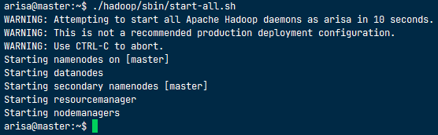

在 HadoopMaster、HadoopWorker1、HadoopWorker2 上都执行 `jps` 命令，可以看到以下进程在执行：

 - HadoopMaster：`NameNode`、`SecondaryNameNode`、`ResourceManager`、`NodeManager`
 - HadoopWorker1：`DataNode`、`NodeManager`
 - HadoopWorker2：`DataNode`、`NodeManager`

同时你也可以检查每台节点开放的端口：

```bash
sudo lsof -i -P -n | grep LISTEN
```

在浏览器上分别检查以下地址，应该都能正常打开：

 - NameNode（HDFS Web UI）：http://192.168.152.200:9870
 - SecondaryNameNode：http://192.168.152.200:9868
 - ResourceManager：http://192.168.152.200:18088

!!! note "提示"

    将 `192.168.152.200` 替换成 `master` 也可以打开对应网页。

    如果使用 `master` 无法打开，请参考 [四、配置网络](#_4) 中的说明，看看有没有踩坑。

### 9.3 测试 HDFS

进入 [HDFS 文件系统浏览器](http://192.168.152.200:9870/explorer.html#/)，尝试创建一个 `testdir` 文件夹：

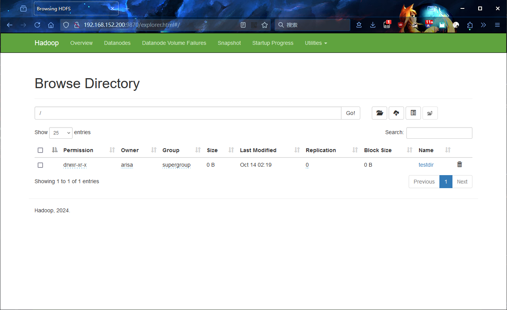

尝试在 `testdir` 中上传一个文件：


### 9.4 测试 MapReduce

通过 Pi 估算程序，测试 MapReduce 是否能够正常进行计算任务：

```bash
cd ~
./hadoop/bin/hadoop jar ./hadoop/share/hadoop/mapreduce/hadoop-mapreduce-examples-3.4.0.jar pi 10 10
```

这会使用 MapReduce 框架计算 Pi 的值。

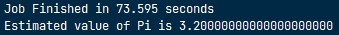

若能正确估算，说明 MapReduce 可以正常工作。
