## 一、问题背景

Google Drive 是一个好东西，但是它缺少 WebDAV 的访问方式。截止 2024 年 11 月，全网仍然缺少 WebDAV 访问方式的教程，因此我决定写一个以填补这个领域的空白。

由于 Google Drive 原生不提供 WebDAV 访问方式，因此我们需要借助 rclone 来实现这个功能。

大致解决思路为：

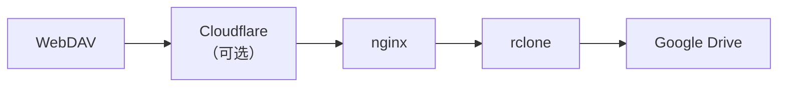

!!! info "省流版"

    如果你什么东西都有了，而且你完全知道你在做什么，那么本文章能给你的帮助只有如下三点：

    1. 
      ```bash
      rclone mkdir gdrive:webdav
      rclone serve webdav gdrive:/webdav --addr 127.0.0.1:8080 --user USERNAME --pass PASSWD --buffer-size 32M --vfs-cache-mode minimal
      ```
    2. `--vfs-cache-mode` 参数说明：[rclone 文档](https://rclone.org/commands/rclone_serve_webdav/#vfs-cache-mode-off)
    3. nginx 配置时注意设置 `client_max_body_size`

## 二、前提需求

 - 一台服务器
 - [rclone](https://rclone.org/downloads/) 已安装

本文章已默认你熟悉：

 - rclone
 - Google Cloud Console
 - nginx
 - Cloudflare 

的相关操作。

本文的图片只展示关键位置的图片，部分无太大意义的图片（比如告诉你创建按钮在哪）将被省略并以文字说明替代。

## 三、获取 Google Drive 相关令牌

### 3.1 获取 JSON 格式的私钥

按照 [官方教程](https://rclone.org/drive/#1-create-a-service-account-for-example-com) 或本文提供的教程获取 JSON 格式的私钥。

#### 创建项目

首先打开 [Google Cloud Console](https://console.cloud.google.com/) 并创建一个项目

#### 创建服务账号

在左侧导航菜单中找到 `IAM 和管理` 里的 `服务账号`：

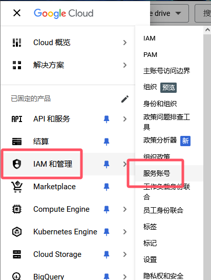

点击最上方 `创建服务账号`。

创建服务账号中的第 2、3 步骤为可选步骤，可以跳过。

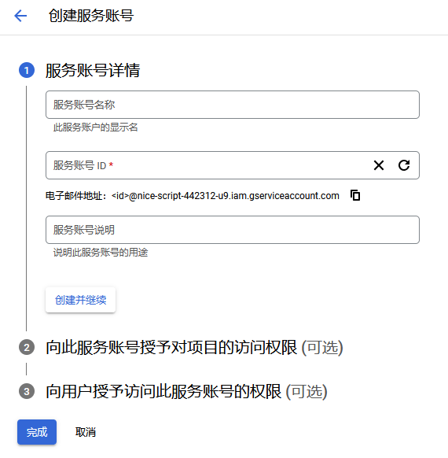

#### 下载 JSON

创建完成后，选择你刚刚创建的那个服务账号，进入 `密钥` 选项卡，点击 `添加键` - `创建新密钥` - `JSON`：

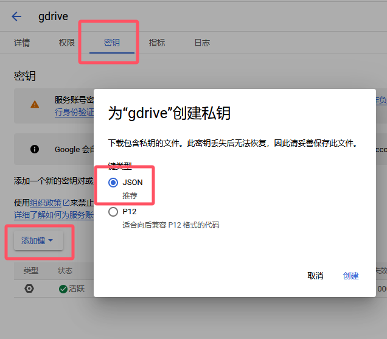

点击 `创建` 后，会下载一个 JSON 文件，这个文件就是你的私钥。

稍后你需要将其上传至你的服务器，并记录这个文件的绝对路径。

### 3.2 获取 OAuth 2.0 Client 的 ID 和密钥

按照 [官方教程](https://rclone.org/drive/#making-your-own-client-id) 或本文提供的教程获取 JSON 格式的私钥。

#### 找到 Google Drive API

首先还是进入 [Google Cloud Console](https://console.cloud.google.com/)，并进入你之前创建的项目。

点击 `启用 API 和服务`，搜索 `Google Drive`：

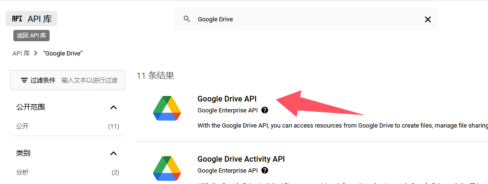

点击 `启用`。

#### 配置权限请求页面

启用完成后点击左侧导航菜单的 `OAuth 权限请求页面` 来配置权限请求页面（以前这个地方叫做 `同意屏幕`）

点击 `配置权限请求页面`。这里可能会提示让你进入新界面：

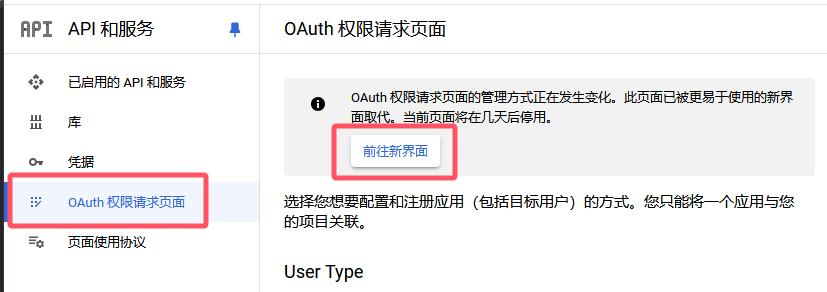

为了统一教程，我们进入新界面。

应用名称随便输入，我这里输入 `rclone`。用户支持电子邮箱在下拉栏中选择你自己的邮箱即可。

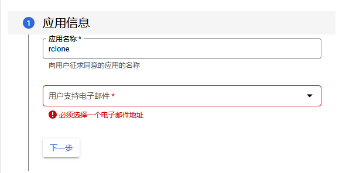

受众群体选择 `外部`：

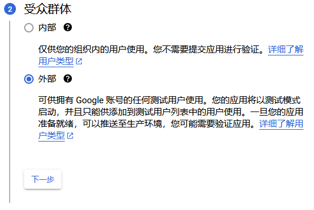

联系信息填你自己的邮箱。

#### 配置数据访问范围

创建完成后,在左侧菜单中点击 `数据访问`，添加以下范围：

 - `https://www.googleapis.com/auth/docs`
 - `https://www.googleapis.com/auth/drive`
 - `https://www.googleapis.com/auth/drive.metadata.readonly`

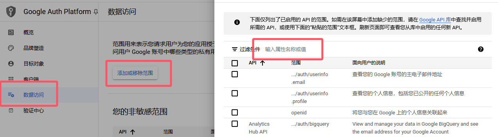

添加完成后应该是这个样子的：

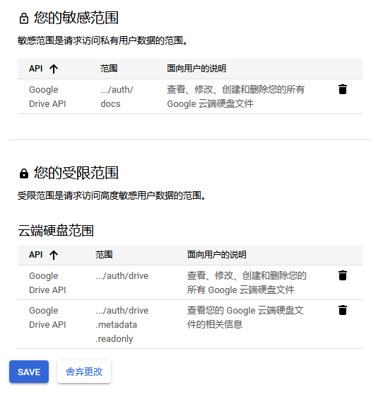

点击 `保存`。

#### 添加自己为测试用户并发布应用

点击左侧菜单中的 `目标对象`，把你自己的邮箱添加进测试用户列表里：

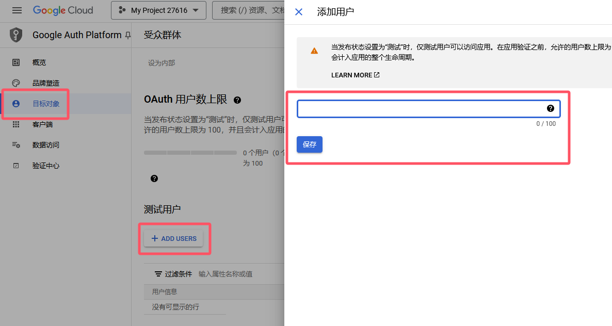

然后选择 `发布应用`，发布后会提示 `您的应用需要进行验证。完成信息配置后，请提交您的应用以供审核。`，点击 `前往验证中心`。

#### 创建 OAuth 2.0 客户端

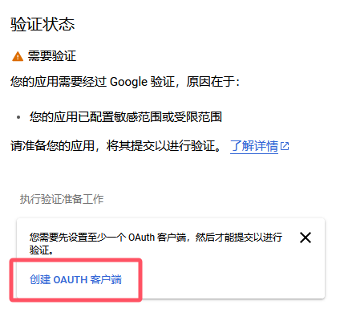

类型选择 `桌面应用`，名称随意：

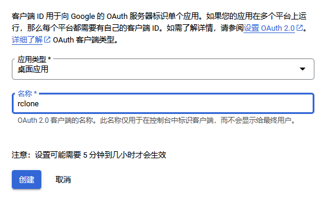

#### 获取客户端 ID 和客户端密钥

验证完成后通过左侧菜单回到凭据页：

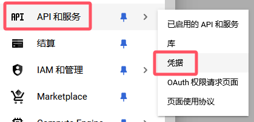

点击你刚刚创建的 OAuth 2.0 客户端 ID：

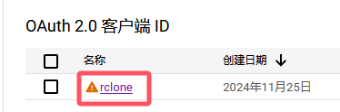

在右侧 `Additional information` 区域复制客户端 ID 和客户端密钥即可。

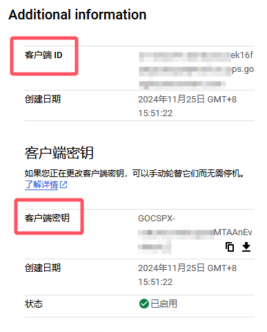

## 四、配置 rclone

### 4.1 上传 JSON 文件

首先上传你的 JSON 文件到服务器上，记录其绝对路径。

### 4.2 配置 remote（教程所用 rclone 版本：`1.66.0`）

然后按照如下配置添加 rclone remote：

```bash
rclone config
```

会出现：

```
No remotes found, make a new one?
n) New remote
r) Rename remote
c) Copy remote
s) Set configuration password
q) Quit config
n/r/c/s/q> n
name> gdrive
```

这里我们新建的 remote 名为 `gdrive`

```
Type of storage to configure.
Choose a number from below, or type in your own value
[snip]
XX / Google Drive
   \ "drive"
```

输入 Google Drive 的对应数字。

```
Google Application Client Id - leave blank normally.
client_id>
Google Application Client Secret - leave blank normally.
client_secret>
```

输入你获取的 OAuth 2.0 客户端 ID 和客户端密钥。

```
Scope that rclone should use when requesting access from drive.
Choose a number from below, or type in your own value
 1 / Full access all files, excluding Application Data Folder.
   \ "drive"
 2 / Read-only access to file metadata and file contents.
   \ "drive.readonly"
   / Access to files created by rclone only.
 3 | These are visible in the drive website.
   | File authorization is revoked when the user deauthorizes the app.
   \ "drive.file"
   / Allows read and write access to the Application Data folder.
 4 | This is not visible in the drive website.
   \ "drive.appfolder"
   / Allows read-only access to file metadata but
 5 | does not allow any access to read or download file content.
   \ "drive.metadata.readonly"
```

输入 `1`，即 `drive`。

```
Service Account Credentials JSON file path - needed only if you want use SA instead of interactive login.
service_account_file>
```

输入你保存的 JSON 文件的绝对路径。

### 4.3 测试 remote

假设我们刚刚创建的 remote 名为 `gdrive`，现在你可以通过以下命令行测试是否配置正确：

```bash
rclone ls gdrive:  # 列出 Google Drive 的文件
rclone lsd gdrive:  # 列出 Google Drive 的文件夹
```

以上命令行应该能够列出你的 Google Drive 文件和文件夹。如果什么内容都没有，那么你可以尝试新建一个文件夹再 `lsd`：

```bash
rclone mkdir gdrive:test
rclone lsd gdrive:
```

此时你应该可以看到 `test` 文件夹。你可以通过：

```bash
rclone rmdir gdrive:test
```

来删除这个测试文件夹。

### 4.4 配置 WebDAV

（如果你已经很熟悉 rclone 了，并且你知道你在做什么，那么你可以跳过这部分，自由配置 WebDAV）

先在 Google Drive 中新建一个文件夹，名为 `webdav`，以便我们单独管理 WebDAV 的文件。

```bash
rclone mkdir gdrive:webdav
```

然后通过以下命令行启动 rclone：

```bash
rclone serve webdav gdrive:/webdav --addr 127.0.0.1:8080 --user USERNAME --pass PASSWD --buffer-size 32M --vfs-cache-mode minimal
```

其中：

 - `--addr` 是你要监听的地址和端口，我们监听在 `127.0.0.1` 下面以便后续配置 nginx
 - `--user` 和 `--pass` 是你通过 WebDAV 访问时的用户名和密码
 - `--vfs-cache-mode` 我们设置为 `minimal`，你也可以设置为其他的值，请参考 [rclone 文档](https://rclone.org/commands/rclone_serve_webdav/#vfs-cache-mode-minimal)

## 五、配置相关网络服务

### 5.1 nginx

打开你的 nginx 配置文件，添加一个 `server` 块

```nginx hl_lines="11"
server {
    listen 80;
    listen [::]:80;
    server_name 你准备监听的主机名;

    location / {
        proxy_set_header Host $host;
        proxy_set_header X-Real-IP $remote_addr;
        proxy_set_header X-Forwarded-For $proxy_add_x_forwarded_for;
        proxy_pass http://127.0.0.1:8080;
        client_max_body_size 100M;
    }
}
```

配置中最重要的一个部分是 `client_max_body_size`，它的参数决定了你能上传文件的最大限制。其他的行就按照你平时配置 nginx 的方式来配置即可。

### 5.2 Cloudflare

会用 Cloudflare 的自然无需再教。这里额外说一句，对应 DNS 的代理选项是可以勾的，不过速度好像没怎么变化。

## 六、测试

### 6.1 浏览器

直接打开你的域名，然后输入你的 WebDAV 用户名和密码，你应该可以看到你的 Google Drive 文件了。

新打开的应该是空的，因为 `webdav` 文件夹下并没有保存任何文件。

在浏览器中你只能下载，无法上传文件。

### 6.2 Android

可以下载质感文件：

 - [GitHub](https://github.com/zhanghai/MaterialFiles)
 - [Google Play](https://play.google.com/store/apps/details?id=me.zhanghai.android.files&hl=zh)

在汉堡菜单中选择 `添加存储空间`，选择 `WebDAV 服务器` 即可。

在质感文件中你可以尝试添加文件，从而测试上传功能。