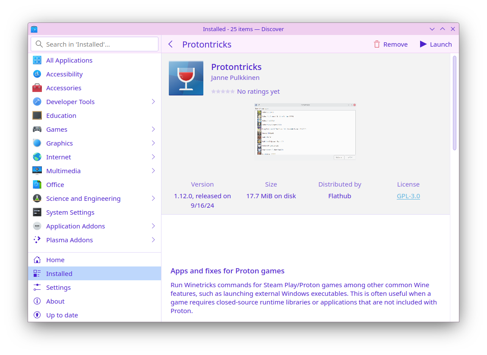
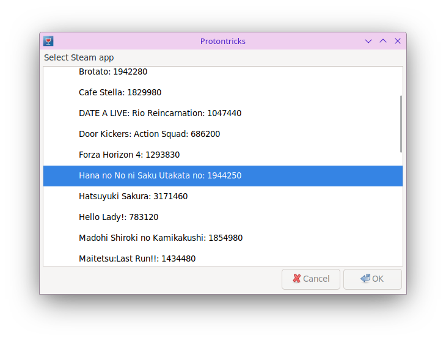
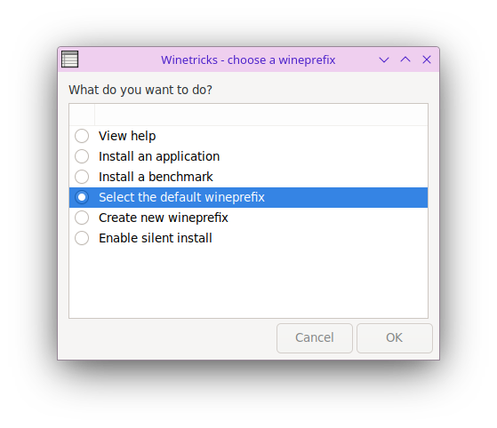
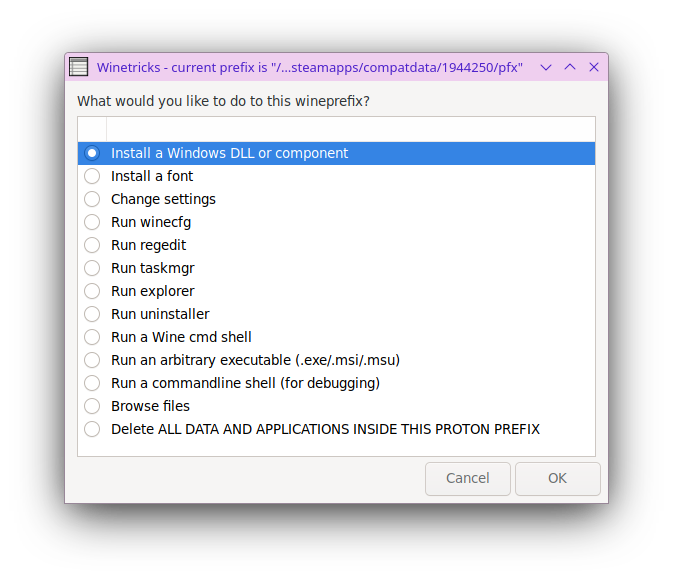
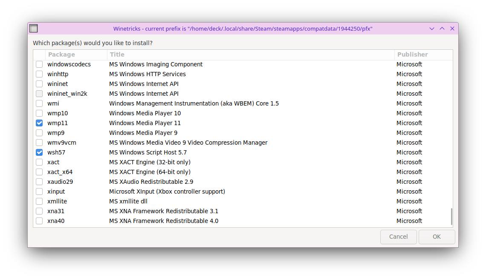

!!! info "省流版"

    其实就是在 Protontricks 安装 wmp11 + quartz + directshow + lavfilters 这些运行环境，然后就可以播放视频了。

    推荐在 [ProtonDB](https://www.protondb.com/) 事先查询该游戏需要安装哪些运行环境。

## 一、安装 Protontricks 工具

Protontricks 是个好东西，它已经集成了绝大多数游戏运行的所需环境，我们只用勾选即可让它帮我们自动下载并安装。

在 SteamOS / KDE 自带的软件商城 Discover 中搜索并安装这个工具即可。本文所用版本为 1.12.0，发布于 2024 年 9 月 16 日



## 二、尝试添加缺失的运行环境

首先运行一次你所需修复的游戏，无论是否启动成功。这一步是为了让 SteamOS 自动生成游戏的 Wine 环境。

然后打开 Protontricks，选择你所需修复的游戏，这里我以 [五色浮影绽放于花之海洋（1944250）](https://store.steampowered.com/app/1944250) 为例：



选择 `OK` 后耐心等待一段时间后将出现 wineprefix 选项，这里要求我们选择一个 Wine 环境进行操作，选择 `Select the default wineprefix`：



然后 Protontricks 会询问我们要对该 Wine 环境进行什么操作，选择 `Install a Windows DLL or component`：



稍等一会，Protontricks 将列出一堆运行环境，选择你所需要的组件：



!!! tip "关于运行环境的选择"

    一般来说，选择 wmp11 + quartz + directshow + lavfilters 即可解决绝大部分视觉小说无法播放视频的问题。

    如果还是不行，你可以自行尝试排列组合其他组件。

    推荐在 [ProtonDB](https://www.protondb.com/) 事先查询该游戏需要安装哪些运行环境。

点击 `OK` 后，Protontricks 会在后台通过 aria2c 下载所需的运行环境，并自动安装。

勾选的全部组件安装完成后，将回到 `What do you like to do to the wineprefix?` 界面，关闭即可。

然后测试游戏，视频应该可以正常播放了：


## 三、关于网络问题

### 3.1 关于 Flathub 镜像源

若 Discover 网络不佳，可在其 Settings 中自行添加 Flathub 镜像源（上海交通大学）：

```
https://mirror.sjtu.edu.cn/flathub
```

### 3.2 关于 Protontricks 代理

Protontricks 需要在互联网上下载组件，如果你没有代理，下载速度可能会令你难受。

假设你在局域网中已经有了一个 HTTP 代理 `http://192.168.1.100:1080`，你可以在终端中设置代理：

```bash
export http_proxy=http://192.168.1.100:1080
export https_proxy=http://192.168.1.100:1080
```

然后再在同一终端中运行 Protontricks：

```bash
/usr/bin/flatpak run --branch=stable --arch=x86_64 --command=protontricks com.github.Matoking.protontricks --no-term --gui
```
