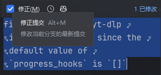
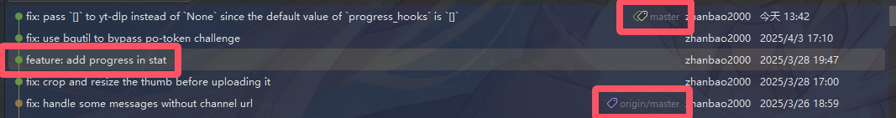
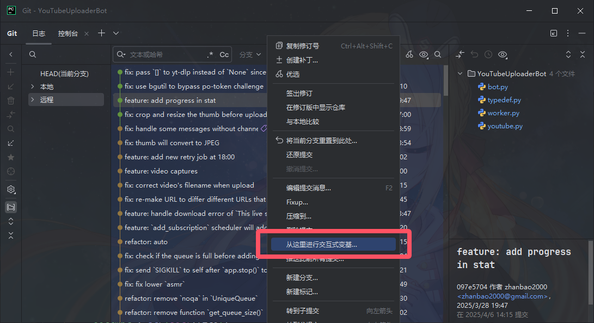
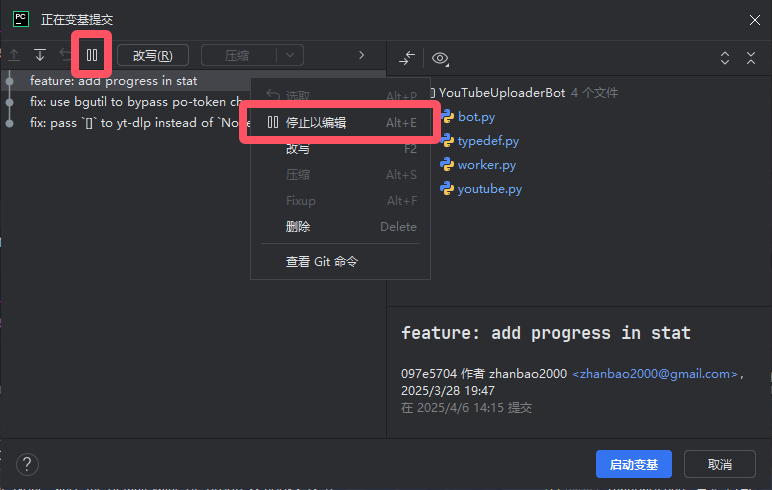
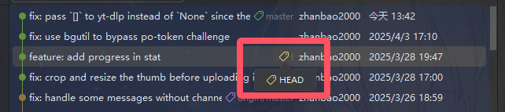
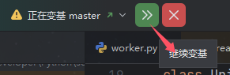

!!! warning "警告"
    
    如果你已经 push 了，并且你还做不到 `#!bash git push -f`，就不要看本文了，神仙难救。

## 背景

在开发过程中，我们可能会对历史中的某次提交记录不满意，例如当时功能差了那么一点点（但又不足以再提交一个 fix），或是有什么一两行的风格有问题（但是为此特地提交一个 refactor 又显得很多余），甚至可能仅仅是当时有个 typo 没发现。为了我们的 Git 提交记录的整洁性和可读性，我们可能会想要修正这些提交记录，而不是弄一个新的 commit。

对于最新的提交，我们自然而然地会想到直接使用 “修正提交” 的功能，它可以无损地将你对代码未提交的修改合并到最新的提交中。



这一操作同等于 Git 命令行的：

```bash
git commit --amend
```

但是对于旧的提交，我们就需要使用交互式变基来实现了。

## 何为交互式变基


交互式变基（Interactive Rebase）是 Git 的一个强大功能，它允许你以交互方式修改 Git 提交历史。与普通变基不同，交互式变基给你提供了一个编辑界面，让你能够对选定的提交序列执行多种操作：

 - 编辑（Edit）：暂停变基过程，让你修改提交内容或提交信息
 - 重写（Reword）：仅修改提交信息
 - 压缩（Squash）：将多个提交合并为一个
 - 丢弃（Drop）：删除某个提交
 - 重新排序：改变提交的顺序

在命令行中，交互式变基通过以下命令启动：

```bash
git rebase -i <基准点>
git rebase -i HEAD~<N>
```

其中 `<基准点>` 是你想要变基的起始提交；或者使用 `HEAD~<N>` 以指定从当前提交开始的 N 个提交。

交互式变基非常适合于：

 - 修复旧提交中的错误或遗漏
 - 整理提交历史，使其更加清晰
 - 在推送到远程仓库前整理本地提交

在 PyCharm 中，交互式变基被集成到 Git 工具窗口中，提供了图形化界面来简化这一过程，对不熟悉命令行的开发者非常友好。

## 如何使用 PyCharm 进行交互式变基

假定我们在本地有一个尚未 push 的旧提交需要修正，他们位于远程 `origin/master` 分支的 HEAD 之后，但位于本地 `master` 分支的 HEAD 之前。



此时右键选中该提交，选择 “从这里进行交互式变基..”：



Git 插件将启动交互式变基 GUI。选中我们想要修正的那一次提交，点击工具栏的 :material-pause: 按钮（或者右键选择 “停止以编辑”）



此时选中的提交前面将会变为 :material-pause: 图标，表示我们已经暂停在该提交上。接下来，点击右下角的 “启动变基” 即可。

变基启动之后，你会发现，当前的 HEAD 已经变成了你选中的提交（原本是在 `master` 上），并且工具栏中也显示了 “正在变基 `master`”



此时修改你的代码……

完成修改后，在提交工具窗口勾选 “修正提交” 选项，点击提交。

最后点击 Git 工具窗口中的 “继续变基” 完成变基操作：



## 对应的命令行实现

刚刚的这一套操作相当于：

1. 先将你的新变更添加到暂存区：

    ```bash
    git add .
    ```

2. 启动交互式变基：

    ```bash
    git rebase -i <基准点>
    ```

3. 在编辑器中，找到你想要修正的提交，将其前面的 `pick` 改为 `edit`，保存并退出编辑器。

4. Git 会停在该提交处，执行：

    ```bash
    git commit --amend
    ```
   
5. 然后继续变基：

    ```bash
    git rebase --continue
    ```
