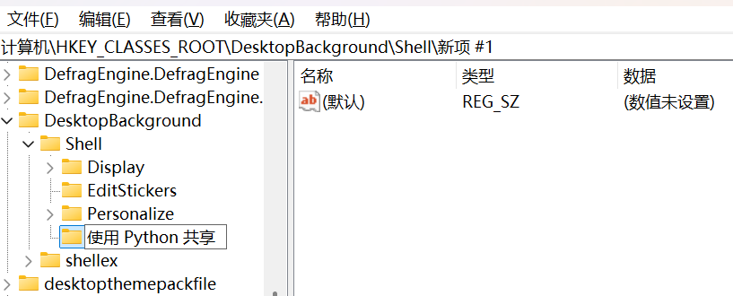
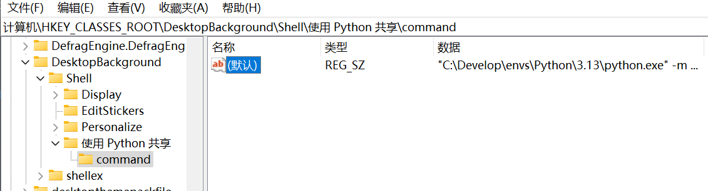
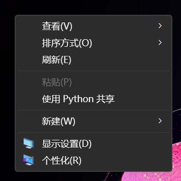
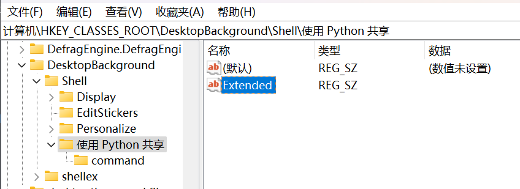
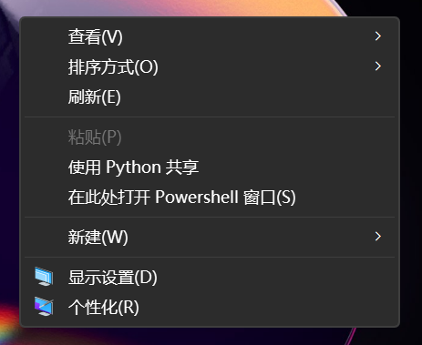
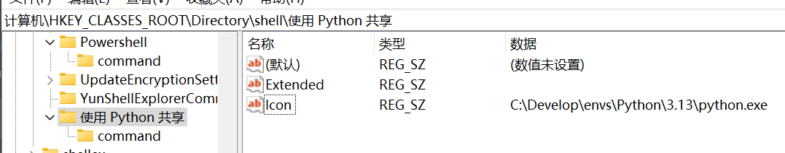
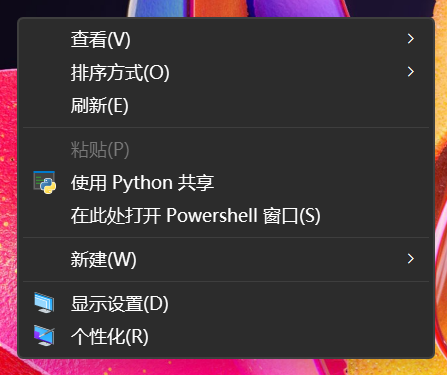

## Python 的 http 模块

Python 自带的 `http.server` 模块可以轻松地将一个文件夹共享为 HTTP 服务器。这个模块提供了一个简单的方式来共享文件和目录，使得其他设备可以通过网络访问这些文件。

```cmd
python -m http.server 8888
```

我们 Python 使用者都知道这个命令，这个命令可以在当前目录（`pwd`）下启动一个简单的 HTTP 服务器，监听 `8888` 端口。

## 右键菜单在注册表中的位置

根据 [How add context menu item to Windows Explorer for folders \[closed\]](https://stackoverflow.com/questions/20449316/how-add-context-menu-item-to-windows-explorer-for-folders)
和 [注册表编辑win10鼠标右键菜单，详解（右键文件夹、文件以及右键空白区域下三种情况）](https://www.cnblogs.com/mq0036/p/18872806)
这两篇文章，我们可以了解到在 Windows 资源管理器中，右键菜单被分为了以下几类：

<table>
  <tr>
    <th colspan="3" style="text-align: center;">情形</th>
    <th style="text-align: center;">注册表位置 </th>
  </tr>
  <tr>
    <td rowspan="3" style="vertical-align: middle;">右键空白区域</td>
    <td colspan="2">桌面空白区域</td>
    <td><code>计算机\HKEY_CLASSES_ROOT\DesktopBackground\Shell</code></td>
  </tr>
  <tr>
    <td rowspan="2" style="vertical-align: middle;">一般空白区域</td>
    <td>管理员</td>
    <td><code>计算机\HKEY_CLASSES_ROOT\Directory\Background\shell</code></td>
  </tr>
  <tr>
    <td>普通用户</td>
    <td><code>计算机\HKEY_CURRENT_USER\Software\Classes\Directory\Background\shell</code></td>
  </tr>
  <tr>
    <td rowspan="2" style="vertical-align: middle;">右键文件夹</td>
    <td colspan="2">管理员</td>
    <td><code>计算机\HKEY_CLASSES_ROOT\Directory\shell</code></td>
  </tr>
  <tr>
    <td colspan="2">普通用户</td>
    <td><code>计算机\HKEY_CLASSES_ROOT\Directory\shell</code></td>
  </tr>
  <tr>
    <td rowspan="2" style="vertical-align: middle;">右键文件</td>
    <td colspan="2">管理员</td>
    <td><code>计算机\HKEY_CLASSES_ROOT\*\shell</code></td>
  </tr>
  <tr>
    <td colspan="2">普通用户</td>
    <td><code>计算机\HKEY_CURRENT_USER\Software\Classes\*\shell</code></td>
  </tr>
</table>

## 添加注册表项

由于我们的最终目的是让用户在右键菜单中添加一个 “使用 Python 共享” 的选项，因此我们需要在注册表中添加与文件夹相关的注册表项。

具体而言，我们应该在以下注册表位置添加相关子项：

 - 桌面空白区域：`计算机\HKEY_CLASSES_ROOT\DesktopBackground\Shell`
 - 一般空白区域（普通用户）：`计算机\HKEY_CURRENT_USER\Software\Classes\Directory\Background\shell`
 - 右键文件夹（普通用户）：`计算机\HKEY_CLASSES_ROOT\Directory\shell`

在注册表中添加右键菜单项分为两种情况，分别是直接单击右键和按住 ++shift++ 的同时单击右键。

为了美观，本文建议你只添加按住 ++shift++ 的右键菜单项。但是本文仍然会对这两种情形都做介绍。

#### 直接单击右键

以桌面空白区域为例，在 `shell` 下新建一个子项，名为 `使用 Python 共享`：



再在 `使用 Python 共享` 下新建一个子项，名为 `command`，然后将 `command` 的默认值设置为以下内容：

```
"C:\Develop\envs\Python\3.13\python.exe" -m http.server 8888
```

其中 Python 路径请替换为你自己的 Python 绝对路径，即使你已经在环境变量中设置了 Python 的路径。



改完后重启资源管理器，你在单击桌面空白部分后，应该可以看见已经生效：



#### 按住 ++shift++ 的右键菜单

首先，按照上面的步骤，创建名为 `使用 Python 共享` 的子项及其 `command` 子项。

然后在 `使用 Python 共享` 下新建一个名值为 `Extended` 的字符串值，其值为空：



然后还是一样重启资源管理器，你在按住 ++shift++ 的同时右键单击桌面空白部分后，应该可以看见已经生效：



## 为右键菜单添加图标

只需要为项 “使用 Python 共享” 添加一个名为 `Icon` 的字符串值，其值为 Python 的可执行路径即可：




