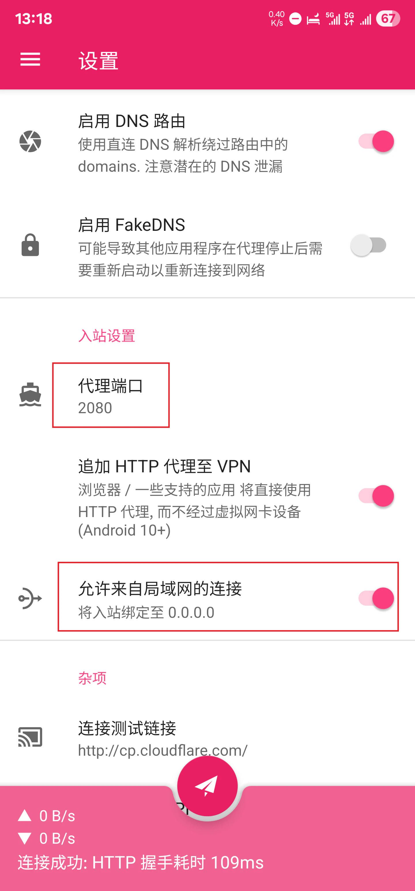
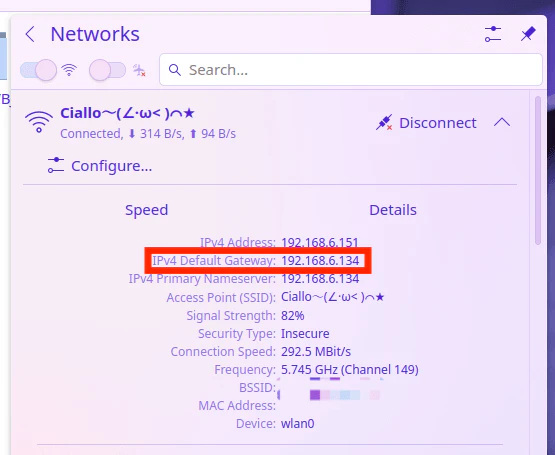
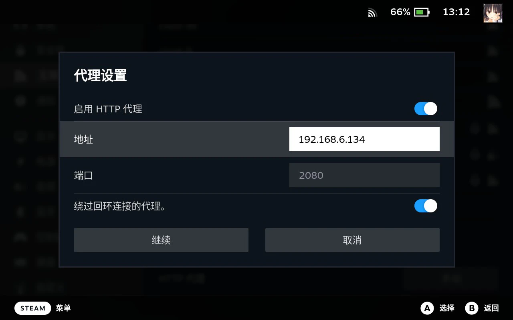

## 1. 背景

在大陆使用 Steam Deck 难免会遇到需要代理的问题。而这里所说的代理，不仅仅指访问 Steam 客户端内的代理，同时也包含了终端、Discover 甚至部分软件（比如 Firefox）的代理。

我们都知道在 Linux 操作系统上设置代理是一件很简单但同时又很麻烦的事。简单是因为 Linux 下绝大多数程序会默认读取环境变量中的 `http_proxy` 和 `https_proxy` 作为代理，无需在程序内单独设置，并且非常老实。麻烦是因为这两个环境变量需要每次都去手动设置（包括手动删除），而且只能设置 `http` 或者 `socks` 代理（这点和 Windows 上一样，如果需要其他协议，则需要外部代理内核进行 “转发”）。

而到了 Steam Deck 上，这种麻烦程度则会变本加厉，因为大多数情况下我们不会随身携带键盘，此时只能用触摸屏一个字一个字地输入，且难以进行复制粘贴操作。

我们当然可以在 Steam Deck 上起一个 [sing-box](https://github.com/SagerNet/sing-box) 或者 [v2ray-core](https://github.com/v2fly/v2ray-core) 内核，然后搭配 GUI，但这么做只会让操作更加复杂。

这篇博客的目的，就是提供一种方法，让 Steam Deck 连接到手机热点，即可享受手机上的同等代理及其分流规则。在本博客中，我假设读者已经对 Linux 操作系统与网络代理有最基本的了解。

## 2. Steam Deck 代理体系说明

在解释具体方法之前，我觉得有必要回顾一下 Steam Deck 的代理体系。

#### 2.1 KDE Plasma 设置应用

Steam Deck 默认的 Linux 桌面是 KDE Plasma，在 Plasma 的系统设置中设置的代理，仅对部分 KDE 桌面应用程序有效。在这里设置代理，基本等同于没设置。

#### 2.2 终端 `http_proxy` 和 `https_proxy` 环境变量

在 Linux 操作系统中，绝大多数程序均会读取此环境变量作为代理，在这里设置代理，可以让绝大多数程序走代理，但是不保险，可能会有漏网之鱼且难以排查。

#### 2.3 应用程序内代理

Steam 客户端等应用程序可以直接在应用程序内设置代理地址。虽然该代理的作用域十分有限，无法对其他程序生效，但至少可以保障在此程序内的网络连接均走代理。

下文要讲的方法，即是在 Steam 客户端内设置代理。

## 3. 部署局域网代理

我们要在局域网内起一个代理，在此之前你首先得有一个代理。然后就是让你在各个平台上对应的代理软件监听 `0.0.0.0`（为了方便，我们假设代理端口均设为 `2080`）。

如此一来，就省去了在 Steam Deck 上安装外部代理软件的麻烦，并且 Steam Deck 在走代理的同时，还会应用我们的路由规则。

以 [NekoBox](https://github.com/MatsuriDayo/NekoBoxForAndroid) 为例，直接在设置中勾选 `允许来自局域网的连接` 即可：



我们开启手机热点后，只需在该子网中找到网关地址（即手机的 IP 地址），并将其作为代理的 IP 地址填写到 Steam Deck 上即可，将在下一节中详细说明。

## 4. 设置代理

这一步我们需要让 Steam Deck 以我们手机在局域网中的 IP 作为代理地址。这个流程中最麻烦的地方在于，这个 IP 地址是不确定的。

在手机开热点的情况下，只要手机系统不重启不关机，那么无论我们怎么折腾手机热点，分配的子网和网关都会是固定的。因此我们只需要在第一次打开热点后，知道这个子网的网关地址即可。



但是麻烦之处在于，总会有那么一个时候我们要重启手机，或者用不同的手机开热点的情况。那么每次我们都需要用同样的方式来找到网关的 IP 地址，并且用极其难以操作的输入方式键入该 IP 地址。

幸运的是我们可以通过 `#!bash ip route` 命令来获取网关地址：

```bash
GATEWAY_IP=$(ip route | awk '/default/ {print $3; exit}')
```

#### 4.1 Steam 代理

在开启 Steam 大屏幕的情况下，可以直接到网络设置里设置代理：



在 Steam 启动时，这个代理会成为启动的命令行参数之一，这也是修改 Steam 代理后需要重新启动 Steam 的原因。

然而在这里手动输入 IP 地址还是太麻烦了，我们可以考虑先通过 `#!bash ip route` 命令来获取网关地址，然后将这个地址设置为代理地址。

这一步的关键之处，就是 `/home/deck/.steam/steam/config/proxyconfig.vdf`。这是 Steam 客户端存储代理地址的地方，这个文件打开是这样的（使用制表符 `\t` 作为分隔符，而不是空格）：

```vdf title="proxyconfig.vdf"
"proxyconfig"
{
	"proxy_mode"		"2"
	"address"		"192.168.213.244"
	"port"		"2080"
	"exclude_local"		"1"
}
```

我们可以用 `sed` 命令修改其中的 `address` 值。我们可以把整个流程写成一个 bash 脚本：

```bash
#!/bin/bash

GATEWAY_IP=$(ip route | awk '/default/ {print $3; exit}')

CONFIG_FILE="/home/deck/.steam/steam/config/proxyconfig.vdf"

sed -i '/"address"/ s/"[^"]*"/"'"$GATEWAY_IP"'"/2' "$CONFIG_FILE"

echo "代理地址已更新为: $GATEWAY_IP"

exec bash
```

#### 4.2 终端代理

我们需要在 Konsole 中设置 `http_proxy` 和 `https_proxy` 环境变量以设置代理，借鉴上文所述的 bash 脚本，我们在这里可以这么写：

```bash
#!/bin/bash

GATEWAY_IP=$(ip route | awk '/default/ {print $3; exit}')

export http_proxy=http://$GATEWAY_IP:2080
export https_proxy=http://$GATEWAY_IP:2080

exec bash
```

需要注意的是，最后一行的 `#!bash exec bash` 会让脚本执行结束后继续进入 bash 界面，如果没加这一行则会卡住。

## 5. 如何使 Steam 下载流量不经过代理，与社区流量分流

题外话。既然我们已经可以让 Steam Deck 上的代理应用我们的路由规则，那么肯定要好好利用。

之前社区有一个问题是：如何让 Steam 下载流量不经过代理，而除此之外的例如 `steamcommunity.com` 等域名仍然经过代理。

这个方法我已经在 [求教怎么手动添加让steam下载走直连 · Issue #1361 · 2dust/v2rayN](https://github.com/2dust/v2rayN/issues/1361#issuecomment-1856192253) 进行了回答。

简单来说，以下直连即可：

```
geosite:steam@cn
domain:steamserver.net
```

解释：

1. steam 客户端通过 `steamserver.net` 最终判断下载位置，该域名在 `geosite:steam` 中，且没有 `@cn` 标记。
2. 若 `steamserver.net` 经过代理，则 steam 会从 `steamcontent.com` 域名下载游戏（例如 `cache1-hkg1.steamcontent.com`）。
3. 若 `steamserver.net` 不经过代理，则 steam 会从 `xz.pphimalayanrt.com` 域名（阿里云）下载游戏，该域名在 `geosite:steam@cn` 中。
4. 该操作不影响 `steamcommunity.com` 等没有 `@cn` 标记的域名，这些域名依旧会被代理。
