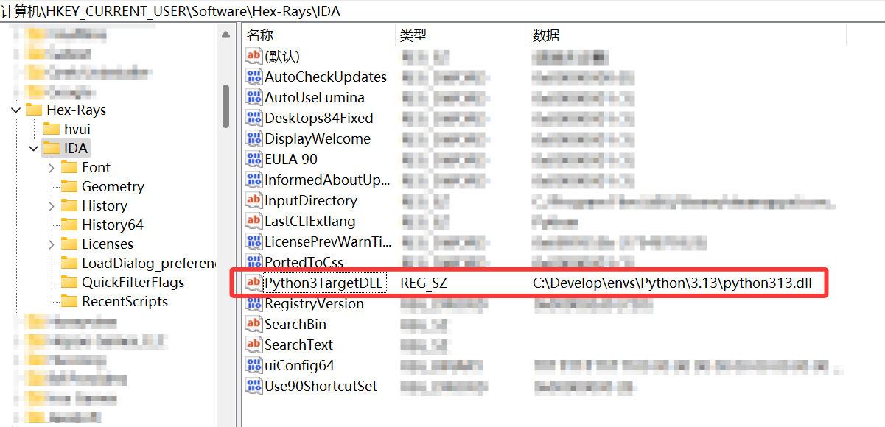

## 背景

IDA 默认采用系统 Python 解释器来运行 IDAPython 脚本，这对于 IDA 本身以及一些脚本来说已经足够（调用 `idaapi` 库）。

但当我们需要安装基于 IDAPython 的插件时，要求我们通过 `pip` 安装依赖包，这时就需要一个独立的 Python 环境来避免与系统 Python 产生冲突。

然而，IDA 并不支持直接使用虚拟环境中的 Python 解释器，因此我们需要一些额外的配置来使 IDA 能够使用虚拟环境。

## IDA 如何使用 Python

IDA 本体并不包括 Python 解释器，它会自动检测操作系统上已安装的 Python 发行版，并通过链接 `python3xx.dll`（具体文件名由 Python 版本号决定）动态链接库来动态调用 Python。

IDA 会使用 `计算机\HKEY_CURRENT_USER\Software\Hex-Rays\IDA` 的 `Python3TargetDLL` 项中定义的值作为 `python3xx.dll` 的路径。



然而使用虚拟环境创建的 Python 环境并不包括 `python3xx.dll` 文件，因此无法通过在注册表中指定该值来让 IDA 使用虚拟环境。

## 解决方法

`idapythonrc.py` 是 IDA 启动时初始化 Python 时加载的 IDAPython 专用配置文件，因此我们可以使用此文件来激活虚拟环境。

它的示例在 `C:\Program Files\IDA Pro\python\examples\misc\idapythonrc.py`。

根据 [Setting up a virtual environment for IDA Python](https://github.com/eset/ipyida/blob/master/README.virtualenv.adoc) 中的说明，将以下内容保存为 `idapythonrc.py`：

```python
import os
import idaapi

def activate_virtualenv(virtualenv_path):
    for bindir in ("Scripts", "bin"):
        activate_this_path = os.path.join(virtualenv_path, bindir, "activate_this.py")
        if os.path.exists(activate_this_path):
            break
    else:
        raise ValueError('Could not find "activate_this.py" in ' + virtualenv_path)

    with open(activate_this_path) as f:
        exec(f.read(), dict(__file__=activate_this_path))

activate_virtualenv(r"C:\Develop\envs\Python\IDAPython\.venv")  # 替换为你的虚拟环境路径
```

将该文件放置在配置文件目录下以便 IDA 能够使用它：

 - Windows: `%APPDATA%\Hex-Rays\IDA Pro\idapythonrc.py`
 - Linux & Mac: `~/.idapro/idapythonrc.py`

上述的 `activate_this.py` 是虚拟环境创建时自动生成的脚本，用于激活虚拟环境。
