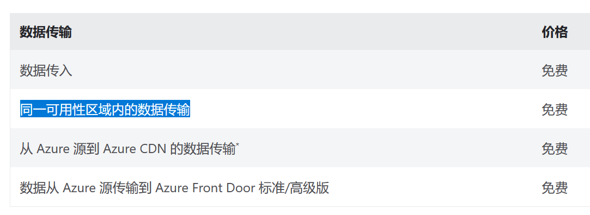
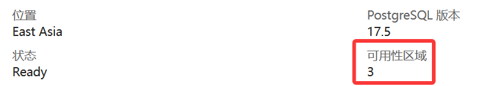
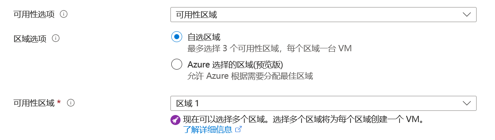
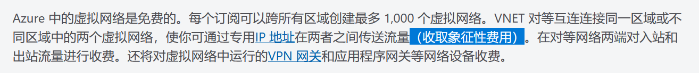
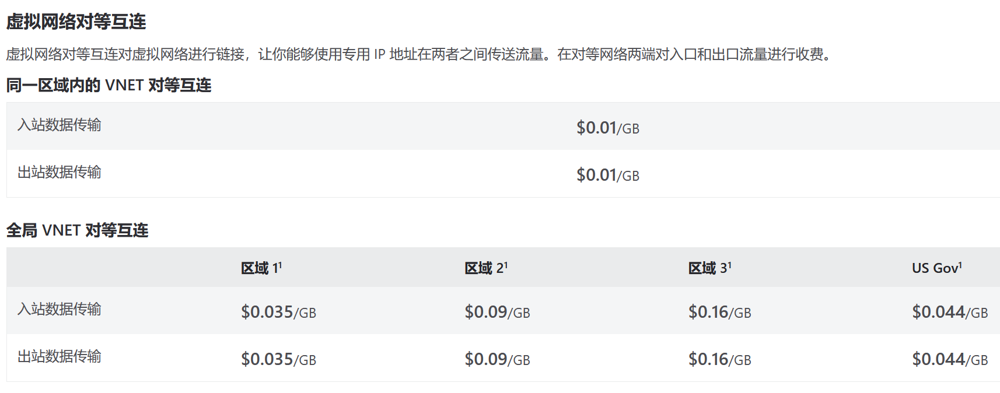

## 背景

最近需要使用数据库，突然想起来了其实 Azure 学生免费订阅为我们分别提供了 PostgreSQL 和 MySQL 各一个的免费数据库配额，规格都是 B1ms 的 32 GB。于是开始重新折腾了 Azure。

由于我的虚拟服务器在 East Asia（即香港），考虑到速度和成本，不用多想也知道开一台香港的数据库更好。甚至 Azure 还 “贴心” 地提供了一个服务，能将数据库和虚拟机放在同一个虚拟网络中，省去公网流量费用。~~虽然后来才知道这纯纯是一个大坑~~

今天这篇 Blog 就来谈谈 Azure 是怎么计算你的内部数据传输成本的。顺便也记录下自己迁移虚拟机可用性区域的一个过程。

如果想节约时间的话，可以直接跳到最后的 [总结](#_6) 部分。

## 带宽定价

翻开 [Azure 带宽定价文档](https://azure.microsoft.com/zh-cn/pricing/details/bandwidth/)，文档里清清楚楚地写道：

<figure markdown>
  
  <figcaption>同一可用性区域内的数据传输 免费</figcaption>
</figure>

看到这里，其实这篇 Blog 已经可以结束了。“Azure 是怎么计算你的内部数据传输成本的” 这个问题的回答，就是**同一可用性区域内的数据传输是免费的**。

可是，精简的语言总是蕴藏着巨大的天坑。

## 可用性区域

如果深入探讨，就不得不提到**可用性区域**这一折磨所有 Azure 人的东西，当然这个东西和我们今天说的主题关系不大，如果你知道什么是可用性区域则完全可以跳过，只是单纯我今天折腾的时候被这玩意折磨得要死，所以特地写一章来记录下。

何为可用性区域？**可用性区域**和**区域**不同。

 - **区域（Region）**是用于计费目的的 Azure 区域的地理分组。数据传输定价基于区域。一个 Azure 区域是一个地理位置（比如 East Asia、Japan East、West US 3）
 - **可用性区域（Availability Zone, AZ）**是 Azure 区域内的独立位置，且具有自己的独立电源、网络和冷却。Azure 区域中的可用性区域的物理和逻辑分离可防止应用程序和数据出现区域级故障。通常一个区域有 3 个 AZ（比如 East Asia Zone 1 / Zone 2 / Zone 3）。

你可以在每个资源的**概览**选项卡中找到该资源所在的实际可用性区域：



每当你创建资源的时候，都有一个可用性区域选项，可以让你把资源放在一个或多个可用性区域中（多选意味着互相备份，但也意味着要多花钱）。

既然我们已经知道了“同一可用性区域内的数据传输是免费的”，因此只要你把所有资源放在同一个可用性区域里，就能享受免费的内部数据传输：



!!! warning "注意"

    如果资源在**邻近放置组（Proximity Placement Group, PPG）**内，将无法指定可用性区域。

    资源实际上被放置在了该区域中的一个**随机**的可用性区域，且对客户透明。后期也无法使资源退出邻近放置组，除非删了重建。

    所以如果没有必要，则不要使用邻近放置组。

!!! warning "注意 x2"

    不过对于虚拟机来说，删了重建问题不大，毕竟托管硬盘、网络接口、公共 IP 地址都是可以选择性删除的，在删除的时候取消勾选这三样即可。

    但是新虚拟机和旧托管磁盘必须位于同一可用性区域，否则无法基于旧托管磁盘创建新虚拟机。

    如果真的发生了这个情况，你只能将旧磁盘创建一个快照，然后基于快照创建一个新的托管磁盘（指定到你期望的可用性区域），最后基于新的托管磁盘创建虚拟机。

!!! info "提示"

    既然都说到这了，不妨再说一说怎么重建新虚拟机。

    假定我们在删除旧虚拟机的时候，保留了托管硬盘、网络接口、公共 IP 地址这三样，那我们有两种方法可以重建新虚拟机：

    第一种是使用 Azure 控制台：

    ```bash
    az vm create --size Standard_B2ats_v2 --resource-group 资源组名 --name 虚拟机名 --attach-os-disk 磁盘名 --os-type linux --nics 网络接口名 --zone 3
    ```

    其中 `Standard_B2ats_v2` 是 Azure 学生免费订阅中可以享受免费资格的虚拟机规格（如果发生了改变，建议自己找下最新的），`--zone 3` 指定了可用性区域为 Zone 3，修改为你期望的可用性区域即可。由于区域会跟着你指定的资源组走，因此不需要额外指定。
    
    第二种是直接在原有的托管磁盘概述页上，点击创建 VM：

    

    当然由于这个磁盘已经被我 Attach 到对应的虚拟机上了，所以这个按钮是灰色的。如果你是基于快照创建的新磁盘，那么这个按钮就是可点击的。

## 虚拟网络定价

虚拟网络（VNet）顾名思义，能够将多个资源组成一个虚拟网络，这样就能在资源中使用私有 IP 地址访问其他资源了。虚拟网络内的数据传输不收取额外费用，但是如果发生了跨可用性区域流量，还是要正常收费的。

虚拟网络与区域、可用性区域、邻近放置组都不是一回事。尤其要注意的是，虚拟网络内的资源**不一定**在同一个可用性区域内（但**必须**在同一区域内）。

比如我可以在 East Asia 区域创建一个虚拟网络 `vnet-eastasia`，然后把虚拟机放在 Zone 1，把数据库放在 Zone 2，然后把它们的网络接口都绑定到这个虚拟网络上来，这样它们就能用内网 IP 互相访问了，但是它们并不在同一个可用性区域内。

!!! warning "注意"

    即使它们位于同一个虚拟网络内，跨可用性区域的数据传输也是要收费的。

我也可以在同一 East Asia 区域创建两个虚拟网络 `vnet-eastasia-1` 和 `vnet-eastasia-2`，然后把它们连起来。这种用法就是 [Azure 虚拟网络对等互连](https://learn.microsoft.com/zh-cn/azure/virtual-network/virtual-network-peering-overview)。这样你就可以用内网流量来连接这两个资源，而不需要经过公共 Internet、网关或加密，**不过你需要对内网流量付费**。

<figure markdown>
  
  <figcaption>象征性费用</figcaption>
</figure>

当然虚拟网络也是可以跨区域的，和上面说的对等互连类似，这个叫做**全球虚拟网络对等互连**，**当然也是要付费的**。但是这么做你就可以用内网 IP 地址访问其他区域的资源了，是不是很酷？实际上这么做有它自己的独特优点：虚拟网络之间的流量仅限于 Microsoft 主干网络，且流量不会从 Microsoft 主干网络中退出。

刚刚提到了三种虚拟网络的用法，其中后两种用法属于对等互联，都是要付费的，具体价格可以参考 [Azure 虚拟网络定价文档](https://azure.microsoft.com/zh-cn/pricing/details/virtual-network/)。这个计费不仅要计出站，甚至还要计入站流量，有点离谱。



!!! warning "注意"

    值得注意的是，即使是同一可用性区域内的资源，只要它们不在同一个虚拟网络内，那么它们之间的对等互联也是要收费的。

## 专用终结点定价

**专用终结点（Private Endpoint，在具体服务中也可能会看到它叫虚拟终结点、专用链接）**是 Azure 提供的一种将 PaaS 服务（比如 Azure Database for PostgreSQL）连接到你的虚拟网络的方式。专用终结点使用一个私有 IP 地址从你的虚拟网络中进行连接，从而使服务看起来就像是你虚拟网络中的一部分。

比如说，你创建了一个 PostgreSQL 服务，它在 Azure 中是只有终结点（实际上是域名）没有公网 IP 地址的，因此也不会有网络接口。但是借助专用终结点，你就可以把这项服务分配一个网络接口和私有 IP 地址，把网络接口并入现有的虚拟网络后，你就可以在虚拟网络内的其他资源中通过这个私有 IP 地址访问 PostgreSQL 了：


这么做的目的无外乎就是提升安全性，这样你就可以关掉数据库的公网访问了。

我为 PostgreSQL 启用了专用终结点，结果搞半天没想到这个也是要钱的，具体价格可以参考 [Azure 专用链接定价](https://azure.microsoft.com/zh-cn/pricing/details/private-link/)。这个是按照 0.01$ 每小时计费的，折合每月大概 7 元人民币左右。

如果你和我一样，想把数据库和虚拟机放在同一个虚拟网络中以节省流量费用，那么与其开这个专用终结点，不如直接把数据库和虚拟机放在同一个可用性区域。

## 总结

### 什么情况不需要付费

 - 在同一可用性区域内的数据传输，原则上是不需要任何付费的。但是如果你画蛇添足地搞出了 VNet 对等互联，就不要问为什么扣了你的钱了。
 - 在同一个 VNet 内的发生的数据传输，不需要对此额外付费（若在同一 VNet 中出现了跨可用性区域传输的流量，则正常按照定价计费）。VNet 也许有多个子网，从相同 VNet 的一个子网到另一子网，本质上仍是在同一个 VNet 内，因此不需要付费。

### 什么情况需要付费

 - 在不同可用性区域内的数据传输，需要为流量付费。至于资源具体被分配到了哪一个可用性区域，可以在对应资源的概览页中查看。[Azure 带宽定价](https://azure.microsoft.com/zh-cn/pricing/details/bandwidth/)
 - 跨区域的数据传输，本质上属于更昂贵的跨可用性区域，也需要付费。
 - 连接两个不同的 VNet 以实现对等互联，需要为内网流量付费。[Azure 虚拟网络定价](https://azure.microsoft.com/zh-cn/pricing/details/virtual-network/)
 - 对 PaaS 服务启用专用终结点，需要按小时付费。[Azure 专用链接定价](https://azure.microsoft.com/zh-cn/pricing/details/private-link/)

### 最佳实践

如果你真的和我一样，想把数据库和虚拟机放在一起以节省流量费用并且加速，那么：

 - 不要对虚拟机使用邻近放置组
 - 把所有资源（包括虚拟机、托管磁盘和数据库）放在同一个可用性区域内
 - 不要为数据库启用专用终结点，即便这样可以让数据库分配一个私有 IP 地址从而允许你在虚拟机内用内网 IP 地址访问它
