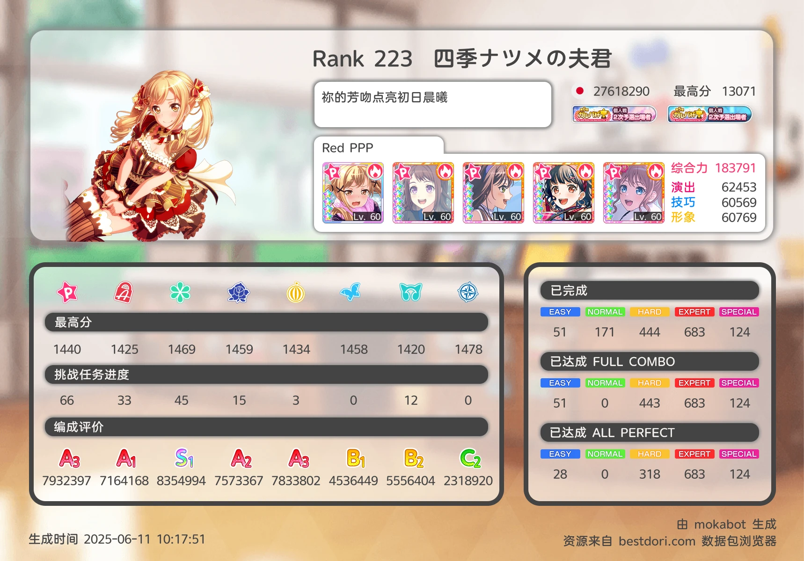
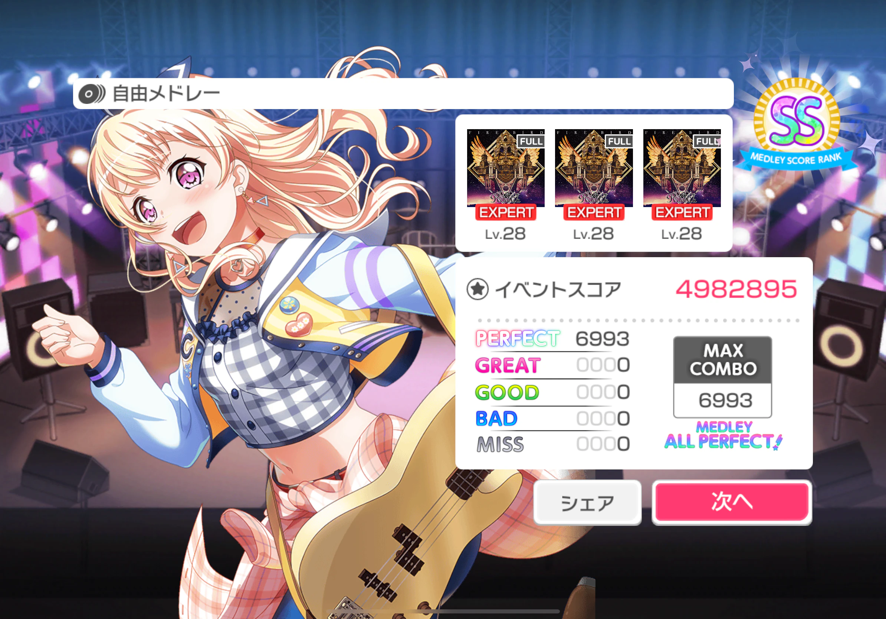
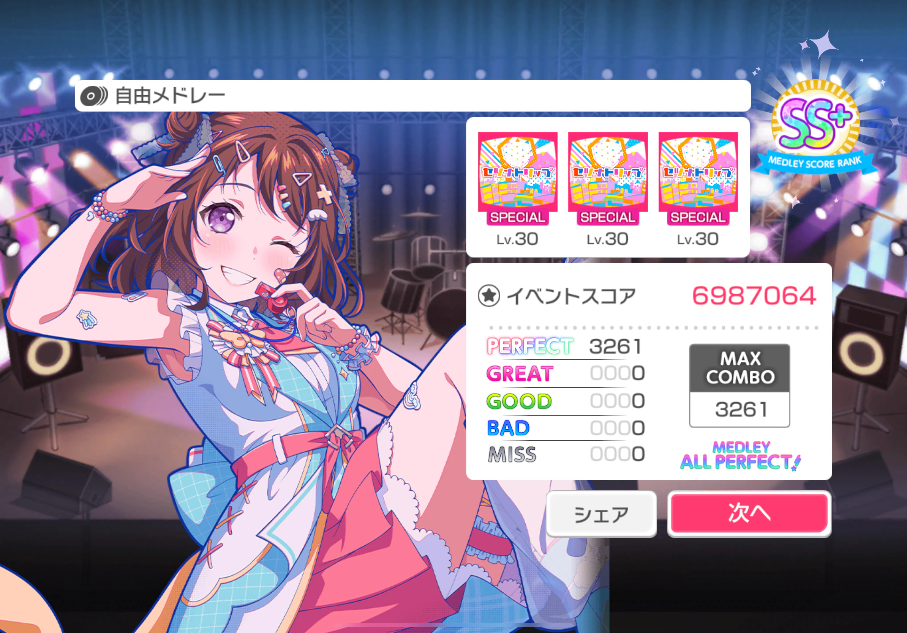
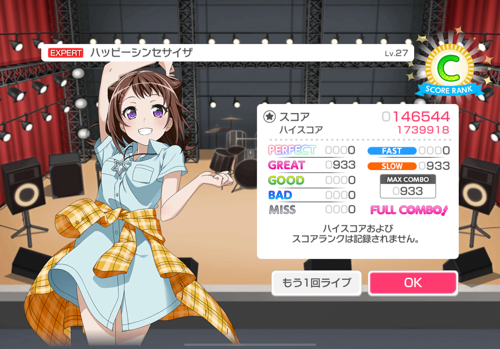
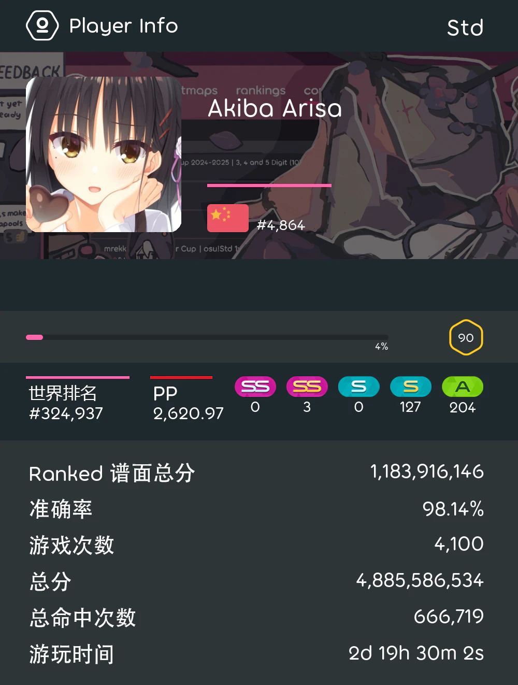

# 扩列

这个页面可能会很乱，毕竟扩列的图实在是太多了。

手机上可能看得更舒服吧。

## :material-steam: Steam

基本上只玩 GalGame 和 Counter-Strike 2，偶尔玩一些 3A。团建类很少玩，不过欢迎找我团建。

刚拿到 Steam Deck 的那一段时间沉迷于土豆兄弟、挺进地牢等小游戏，现在不怎么玩了。

GalGame 目前进度见 [我的 VNDB](https://vndb.org/u200138/ulist?vnlist=1)。

CS2 完美最高答辩 S，只打 5 排固定队，主要负责在队伍里当瘤子或者拉枪线。

## :material-guitar-electric: バンドリ！ ガールズバンドパーティ！

18 年入坑，纯日服玩家，只打有判全 All Perfect，目前 ~~应该还是~~ 全曲 AP，不冲活动，只给各大评级组当工具人。

打过 3 次ガルパ杯，但是都止步于 2 次予選，毕竟，2 次予選から準決勝に出場できる参加者は 10 名です。偶尔有幸也会参与群友举办的小型比赛，虽然嘴上说着友谊第一，但实际上心想着哪怕拿一次前三也好。

已经和🐔🐶二团切割，引流的还是太多了。

整过不少烂活，什么🔥🐔仙人、刹那仙人、断手器仙人：

## :simple-osu: osu!

std 和 4K 玩家，入坑不到半年，有点菜。

 - 键盘：Piifox WALKER68 磁玉轴 Pro
 - 鼠标：Logitech G PRO WIRELESS
 - 数位板：Wacom CTL-472

